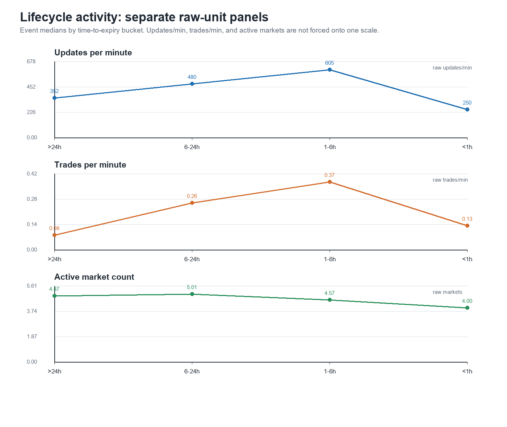
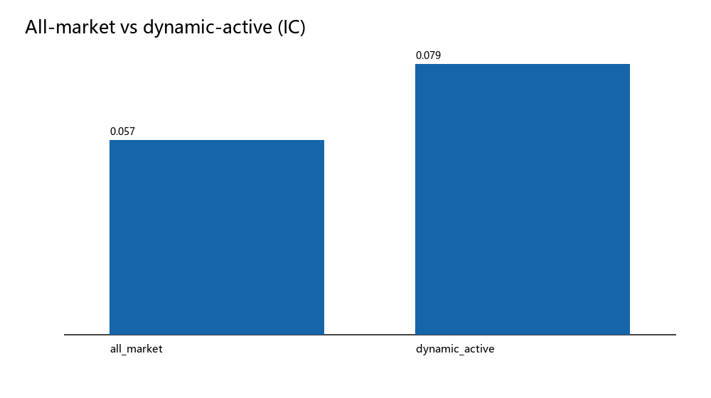
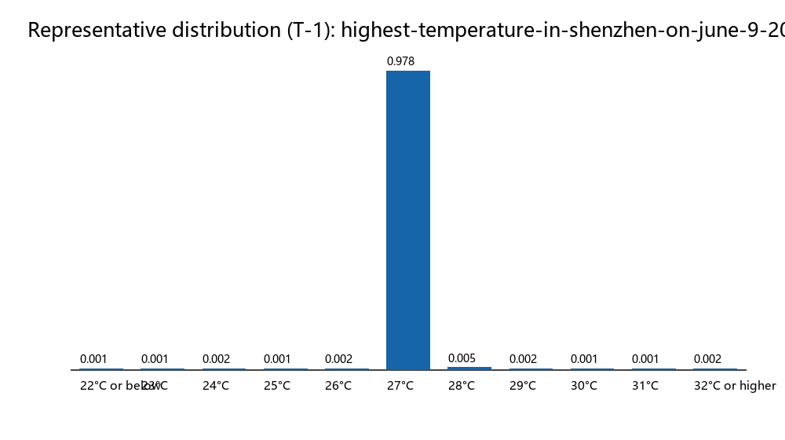
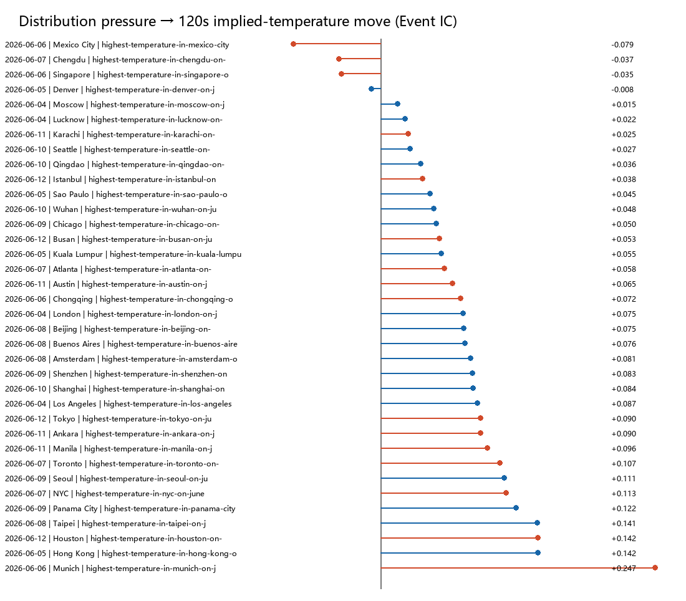

# 20260715 - Polymarket PMXT 天气因子研究进展

## TLDR

1. 这轮先解决历史 PMXT 数据回测问题，并重新启用 PMXT。此前由于时间顺序质量不足，PMXT 一度准备从回测路径中降级；上次会议后确认历史天气数据仍需要纳入，因此本轮把历史数据重新整理成可审计、可复现的研究输入。
2. PMXT replay 与 Nautilus replay 已统一到同一套数据合同和时钟语义下，因子研究与回测引擎不再各自解释历史数据。后续同一份 replay 输入可以同时服务 offline factor research 和 Nautilus research backtest。
3. 独立因子研究链路已补齐：从 PMXT Event 数据、adapter、replay contract、factor panel、label、compact 输出到报告，已经形成可重复运行的研究闭环。
4. 单 Token 盘口因子完成初测后，核心问题从“哪个 L2 因子更强”转为“研究单位是否合理”。单 token fixed-horizon baseline 有方向信息，但 crossing 全部为负，不能直接升级为 taker 策略。
5. 36 Event 实验暴露了三项结构问题：lifecycle 不同阶段不是同一种市场，Event 内 outcome 活跃度高度不均，固定时间 label 在不同活跃度下信息量不等价。下一阶段应转向 Event 内结构性 alpha，而不是继续扩大单 token 因子池。

## 1. PMXT 与 weather inventory

本轮先从历史 PMXT 数据中提取更多 weather Event，目标不是直接扫全量做策略，而是把天气历史数据整理成可抽样、可复现、可分层的研究样本池。

PMXT 现在已经接入统一链路：

```text
PMXT event data
  -> PMXT adapter / replay contract
  -> factor research
  -> PolymarketL2DatasetV1
  -> Nautilus native data
  -> BacktestEngine
```

当前 weather inventory：

| 项目 | 数量 |
| --- | ---: |
| events | 441 |
| cities | 49 |
| dates | 9 |
| markets | 4,851 |
| tokens | 9,702 |
| rows_written_total | 747,185,591 |

可用性上，441 个 Event 已按数据质量分成两类：245 个 `primary_development_replication`，196 个 `degraded_robustness`。primary cohort 的覆盖更完整，degraded cohort 主要用于稳健性和异常压力测试，不和 primary 混成一个无差别样本。inventory 层面的行数和覆盖已经足够支持抽样实验，但质量差异必须进入实验设计，而不是事后解释。

本轮 36 Event 验证样本从这个 inventory 中抽取，覆盖 9 个日期、36 个城市、20 clean + 16 degraded，共 396 tokens。实际进入 token baseline 分析的是 366 tokens；24 个 token 因无 ranking observations 被跳过，6 个 token 因 PMXT tick 状态冲突失败且未静默修补。这个审计结果说明样本可用，但不能把“可用”理解成“无质量边界”。

## 2. 单 Token 盘口因子结果

Wave 0 因子定义已经补齐，主要是 prefix-causal、outcome-blind 的纯 book-state 因子：

- depth imbalance：`depth_imbalance_1`、`depth_imbalance_3`、`depth_imbalance_5`
- top-level / depth shape：`top_level_depth`、`depth_concentration`、`depth_slope`
- microprice：`microprice_minus_mid`
- liquidity asymmetry：`bid_ask_liquidity_asymmetry`
- spread / boundary / regime：`spread`、`distance_to_zero_one`、`tick_size_regime`
- 诊断分层：`book_staleness_seconds`、`book_update_intensity`

OFI、trade pressure、cancel pressure 这类 flow 或 message-order-sensitive 因子仍在隔离区，只能做 research diagnostic，不能参与 Wave 0 ranking 或 PnL 解释。

36 Event baseline 的正式范围是 36 Event / 9 日期 / 36 城市 / 396 tokens，不是 441 Event 融合结果。event-level runner 最终选取 `depth_imbalance_1` 和 `microprice_minus_mid` 两个代表性盘口因子，跑固定时间 label 的 token-level baseline。

label 工作量也比表面上的“看 120s 后价格”复杂。固定时间 horizon 覆盖 30/60/120/300/600/900s，其中 30/120/600 是主窗口，60/300/900 是诊断与敏感性分析。每个 anchor 必须是 `ranking_observation = actual_mutation AND valid_book`；对每个 horizon，代码在 `t+h` 之后寻找第一个同 token L2 mutation timestamp，并使用该 timestamp 的最后一个 mutation 作为 future mid。找不到未来 mutation、遇到 declared gap / resolution barrier、future book invalid，都会写入 censor reason；只有 current/future mid 都有效的行才进入 label。coverage 是有效 label 行数占 anchor 行数的比例；zero-return 在有效 label 内单独统计，不会被静默丢弃。

核心结果：

| factor | horizon | events | median IC | positive Event | zero | crossing | coverage |
| --- | ---: | ---: | ---: | ---: | ---: | ---: | ---: |
| depth_imbalance_1 | 30s | 36 | 0.077 | 1.000 | 0.795 | -0.0090 | 0.998 |
| depth_imbalance_1 | 60s | 36 | 0.077 | 0.972 | 0.751 | -0.0090 | 0.997 |
| depth_imbalance_1 | 120s | 36 | 0.085 | 0.972 | 0.691 | -0.0090 | 0.995 |
| depth_imbalance_1 | 300s | 36 | 0.087 | 0.972 | 0.607 | -0.0090 | 0.990 |
| depth_imbalance_1 | 600s | 36 | 0.093 | 0.972 | 0.518 | -0.0088 | 0.981 |
| depth_imbalance_1 | 900s | 36 | 0.106 | 0.944 | 0.459 | -0.0087 | 0.977 |
| microprice_minus_mid | 30s | 36 | 0.049 | 1.000 | 0.795 | -0.0090 | 0.998 |
| microprice_minus_mid | 60s | 36 | 0.056 | 0.944 | 0.751 | -0.0090 | 0.997 |
| microprice_minus_mid | 120s | 36 | 0.058 | 0.944 | 0.691 | -0.0090 | 0.995 |
| microprice_minus_mid | 300s | 36 | 0.062 | 0.917 | 0.607 | -0.0090 | 0.990 |
| microprice_minus_mid | 600s | 36 | 0.054 | 0.917 | 0.518 | -0.0088 | 0.981 |
| microprice_minus_mid | 900s | 36 | 0.065 | 0.889 | 0.459 | -0.0087 | 0.977 |

`depth_imbalance_1` 的 median IC 随 horizon 从 0.077 到 0.106 上升，zero 从 0.795 降到 0.459；但所有 crossing 都为负。`microprice_minus_mid` 也类似，方向信息存在，执行空间不存在。valid_obs pilot 修正过“固定时间内无更新导致大量 0”的诊断，确实能降低 zero；但 `obs200` 的 P90 elapsed 约 2870 秒，超过预注册的 1800 秒门槛，容易把不同 regime 混在一起，因此没有升级为主标签。

这一步给出的结论不是“盘口因子无效”，而是单 token fixed-horizon 的研究单位不够好。不同时间、不同 outcome 的含义完全不同；越接近 settlement，概率收敛和 stale quote 清理又变成另一种市场状态。

## 3. 实验暴露的三项结构问题

第一，约 3 天生命周期里的不同阶段不是同一种市场。

早期、6-24h、1-6h、临近结算这几个阶段，交易密度、spread、活跃 outcome、价格发现行为都不同。把它们混成同质样本，会让一个 IC 数字同时包含早期冷启动、主要价格发现、临近结算收敛和 stale quote 清理。

第二，一个 Event 内约 11 个 outcome 的活跃度不同。

主要概率质量、更新和成交都集中在少数 outcome。静态使用全部 outcome 会稀释信号，也会把 inactive / stale outcome 纳入判断。dynamic active set 的实验验证了这个方向有预测价值，但执行指标没有同步改善。

第三，固定时间 label 在不同活跃度下包含的信息量不同。

同样是 120s，早期可能几乎没有新信息，临近结算可能跨过大量盘口更新和成交。zero rate 会随 horizon 变化，horizon 越长 zero 通常越低；但这不等于可以直接把 horizon 拉长做策略。valid_obs 只解决“有多少盘口更新”的一部分问题，不解决 lifecycle 和 active outcome 的结构差异。

这三点把下一步问题从“哪个 L2 因子更强”改成三个更基础的验证问题：

1. 主要价格发现窗口到底在哪里；
2. dynamic active set 是否能同时改善预测和执行；
3. 研究单位是否应该从 token 升级到 Event probability distribution。

## 4. 36 Event 设计与审计边界

本轮 36 Event 设计是预先固定的：每个日期选 4 个 activity quantile，尽量覆盖不同城市，避免结果出来后再挑样本。

| 项目 | 数量 / 口径 |
| --- | --- |
| Event | 36 |
| 日期 | 9 |
| 城市 | 36 |
| clean / degraded | 20 / 16 |
| token 总数 | 396 |
| 进入分析 | 366 |
| skipped | 24 no ranking observations |
| failed | 6 PMXT tick 状态冲突 |

Event grid 为 1 分钟；每个 token 只用该时刻之前最后一个有效盘口，采用 backward as-of；active gate 只使用当时及过去 30 分钟信息，保持 prefix-causal。

24 个 skipped 主要来自 inactive market 无 ranking observations，且偏向早期 clean 日期和 Lucknow 等城市；因此 token baseline 只代表能形成 ranking 的较活跃 token。6 个失败 token 来自 PMXT `tick_size_change` old tick 与回放状态冲突，未静默修补。

## 5. 结果一：Lifecycle 指向 1-6h 主窗口



| bucket | trades/min | spread | 120s IC | zero |
| --- | ---: | ---: | ---: | ---: |
| >24h | 0.08 | 0.010 | 0.085 | 0.724 |
| 6-24h | 0.26 | 0.006 | 0.111 | 0.709 |
| 1-6h | 0.37 | 0.003 | 0.132 | 0.681 |
| <1h | 0.13 | 0.002 | 0.089 | 0.748 |

1-6h 是当前最像主要价格发现的窗口：trades/min 最高，spread 已经明显收窄，120s IC 最高，zero 也最低。<1h 虽然 spread 更窄，但交易活跃度和 IC 回落，zero 反而上升，更像 settlement regime，而不是统一价格发现窗口。

## 6. 结果二：Active set 改善预测，但不改善执行



| scope | IC | zero | crossing | Top3 mass |
| --- | ---: | ---: | ---: | ---: |
| all_market | 0.057 | 0.812 | -0.0074 | 0.835 |
| dynamic_active | 0.079 | 0.718 | -0.0110 | 0.929 |

dynamic active set 的方向是对的：IC 从 0.057 提升到 0.079，zero 从 0.812 降到 0.718，Top3 mass 从 0.835 升到 0.929，说明主要概率和价格发现确实集中在少数 outcome。

但它没有通过交易前置条件。crossing 从 -0.0074 恶化到 -0.0110，说明预测改善没有转化为更好的直接执行空间。当前决策是：active set 只作为状态特征和研究分层，不作为交易 gate。

## 7. 结果三：Event 概率分布有弱结构信号，但不是 Alpha





| scope | Event IC | positive Event |
| --- | ---: | ---: |
| all | 0.073 | 0.889 |
| clean | 0.075 | 0.950 |
| degraded | 0.069 | 0.812 |
| sum deviation <= 0.10 | 0.064 | 0.833 |

Event probability distribution 的结果比单 token 更接近真实问题。pressure 对 future implied-temperature move 有跨日期稳定的弱结构信号，不只是跨 cohort 弱信号。Raw median Event IC 为 0.073，Event bootstrap 90% CI 为 [0.052, 0.083]；限制到 `|sum(mid)-1| <= 0.10` 后，median Event IC 为 0.064，90% CI 为 [0.051, 0.077]，positive Event 从 0.889 降到 0.833，但信号没有消失。9 组 leave-one-date-out 全部为正，median IC 范围为 0.061-0.075；负 IC Event 有 4 个。

这只能说明结构特征值得继续研究，不能称为 Alpha。所有 crossing 仍然为负，且概率和质量边界仍然限制策略解释。缓存补充实验对概率和尾部做了敏感性归因：

| filter | snapshots / Events | P95 | >0.10 | max |
| --- | ---: | ---: | ---: | ---: |
| Raw | 60,281 / 36 | 0.135 | 7.2% | 3.935 |
| Complete outcomes | 38,105 / 23 | 0.085 | 2.9% | 2.495 |
| Complete + fresh + spread + sync | 14,616 / 22 | 0.077 | 1.4% | 0.180 |

绝大多数极端尾部随完整性、spread 与同步过滤消失；严格过滤后仍有 205 snapshots / 11 Events 的偏差 >0.10，集中于少数 Event。残余尾部需要逐 Event 报价语义核验，不能直接解释为套利，也不能带着这批数据直接进入策略回测。

## 8. 发现 - 证据 - 决策

| 发现 | 证据 | 决策 |
| --- | --- | --- |
| PMXT 历史数据重新纳入研究链路 | 441 Event inventory 已建立；245 primary development / 196 degraded robustness；PMXT 与 Nautilus replay 使用同一数据合同 | 继续使用 PMXT 历史天气数据，但按质量 cohort 分层 |
| 单 token fixed-horizon 有方向信息但不可执行 | `depth_imbalance_1` 120s IC 0.085、900s IC 0.106；所有 crossing 为负 | 不扩大单 token 因子池，不进入直接 taker 分支 |
| 1-6h 是主要价格发现窗口 | trades/min 0.37、spread 0.003、120s IC 0.132、zero 0.681 | 后续优先围绕 1-6h 设计实验；<1h 单列 settlement regime |
| active set 能提升预测但恶化 crossing | IC 0.057 -> 0.079，zero 0.812 -> 0.718，crossing -0.0074 -> -0.0110 | active set 只作状态特征和分层，不作交易 gate |
| Event probability distribution 有跨日期稳定的弱结构信号 | Raw median Event IC 0.073，90% CI [0.052, 0.083]；sum deviation <= 0.10 后 median 0.064，90% CI [0.051, 0.077]；9 组 leave-one-date-out 全部正向，范围 0.061-0.075；4 个负 IC Event；所有 crossing 仍为负 | 保留为下一阶段 Event 内结构研究方向，不称 Alpha |
| 概率和异常尾部已完成缓存归因，但残余需逐 Event 核验 | Raw 为 60,281 / 36，P95 0.135，>0.10 占 7.2%，max 3.935；Complete + fresh + spread + sync 后为 14,616 / 22，P95 0.077，>0.10 占 1.4%，max 0.180；严格过滤后仍有 205 snapshots / 11 Events >0.10 | Phase 1 做残余 Event 报价语义核验与 native parity，再谈回测；不能把尾部解释为套利 |

## 9. 数据与信任边界

- 概率和异常尾部已完成缓存归因：Raw 口径下 `|sum(mid)-1|` P95 为 0.135，最大 3.935，超过 0.10 的观测占 7.2%；Complete outcomes 后 P95 降到 0.085，>0.10 降到 2.9%；Complete + fresh + spread + sync 后 P95 降到 0.077，>0.10 降到 1.4%，max 降到 0.180。严格过滤后仍有 205 snapshots / 11 Events 偏差 >0.10，需要逐 Event 报价语义核验。
- 24 个 skipped 偏向早期 clean 日期和 Lucknow 等城市。token baseline 只代表可形成 ranking 的较活跃 token，不能当成全部 token 的无偏估计。
- 6 个 PMXT tick 状态冲突失败 token 尚待分类。当前没有静默修补，因此结论没有掩盖这类异常，但也不能忽略它们。
- crossing 不是 PnL。它只是一个更接近执行约束的诊断指标，不包含真实 bid/ask 路径、fees、队列、成交概率、容量、持仓和撤单逻辑。
- 本批次 native parity 未补齐，不进入 Nautilus 策略回测。

## 10. 我们研究的 Alpha 是什么

当前优先研究的是 endogenous / Event 内结构性 alpha，而不是先接天气外部数据源。

这条主线只依赖市场内部数据：prices、orderbook、trades、activity、spread、depth、Event 内 outcome 概率结构，以及同一 Event 内不同 outcome 的相对变化。它要回答的问题不是“天气预报是否领先市场”，而是“多结果 Event 内部是否存在可稳定表示、可审计、最终可执行的结构性 mispricing 或价格发现路径”。

天气的价值在于它是通用多结果 Event 的试验田：生命周期短，多 outcome 明确，重复样本多，结算规则清晰。下一阶段通用目标包括：

- YES/NO 一致性；
- 多 outcome 概率和与 simplex consistency；
- probability mass flow；
- Outcome 内 leader-lag；
- stale quote / inactive outcome 识别；
- lifecycle regime；
- 真实 bid/ask、fee、容量、持续时间约束下的执行边界。

天气外部数据源、天气预报、implied temperature 等 domain fundamental 未来可以插件化接入，但不是当前主线。跨 Event leader-lag 也先放后面；Event 内结构和执行边界不稳时，跨 Event 只会放大 ontology 和同步误差。

## 11. 决策：停止单 token 固定时间 + 直接 taker 分支

建议现在做三个明确停止：

1. 不扩 100。36 Event 已经足够暴露结构问题，继续扩大样本只会更快地产生更多同类诊断表，不会自动解决研究单位和执行边界问题。
2. 不进入 Nautilus 策略回测。native parity、残余概率尾部逐 Event 核验、tick 冲突、真实 bid/ask + fee + 容量边界都还没补齐。
3. 不扩大单 token 因子池。继续加更多 L2 因子，会把研究资源投入到当前证据最弱的分支。

这不是停止 PMXT weather 项目，而是停止“单 token 固定时间 + 直接 taker”的分支。后续要把单 token 因子降为 Event-level 的局部特征和对照组。

## 12. Roadmap：先 Event 内结构性，跨 Event 延后

| Phase | 工作 | 目标 |
| --- | --- | --- |
| Phase 1 | 残余数据异常核验、native parity、IT 数据合同 | 分类 6 个 tick 冲突；逐 Event 核验严格过滤后仍 >0.10 的 205 snapshots / 11 Events 报价语义；补齐 research replay 与 native 数据一致性；推动 IT 交付 Event bundle / raw 边界 / receive timestamp / market-fee-settlement metadata |
| Phase 2 | Event 内结构特征 | YES/NO 一致性、多 outcome 概率和、probability mass flow、Outcome 内 leader-lag、stale outcome、lifecycle |
| Phase 3 | 可执行边界 | 用真实 bid/ask、fee、容量、持续时间、成交概率区分观察信号和可执行信号 |
| Phase 4 | Nautilus 多腿回测 | 只有 Phase 1-3 通过后，再把多 outcome order intent 接入 Nautilus |
| Phase 5 | 跨 Event | 跨城市、跨日期、跨主题 leader-lag 和相关 Event 网络，等 Event 内能力稳定后再做 |

IT 数据进度截至 2026-07-16：原先已与张琦对齐数据需求，上周预计交付第一版；本周一转由实习生承接，目前刚完成需求对齐，第一版仍待交付。关键不是人，而是交付边界必须固定：Event bundle 边界、raw message/update 原子边界、真实 receive timestamp、market metadata、fee schedule、tick-size change、resolution / settlement metadata 都要进入数据合同，否则只能继续依赖临时 normalizer 和研究侧补丁。

## 13. 会议讨论点

建议会议只讨论五个决策点：

1. 是否认可下一阶段主线切到 Event 内结构性，而不是继续扩大单 token taker 因子。
2. 是否认可 1-6h 作为主要价格发现窗口，<1h 单列为 settlement regime。
3. 是否暂停单 token taker 扩张，只把 token baseline 保留为局部特征和对照组。
4. 是否先投入数据异常、native parity、IT 数据合同和真实可执行边界，而不是直接进 Nautilus 策略回测。
5. 是否同意只有 Phase 1-3 通过后，再投入多腿 Event-level 回测；跨 Event leader-lag 放到更后面。

当前可以对外说：PMXT 历史天气数据已重新纳入统一 pipeline，441 Event inventory 已建立，36 Event 实验识别出 lifecycle、active set、Event probability distribution 三个关键结构问题，并给出下一阶段路线。

当前不能对外说：已经发现可交易 alpha，或者已有 Nautilus 策略回测收益证明。
