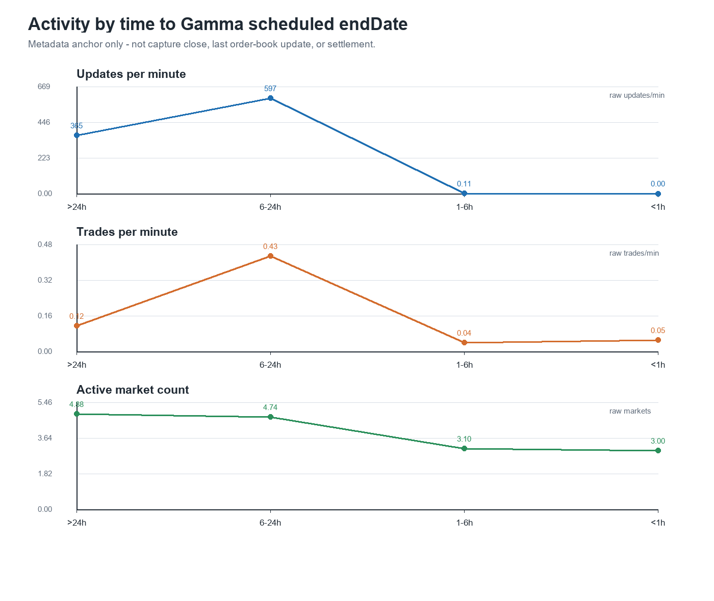
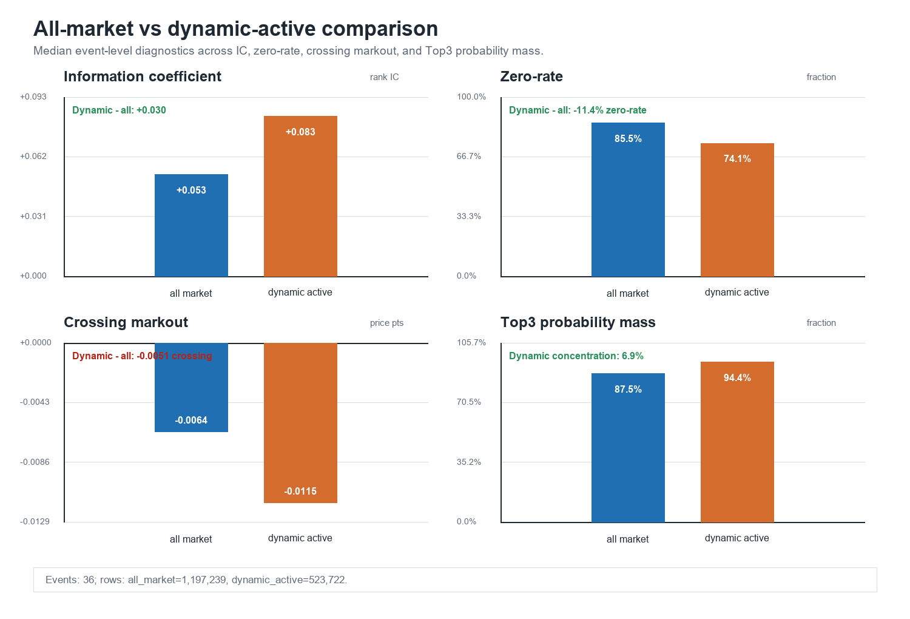
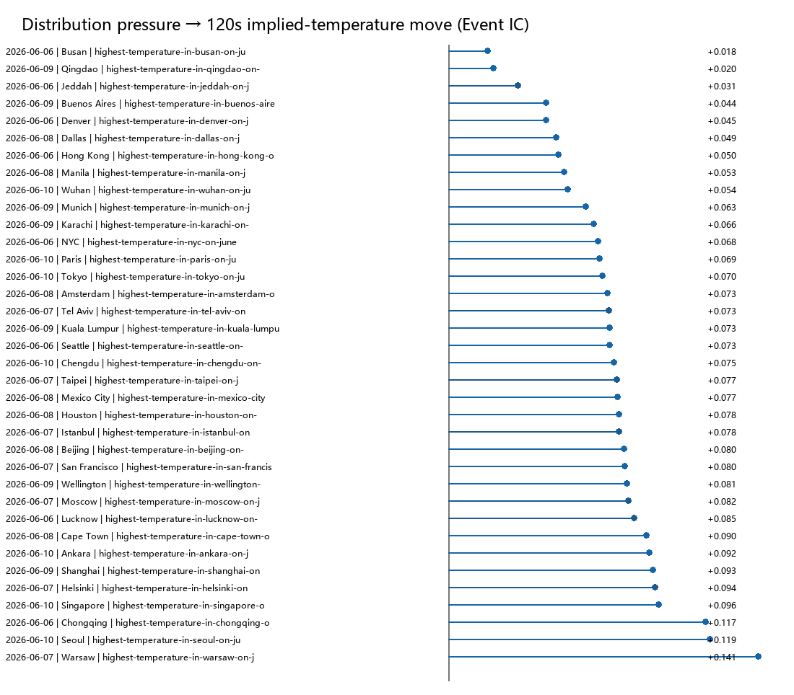
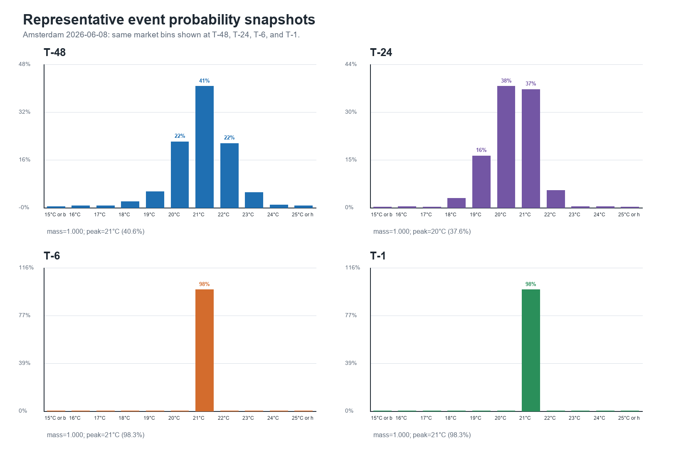

# 20260716 - Polymarket PMXT 天气因子与市场结构研究进展

> 本轮完成的是数据建设、因子研究和市场结构验证，不是 PnL 回测。文中的 crossing markout 是跨价后的价格变化诊断，不等于实际成交收益。

## TLDR

1. PMXT 天气数据已经进入统一研究链路。因子研究和 Nautilus 数据转换消费同一份 Event 数据、同一套排序规则，不再各自解释数据顺序。
2. 从 169 个连续 hourly Parquet 中整理出 227 个完整生命周期的最高气温 Event：覆盖 5 个日期、49 个城市、2,497 个二元 Market、4,994 个 token，共 707,045,334 行；missing hour 和 bad file 均为 0。
3. 单 token 盘口压力对未来价格方向存在稳定信息。36 Event 中，`depth_imbalance_1` 在 30s / 120s / 600s 的 median IC 为 0.069 / 0.084 / 0.104，positive Event 均为 100%。
4. 方向信息尚不能直接交易：对应 crossing markout 为 -0.0090 / -0.0086 / -0.0083，说明信号幅度不足以覆盖当下 bid-ask spread，更不能据此宣称 taker Alpha。
5. 单 token 研究进一步暴露出三个结构问题：交易活跃度随生命周期变化；一个 Event 中只有少数温度 Outcome 活跃；多个 Outcome 共同组成一条概率分布，Event 才是更完整的研究单位。
6. Event-level 的 distribution pressure 是目前更值得继续研究的内部结构信号：36 个 Event 的 IC 全部为正，中位数 0.074，90% bootstrap CI 为 [0.070, 0.079]，5 组 leave-one-date-out 均保持正向。
7. 当前结论是“存在稳定但较弱的市场内生结构信号”，不是“已经找到可交易 Alpha”。优先方向应是 Event 内概率质量迁移、相对价值和被动执行，而不是立刻扩大样本或进入正式策略回测。

## 1. 先把数据变成可研究、可回放的 Event

### 1.1 PMXT hourly 是文件分区，不是每小时一个快照

PMXT 数据按小时落成 Parquet 文件。这里的“hourly”表示文件分区频率，文件内部仍然保留逐行的：

- `book`；
- `price_change`；
- `last_trade_price`；
- `tick_size_change`；
- source timestamp、receive timestamp 和原始物理行序。

因此它可以用于订单簿重放和因子计算，但不能把“文件按小时切分”误解为“每小时只有一张盘口快照”。

同时，PMXT 也不是交易所撮合级审计数据。对照 PolyReaper 的抓取记录、PMXT 社区说明和真实文件后，当前采用的信任边界是：

- source timestamp 用于重建 research replay 顺序；
- timestamp received、原始行序和 tie 情况保留用于审计；
- 不把 source timestamp 宣称为交易所真实到达顺序；
- 不静默补齐缺失小时、坏文件或无法解释的状态转换。

### 1.2 从 hourly 文件摘出完整 Event

源数据连续范围为 `2026-06-04 00:00 UTC` 至 `2026-06-11 01:00 UTC`（右开），共 169 个连续小时文件。天气数据整理过程为：

```text
PMXT hourly Parquet
  → Gamma Event / Market metadata
  → conditionId 匹配
  → 收集 Event 下全部 Market 和 YES/NO token
  → 按完整 Event 生命周期裁剪
  → Event-level Parquet + manifest
```

这里不能只按 Event 页面上的开始、结束时间机械裁剪。Polymarket 的层级关系是：

```text
Event：展示和组织层
  └── Market：condition、YES/NO token、独立 CLOB 订单簿
```

当前数据合同分别保存四个时间概念：

| 时间 | 定义 | 用途 |
| --- | --- | --- |
| capture start | `min(all market.createdAt)` | 完整归档起点 |
| trading start | `min(all market.acceptingOrdersTimestamp)` | 交易研究起点 |
| scheduled end | `max(all market.endDate)` | 规则上的预定截止，只保存、不裁剪盘口 |
| capture end | `max(event.closedTime, all market.closedTime, all market.umaEndDate)` | 正式 Event Parquet 的归档终点 |

最终提取区间为 `[captureStartAt, captureEndAt]`。关闭后一小时只做迟到消息诊断，不写入正式 Event Parquet。

### 1.3 为什么生命周期要这样定义

上海 6 月 6 日 Event 提供了一个完整例子：

- 11 个 Market 在约 1.3 秒内创建，但开始接单分布在约 35 秒内；
- Event `creationDate` 比其下 Market 开始活动晚约 14 分钟；
- Event `creationDate` 之前已经存在 2,275 行 PMXT 消息；
- 没有发现 PMXT 消息早于对应 Market 的 `createdAt` 或 `acceptingOrdersTimestamp`；
- `market.endDate` 为北京时间 20:00，而 `event.closedTime` 为次日 00:43；
- 两者之间仍有 140,664 行消息，包括 40 条 `last_trade_price` 更新。

因此：从 Event `creationDate` 开始会漏掉早期盘口；按 `market.endDate` 结束会漏掉约 4 小时 44 分钟的数据。生命周期必须从 Market 层构建，而不能只相信 Event 页面字段。

### 1.4 最终数据规模

| 项目 | 结果 |
| --- | ---: |
| 完整生命周期 Event | 227 |
| 日期 | 5（6/6—6/10） |
| 城市 | 49 |
| 二元 Market | 2,497 |
| Outcome token | 4,994 |
| Rows | 707,045,334 |
| 单 Event rows 中位数 | 3,047,589 |
| Missing hour | 0 |
| Bad file | 0 |

实验产物中曾沿用 `clean/degraded` 字段名。后者实际只表示 7 个样本 Event 在 `captureEndAt` 后的诊断窗口观察到消息，不代表缺文件、坏文件或生命周期覆盖不完整。本报告不把它作为数据质量分组。

### 1.5 数据整理过程中发现的真实边界

| 问题 | 现象 | 当前处理 |
| --- | --- | --- |
| Event 创建晚于 Market 活动 | Event metadata 晚于下属 Market 的实际活动 | 从最早 Market 创建时间归档 |
| `endDate` 早于盘口停止 | 上海在 `endDate` 后仍有 140,664 行消息 | 不用 `endDate` 截断正式数据 |
| capture end 后仍有消息 | 227 个 Event 中，39 个在后一小时出现 9,500 行消息 | 只进入 closure diagnostic，不写入正式 Parquet |
| 短间隔重复 tick 通知 | 23 个 token 在 0—8ms 内重复收到 `0.01 → 0.001` | 仅对同 token、同目标状态且间隔不超过 10ms 的重复告警并按幂等处理 |
| 长间隔重复 tick 通知 | Wuhan 在约 325.489 秒后再次收到同类转换 | 继续严格失败，不套用短重复规则 |
| tick 转换事件缺失 | Beijing 的 YES/NO 在约 19 小时内使用 0.001 网格，但数据中没有 `tick_size_change` | 保留严格失败，只把盘口精度作为诊断证据，不反推官方事件 |

这些问题不是靠 `sort` 或填默认值消失的。它们分别进入 manifest、health gate、warning 或 fail-closed 路径，并由测试锁定。

## 2. 因子和 Nautilus 使用同一条 replay contract

```text
Event-level PMXT 数据
  → PMXTEventV1Adapter
  → PolymarketL2DatasetV1
  → 统一 replay clock / 排序 / health gate
      ├── 因子研究和 Event-level 统计
      └── Nautilus native bridge
          → OrderBookDeltas / TradeTick / InstrumentClose
          → BacktestEngine
```

这次统一解决的是：

- 因子和回测不再各自重排 PMXT；
- source-time 相同的记录使用 timestamp received 和原始行序做稳定 tie-break；
- research replay 和 strict capture 使用不同但显式的时钟合同；
- 每次运行保存 replay mode、clock、排序键、数据路径和输入 hash；
- 盘口、成交、tick size 和 settlement 都通过同一个 adapter 进入后续流程。

当前已执行 4 Event × YES/NO 共 8 条 native 检查：6 条完成转换，且 direct replay 与 native 输出各自保持时间单调；Beijing YES/NO 两条因缺失 tick transition 严格失败。这个检查只能称为 **ordering / convertibility smoke**，尚未逐事件比较 book action、价格、数量、TradeTick、逐步 BBO/深度和最终订单簿状态，因此不能称为完整语义 parity，也不作为正式策略回测的放行条件。

## 3. 第一阶段：当前盘口能否预测未来价格方向

### 3.1 问题和方法

第一步先回答一个窄问题：当前买卖盘的力量差异，是否与固定时间后的中间价变化同方向？

主要候选包括：

- `depth_imbalance_1`：最优一档的买卖深度不平衡；
- `depth_imbalance_3`：前三档深度不平衡；
- `microprice_minus_mid`：微价格相对中间价的偏移；
- `bid_ask_liquidity_asymmetry`：买卖侧流动性不对称。

当前固定时间 label 为：

```text
label_h = mid(t + h) - mid(t)
```

使用 30s、120s、600s 等 horizon，并通过 forward as-of 寻找目标时间之后第一条有效盘口，不使用未来信息参与当前特征。

这个 label 只用于建立方向性 baseline，存在两个解释边界：

1. 天气市场更新不均匀。同样是 120 秒，活跃时可能发生大量更新，冷清时可能完全不变；zero rate 因此反映的不只是“没有信息”，也反映市场没有更新。
2. Polymarket 价格是 `[0,1]` 上的概率。当前使用绝对 mid change，0.04、0.50、0.96 附近的同等变化不具有完全相同的经济含义。因此跨价格区间比较 IC 时需要保守解释。

### 3.2 结果

6 Event 小样本用于确认数据、因子和 label 流程能够工作；随后用 36 Event、36 个城市、5 个日期检查方向是否稳定。Token baseline 取每个温度 Market 的 YES token；NO token 是同一二元 Market 的互补合约，不在这张 baseline 中重复计入。核心结果如下：

- **IC**：因子排序与未来价格变化排序的一致程度，越高说明方向预测越稳定；
- **Zero rate**：固定 horizon 后价格没有变化的样本比例，越高说明 label 的有效信息越稀；
- **Crossing**：按信号立即跨过 spread 后的 markout，负数表示方向判断即使正确，也不足以覆盖当下买卖价差。

| Factor | Horizon | Event | Median IC | Positive Event | Zero rate | Crossing | Coverage |
| --- | ---: | ---: | ---: | ---: | ---: | ---: | ---: |
| depth_imbalance_1 | 30s | 36 | 0.069 | 1.000 | 0.784 | -0.0090 | 0.998 |
| depth_imbalance_1 | 120s | 36 | 0.084 | 1.000 | 0.691 | -0.0086 | 0.996 |
| depth_imbalance_1 | 600s | 36 | 0.104 | 1.000 | 0.552 | -0.0083 | 0.986 |
| microprice_minus_mid | 30s | 36 | 0.061 | 0.972 | 0.784 | -0.0090 | 0.998 |
| microprice_minus_mid | 120s | 36 | 0.068 | 1.000 | 0.691 | -0.0086 | 0.996 |

盘口压力对未来 mid 的排序方向稳定，且 horizon 增加后 zero rate 下降。但所有 crossing 都为负：看到正信号后直接跨 ask 买入，或看到负信号后直接打 bid 卖出，未来价格变化不足以覆盖当前 spread。

因此，单 token 盘口因子目前应被当作 Event 内部的局部状态特征，而不是独立的 taker 策略。

## 4. 单 token 研究暴露出的三个结构问题

### 4.1 生命周期不均匀

天气 Event 通常持续数天，但信息、盘口更新和成交并不均匀到达。固定时间 label 在早期、主要价格发现阶段和接近规则截止时，代表的市场状态不同，不能简单混成同一种样本。

### 4.2 Outcome 活跃度不均匀

一个最高气温 Event 通常包含约 11 个温度 Outcome，但交易主要集中在当前概率中心附近的 2—3 个 Market。其余 Outcome 可能长期 stale 或几乎没有有效双边盘口。把所有 Outcome 无差别混合，会稀释信号并放大 zero rate。

### 4.3 Event 才是完整研究单位

这些 Outcome 不是互不相关的 11 个标的，而是共同描述同一个温度结果的概率分布。一个 Outcome 的概率上升，意味着概率质量需要从其他 Outcome 转移。单 token 研究只能看到局部盘口，Event-level 研究才能看到整条分布如何移动、集中和重新定价。

这三个问题共同说明：token-level 证据不足以描述天气市场的完整结构。因此第二阶段没有继续堆单 token 因子，而是把研究单位提升到 Event，转向 36 Event 的 lifecycle、active set 和 probability distribution 分析。

## 5. 第二阶段：36 Event 的结构验证

### 5.1 Lifecycle

活动和信号主要集中在距规则截止 6—24h 的分桶：该窗口的 updates、trades 和 120s IC 较高；进入 1—6h 后，数据中的盘口 mutation 和有效 label 明显减少。

这里的锚点是 Gamma Event metadata 的 `event_index.endDate`，即规则上的预定截止时间，不是 `captureEndAt`、实际最后盘口时间或结算时间。Event-level activity grid 也在该时间截断。因此以下结果只能写成“距规则截止时间”，不能写成“距结算”或“距订单簿关闭”。

| 距规则截止时间 | Event | Updates/min | Trades/min | Active markets | Spread | 120s IC | Zero | Crossing | Coverage |
| --- | ---: | ---: | ---: | ---: | ---: | ---: | ---: | ---: | ---: |
| >24h | 36 | 365.43 | 0.12 | 4.88 | 0.0080 | 0.080 | 0.734 | -0.0076 | 0.999 |
| 6—24h | 36 | 597.22 | 0.43 | 4.74 | 0.0030 | 0.099 | 0.636 | -0.0105 | 0.990 |
| 1—6h | 35 | 0.11 | 0.04 | 3.10 | 0.0010 | 0.065 | 0.962 | -0.0009 | 0.822 |
| <1h | 21 | 0.00 | 0.05 | 3.00 | 0.0010 | N/A | N/A | N/A | 0.000 |



> 图 1：按规则截止时间分桶后，6—24h 的盘口更新、成交和 120s IC 较高；进入 1—6h 后，数据中的盘口 mutation 明显下降。该图描述的是 metadata endDate 周围的市场结构，不等同于实际结算生命周期。

### 5.2 Dynamic active set

Dynamic active set 只使用当时和过去信息：Market 需要有有效 BBO，并满足当前概率 Top3、过去 30 分钟有成交、或过去 30 分钟 mutation count 排名前三之一。

| Scope | Event | IC | Zero | Crossing | Top3 updates | Top3 trades | Top3 probability mass |
| --- | ---: | ---: | ---: | ---: | ---: | ---: | ---: |
| all_market | 36 | 0.053 | 0.855 | -0.0064 | 0.489 | 0.722 | 0.875 |
| dynamic_active | 36 | 0.083 | 0.741 | -0.0115 | 0.686 | 0.722 | 0.944 |



> 图 2：只看活跃 Outcome 后，IC 提高、zero rate 下降，但 crossing 更负。筛选提高了统计信号浓度，没有提高跨价执行价值。

所以 active set 暂时适合作为 regime 或状态特征，不适合作为直接交易 gate。

### 5.3 Event probability distribution

Event-level 分析先把各温度 Outcome 的 mid 归一化成一条概率分布，再计算这条分布对应的“市场隐含平均温度”。`Distribution pressure` 表示各 Outcome 的盘口压力合并后，整体更倾向把概率推向较高还是较低温度；这里检验它是否与 120 秒后的隐含平均温度同方向。

| 指标 | 结果 |
| --- | ---: |
| Median Event IC | 0.074 |
| Positive Event | 36 / 36 |
| Event bootstrap 90% CI | [0.070, 0.079] |
| Leave-one-date-out | 5 / 5 保持正向 |



> 图 3：36 个 Event 的 distribution pressure IC 全部为正。图中统一使用同一种颜色，不再沿用容易被误解为数据质量分层的实验字段。



> 图 4：T-48 / T-24 / T-6 / T-1 同样相对 Gamma `event_index.endDate`。一个 Event 内，概率质量集中在少数相邻温度 Outcome，并随市场信息整体迁移。这也是 Event-level 表达比孤立 token 更自然的原因。

Bootstrap 区间用于检查对 Event 抽样是否敏感；leave-one-date-out 则每次剔除一个日期，检查结论是否依赖某一天。这两项都保持正向，说明 distribution pressure 不是由单个城市或单个日期偶然贡献。但其量级较弱，而且尚未证明能够覆盖 spread、fee 和执行摩擦，因此当前只能称为“跨日期稳定的弱结构信号”。

### 5.4 概率和异常尾部

如果直接把所有 Outcome 的 mid 相加，原始 snapshot 中存在明显异常；逐步控制完整性、报价新鲜度、spread 和 source-time 同步后，尾部大幅收敛：

| 口径 | Snapshots | Event | P95 `|sum(mid)-1|` | `>0.10` | Max |
| --- | ---: | ---: | ---: | ---: | ---: |
| Raw | 109,767 | 36 | 0.097 | 4.7% | 4.370 |
| Outcomes complete | 101,379 | 34 | 0.086 | 3.6% | 4.370 |
| Complete + fresh | 30,481 | 34 | 0.086 | 3.1% | 4.370 |
| Strict synchronized sample | 25,898 | 34 | 0.080 | 1.8% | 0.249 |

完整性和新鲜度过滤降低了异常比例与 P95，但没有消除最大的极端值；加入 spread 和时间同步约束后，最大值才从 4.370 降到 0.249。结论是：多数极端概率和偏离来自 Outcome 不完整、陈旧报价、宽 spread 或不同步状态，不应直接叫套利。严格样本仍有少量残余偏离，后续只能逐 Event 核对报价语义和可执行容量。

## 6. 当前能够下的结论

### 已确认

1. PMXT 天气数据能够通过统一 adapter 同时服务因子研究和 Nautilus native 数据转换。
2. 单 token 盘口压力对未来 mid 方向存在稳定但较弱的预测信息。
3. 生命周期和 Outcome 活跃度显著改变样本的信息密度，天气 Event 不能按均匀时间序列处理。
4. Event distribution pressure 在 36 Event 和 5 个日期上保持正向，是比孤立 token 更自然的研究表达。
5. 直接 crossing 全部为负，当前结果不支持简单 taker 策略。

### 尚未确认

1. 方向信息能否通过 passive maker、相对价值或组合执行转成可实现收益。
2. 当前 absolute mid-change label 在不同概率区间是否具有完全一致的经济含义。
3. PMXT direct replay 与 Nautilus native bridge 的逐事件完整语义一致性。
4. tick-size 缺失和长间隔冲突的上游成因，以及是否存在可审计的恢复来源。
5. 概率和残余偏离在加入 BBO size、fee、延迟和多腿成交约束后是否仍存在。

## 7. 下一步研究抓手

### 7.1 优先研究市场内部结构

现阶段不优先把路线收窄为天气数据源预测，而是先研究 Polymarket 自身可迁移的内生市场 Alpha：

- **Event 内概率质量迁移**：研究整条 Outcome 分布向哪个方向移动；
- **Event 内相对价值**：识别 stale Outcome、局部断层和相邻 Outcome 定价不一致；
- **盘口压力与被动执行**：方向信息不够跨 spread，但可能适合 maker 定价、挂单偏置和撤单控制；
- **Activity / lifecycle regime**：把活跃度和生命周期作为模型状态，而不是简单删除冷清样本。

天气 Event 是第一个结构清晰、Outcome 完备的验证场景，但上述方法不依赖天气基本面，后续可以迁移到选举、宏观、体育等多 Outcome Event。

### 7.2 暂时后置

- 外部天气预报与 Polymarket 的跨源基本面预测；
- 大规模跨 Event 联动；
- 在信号机制和执行路径确认前扩大到 100 Event；
- 在完整 native semantic parity 和执行语义明确前进入正式策略回测。

### 7.3 建议会上讨论的三个决策

基于“方向存在、跨价为负、Event-level 表达更稳定”这三项结果，下一阶段需要确定研究单位和执行路线：

1. 下一阶段是否将主研究单位从单 token 正式提升为 Event distribution；
2. 是否优先验证 passive maker / relative-value，而不是继续优化 taker crossing；
3. lifecycle 与 activity 是作为统一模型的状态变量，还是拆成独立 regime 分别建模。

## 8. 对外口径

可以说：

> 已经完成 PMXT 天气 Event 数据建设，并统一了因子研究与 Nautilus 数据转换的 replay 顺序。盘口不平衡和 Event-level distribution pressure 对未来价格方向存在跨城市、跨日期的稳定弱信号，但直接跨价执行仍为负，因此下一阶段重点是 Event 内部结构与被动执行，而不是宣称已有可交易 Alpha。

不应说：

- 已经找到稳定盈利策略；
- 概率和偏离就是套利；
- PMXT 等价于撮合级历史数据；
- ordering / convertibility smoke 已证明完整 native parity；
- 6—24h 是“结算前”窗口。

## 9. 结果和审计材料

- 完整实验总览：`polymarket/research/2026-07-15-pmxt-weather-next-stage-experiments-rebuild/README.md`
- 6 Event 因子与 label 报告：`report/pilot_report.md`
- 36 Event 汇总：`event_level/reports/event_level_summary.md`
- Bootstrap、日期留一和概率和尾部：`event_level/reports/cached_supplement_report.md`
- Native smoke 原始结果：`compact/pilot_6_event/direct_native_parity.json`
- Beijing tick transition 诊断：`report/beijing-missing-tick-size-transition.md`
- Event 生命周期标准：`C:\Projects\PolyReaper\docs\development\reference\polymarket-weather-event-lifecycle.md`
- Weather 数据质量登记：`C:\Projects\PolyReaper\docs\development\domains\weather\data-quality-findings.md`
