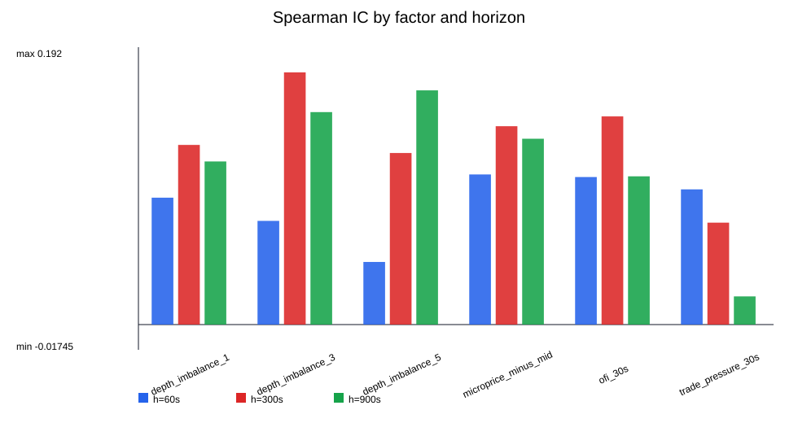
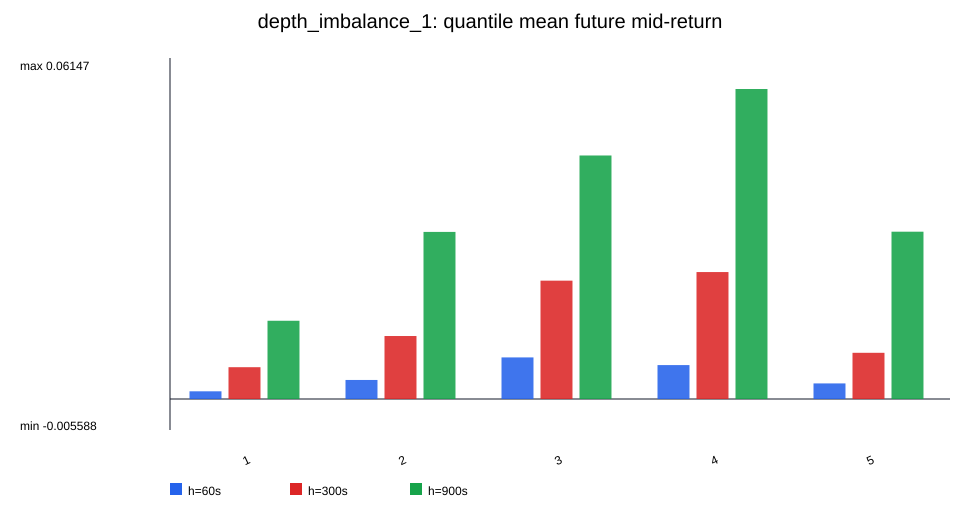
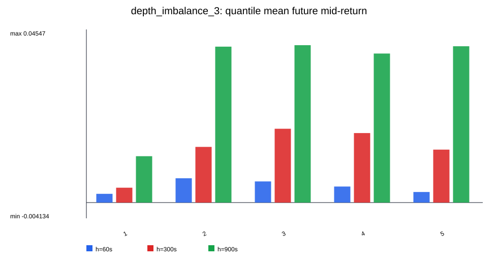
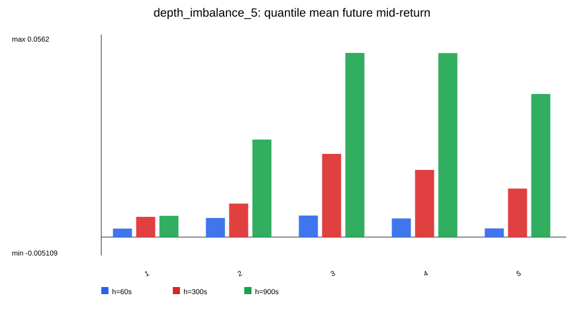
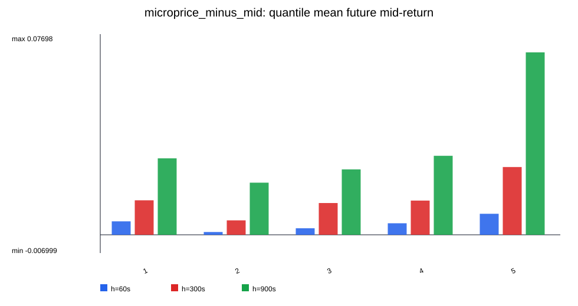

# PMXT L2 Imbalance 因子研究报告

生成时间: 2026-07-09T07:23:49.961374+00:00

## 0. 结论先行

这是一份探索性盘口因子研究，不是 Nautilus 成交回测，也不是 PnL 报告。
PMXT 数据在这里按 `timestamp_received` 做 receive-time replay；source timestamp 的问题只作为数据质量风险暴露。

本轮研究关注：depth imbalance / microprice deviation / OFI 与未来 mid-return 的统计关系。

- 最强 top-bottom 分层差：`trade_pressure_30s` @ 900s，top-bottom mean future mid-return = `0.080733`。
- 最大 |Spearman IC|：`depth_imbalance_3` @ 300s，IC = `0.174504`。
- 注意：样本里 future return 的零值比例很高，均值差不能直接解释为可交易收益。
- 下一步应该做跨 event 复验、手续费/滑点前的纯信号稳定性筛选，然后再决定是否进入 Nautilus 策略回测。

## 1. 信任边界

- data_tier: `TIER1_EXPLORATORY`
- replay_clock: `timestamp_received`
- execution_claims_allowed: `false`
- not_for_pnl: `true`
- 不计算 fee/fill/queue/cash/position/PnL。
- 不把 future mid-return 当成可成交收益。

## 2. 输入和过滤

- panel: `C:\Projects\nautilus_trader\polymarket\research\2026-07-08-pmxt-l2-factor-baseline\outputs\factor_panel.parquet`
- rows_loaded: 334501
- current_valid_rows: 329121

| metric | value |
| --- | --- |
| rows_total | 334501 |
| current_valid_rows | 329121 |
| current_valid_share | 0.983916 |
| book_validity.valid | 329121 |
| book_validity.locked | 2962 |
| book_validity.crossed | 2100 |
| book_validity.missing | 318 |
| h60.current_and_future_valid_rows | 324860 |
| h60.label_coverage_on_current_valid | 0.987053 |
| h300.current_and_future_valid_rows | 324797 |
| h300.label_coverage_on_current_valid | 0.986862 |
| h900.current_and_future_valid_rows | 325288 |
| h900.label_coverage_on_current_valid | 0.988354 |

## 3. 图

## 4. Top-bottom 分层最强组合

| factor | horizon_seconds | count | factor_mean | factor_std | future_mid_return_mean | future_mid_return_std | pearson_corr | spearman_corr | ols_slope_ret_per_factor_unit | bottom_quantile_mean_return | top_quantile_mean_return | top_minus_bottom_mean_return | positive_return_share | zero_return_share |
| --- | --- | --- | --- | --- | --- | --- | --- | --- | --- | --- | --- | --- | --- | --- |
| trade_pressure_30s | 900 | 325288 | 5.22349 | 45.0751 | 0.034936 | 0.134296 | 0.0182815 | 0.0195045 | 5.44674e-05 | 0.0244373 | 0.10517 | 0.0807331 | 0.474263 | 0.217392 |
| trade_pressure_30s | 300 | 324797 | 5.35999 | 44.4214 | 0.014015 | 0.0708407 | 0.0802116 | 0.0705348 | 0.000127917 | 0.00783143 | 0.0549934 | 0.047162 | 0.378399 | 0.338993 |
| microprice_minus_mid | 900 | 325288 | 0.00120872 | 0.0142441 | 0.034936 | 0.134296 | 0.0439457 | 0.128605 | 0.414326 | 0.0293306 | 0.0699851 | 0.0406545 | 0.474263 | 0.217392 |
| ofi_30s | 300 | 324797 | 101.157 | 484.885 | 0.014015 | 0.0708407 | 0.132024 | 0.144049 | 1.92884e-05 | 0.0136299 | 0.0520197 | 0.0383898 | 0.378399 | 0.338993 |
| depth_imbalance_5 | 900 | 325288 | 0.0914579 | 0.408781 | 0.034936 | 0.134296 | 0.098823 | 0.162081 | 0.032466 | 0.00589402 | 0.0396903 | 0.0337963 | 0.474263 | 0.217392 |
| depth_imbalance_3 | 900 | 325288 | 0.0746722 | 0.423495 | 0.034936 | 0.134296 | 0.0685961 | 0.147028 | 0.0217527 | 0.0121799 | 0.0410591 | 0.0288792 | 0.474263 | 0.217392 |
| trade_pressure_30s | 60 | 324860 | 4.89842 | 44.7324 | 0.0042453 | 0.0295385 | 0.0692895 | 0.0935628 | 4.57544e-05 | 0.00173691 | 0.0214566 | 0.0197197 | 0.266001 | 0.541824 |
| depth_imbalance_1 | 900 | 325288 | 0.0760606 | 0.553092 | 0.034936 | 0.134296 | 0.060876 | 0.112889 | 0.0147812 | 0.0141046 | 0.0301601 | 0.0160555 | 0.474263 | 0.217392 |
| ofi_30s | 900 | 325288 | 100.865 | 483.821 | 0.034936 | 0.134296 | 0.0741506 | 0.102592 | 2.05822e-05 | 0.0619941 | 0.076103 | 0.0141089 | 0.474263 | 0.217392 |
| microprice_minus_mid | 300 | 324797 | 0.00111735 | 0.0142352 | 0.014015 | 0.0708407 | 0.0231022 | 0.13727 | 0.114966 | 0.0132348 | 0.0259976 | 0.0127628 | 0.378399 | 0.338993 |
| depth_imbalance_3 | 300 | 324797 | 0.073914 | 0.425399 | 0.014015 | 0.0708407 | 0.0500059 | 0.174504 | 0.00832737 | 0.00390588 | 0.0139073 | 0.0100014 | 0.378399 | 0.338993 |
| ofi_30s | 60 | 324860 | 97.662 | 480.688 | 0.0042453 | 0.0295385 | 0.18604 | 0.102093 | 1.14322e-05 | 0.00491242 | 0.014163 | 0.00925053 | 0.266001 | 0.541824 |

## 5. IC 排名

| factor | horizon_seconds | count | factor_mean | factor_std | future_mid_return_mean | future_mid_return_std | pearson_corr | spearman_corr | ols_slope_ret_per_factor_unit | bottom_quantile_mean_return | top_quantile_mean_return | top_minus_bottom_mean_return | positive_return_share | zero_return_share |
| --- | --- | --- | --- | --- | --- | --- | --- | --- | --- | --- | --- | --- | --- | --- |
| depth_imbalance_3 | 300 | 324797 | 0.073914 | 0.425399 | 0.014015 | 0.0708407 | 0.0500059 | 0.174504 | 0.00832737 | 0.00390588 | 0.0139073 | 0.0100014 | 0.378399 | 0.338993 |
| depth_imbalance_5 | 900 | 325288 | 0.0914579 | 0.408781 | 0.034936 | 0.134296 | 0.098823 | 0.162081 | 0.032466 | 0.00589402 | 0.0396903 | 0.0337963 | 0.474263 | 0.217392 |
| depth_imbalance_3 | 900 | 325288 | 0.0746722 | 0.423495 | 0.034936 | 0.134296 | 0.0685961 | 0.147028 | 0.0217527 | 0.0121799 | 0.0410591 | 0.0288792 | 0.474263 | 0.217392 |
| ofi_30s | 300 | 324797 | 101.157 | 484.885 | 0.014015 | 0.0708407 | 0.132024 | 0.144049 | 1.92884e-05 | 0.0136299 | 0.0520197 | 0.0383898 | 0.378399 | 0.338993 |
| microprice_minus_mid | 300 | 324797 | 0.00111735 | 0.0142352 | 0.014015 | 0.0708407 | 0.0231022 | 0.13727 | 0.114966 | 0.0132348 | 0.0259976 | 0.0127628 | 0.378399 | 0.338993 |
| microprice_minus_mid | 900 | 325288 | 0.00120872 | 0.0142441 | 0.034936 | 0.134296 | 0.0439457 | 0.128605 | 0.414326 | 0.0293306 | 0.0699851 | 0.0406545 | 0.474263 | 0.217392 |
| depth_imbalance_1 | 300 | 324797 | 0.0703112 | 0.553867 | 0.014015 | 0.0708407 | 0.0410003 | 0.124319 | 0.00524402 | 0.00573334 | 0.00832911 | 0.00259577 | 0.378399 | 0.338993 |
| depth_imbalance_5 | 300 | 324797 | 0.091924 | 0.410625 | 0.014015 | 0.0708407 | 0.0543644 | 0.118725 | 0.00937889 | 0.00562053 | 0.0134552 | 0.00783462 | 0.378399 | 0.338993 |
| depth_imbalance_1 | 900 | 325288 | 0.0760606 | 0.553092 | 0.034936 | 0.134296 | 0.060876 | 0.112889 | 0.0147812 | 0.0141046 | 0.0301601 | 0.0160555 | 0.474263 | 0.217392 |
| microprice_minus_mid | 60 | 324860 | 0.00112175 | 0.0142182 | 0.0042453 | 0.0295385 | -0.0105144 | 0.103898 | -0.0218438 | 0.00515916 | 0.00806293 | 0.00290377 | 0.266001 | 0.541824 |
| ofi_30s | 900 | 325288 | 100.865 | 483.821 | 0.034936 | 0.134296 | 0.0741506 | 0.102592 | 2.05822e-05 | 0.0619941 | 0.076103 | 0.0141089 | 0.474263 | 0.217392 |
| ofi_30s | 60 | 324860 | 97.662 | 480.688 | 0.0042453 | 0.0295385 | 0.18604 | 0.102093 | 1.14322e-05 | 0.00491242 | 0.014163 | 0.00925053 | 0.266001 | 0.541824 |

## 6. Quantile return 明细预览

| factor | horizon_seconds | quantile | count | mean_future_mid_return | median_future_mid_return | positive_return_share | zero_return_share |
| --- | --- | --- | --- | --- | --- | --- | --- |
| depth_imbalance_1 | 60 | 1 | 65472 | 0.00138665 | 0 | 0.254628 | 0.447382 |
| depth_imbalance_1 | 60 | 2 | 64496 | 0.003432 | 0 | 0.256171 | 0.53377 |
| depth_imbalance_1 | 60 | 3 | 65207 | 0.00749683 | 0 | 0.322159 | 0.469597 |
| depth_imbalance_1 | 60 | 4 | 64720 | 0.00611316 | 0 | 0.279604 | 0.562747 |
| depth_imbalance_1 | 60 | 5 | 64965 | 0.0028092 | 0 | 0.217302 | 0.696652 |
| depth_imbalance_1 | 300 | 1 | 65106 | 0.00573334 | 0 | 0.367585 | 0.203161 |
| depth_imbalance_1 | 300 | 2 | 64830 | 0.0113551 | 0 | 0.345288 | 0.31834 |
| depth_imbalance_1 | 300 | 3 | 64977 | 0.0213337 | 0 | 0.412869 | 0.284408 |
| depth_imbalance_1 | 300 | 4 | 66960 | 0.0228836 | 0 | 0.395281 | 0.388187 |
| depth_imbalance_1 | 300 | 5 | 62924 | 0.00832911 | 0 | 0.370145 | 0.504831 |
| depth_imbalance_1 | 900 | 1 | 65132 | 0.0141046 | 0 | 0.446985 | 0.100749 |
| depth_imbalance_1 | 900 | 2 | 65196 | 0.0301222 | 0 | 0.421544 | 0.192527 |
| depth_imbalance_1 | 900 | 3 | 64917 | 0.0438976 | 0.0015 | 0.518323 | 0.17735 |
| depth_imbalance_1 | 900 | 4 | 66471 | 0.0558847 | 0 | 0.46494 | 0.297333 |
| depth_imbalance_1 | 900 | 5 | 63572 | 0.0301601 | 0.005 | 0.521031 | 0.3197 |
| depth_imbalance_3 | 60 | 1 | 64972 | 0.00229518 | 0 | 0.297066 | 0.388521 |
| depth_imbalance_3 | 60 | 2 | 65191 | 0.00638366 | 0 | 0.286757 | 0.501787 |
| depth_imbalance_3 | 60 | 3 | 64753 | 0.00555497 | 0 | 0.222955 | 0.616311 |
| depth_imbalance_3 | 60 | 4 | 64993 | 0.00421193 | 0 | 0.223039 | 0.633284 |
| depth_imbalance_3 | 60 | 5 | 64951 | 0.00277748 | 0 | 0.299995 | 0.569583 |
| depth_imbalance_3 | 300 | 1 | 64966 | 0.00390588 | 0 | 0.379106 | 0.16758 |
| depth_imbalance_3 | 300 | 2 | 65010 | 0.0146212 | 0 | 0.340978 | 0.311521 |
| depth_imbalance_3 | 300 | 3 | 65091 | 0.0193881 | 0 | 0.310243 | 0.422255 |
| depth_imbalance_3 | 300 | 4 | 64770 | 0.0182544 | 0 | 0.35203 | 0.422402 |
| depth_imbalance_3 | 300 | 5 | 64960 | 0.0139073 | 0.002 | 0.509729 | 0.371321 |
| depth_imbalance_3 | 900 | 1 | 65060 | 0.0121799 | 0 | 0.4832 | 0.102352 |
| depth_imbalance_3 | 900 | 2 | 65055 | 0.0409562 | 0 | 0.427423 | 0.18821 |
| depth_imbalance_3 | 900 | 3 | 65061 | 0.041339 | 0 | 0.394568 | 0.283242 |
| depth_imbalance_3 | 900 | 4 | 65058 | 0.0391469 | 0 | 0.435242 | 0.273894 |
| depth_imbalance_3 | 900 | 5 | 65054 | 0.0410591 | 0.005 | 0.630891 | 0.239263 |
| depth_imbalance_5 | 60 | 1 | 64973 | 0.00235793 | 0 | 0.327274 | 0.376695 |
| depth_imbalance_5 | 60 | 2 | 64977 | 0.00529978 | 0 | 0.277991 | 0.51075 |
| depth_imbalance_5 | 60 | 3 | 64973 | 0.00597693 | 0 | 0.232527 | 0.608653 |
| depth_imbalance_5 | 60 | 4 | 65062 | 0.00517738 | 0 | 0.217546 | 0.635917 |
| depth_imbalance_5 | 60 | 5 | 64875 | 0.00241036 | 0 | 0.274744 | 0.577033 |
| depth_imbalance_5 | 300 | 1 | 64965 | 0.00562053 | 0 | 0.425491 | 0.174879 |
| depth_imbalance_5 | 300 | 2 | 64961 | 0.00929284 | 0 | 0.36351 | 0.274796 |
| depth_imbalance_5 | 300 | 3 | 64982 | 0.0230753 | 0 | 0.338925 | 0.378782 |
| depth_imbalance_5 | 300 | 4 | 64936 | 0.0186303 | 0 | 0.319068 | 0.462286 |
| depth_imbalance_5 | 300 | 5 | 64953 | 0.0134552 | 0 | 0.444999 | 0.404277 |
| depth_imbalance_5 | 900 | 1 | 65100 | 0.00589402 | 0.0015 | 0.536252 | 0.10255 |
| depth_imbalance_5 | 900 | 2 | 65218 | 0.0270519 | 0 | 0.39394 | 0.119001 |
| depth_imbalance_5 | 900 | 3 | 64862 | 0.0510889 | 0 | 0.388856 | 0.261108 |
| depth_imbalance_5 | 900 | 4 | 65167 | 0.0510233 | 0 | 0.46166 | 0.304203 |
| depth_imbalance_5 | 900 | 5 | 64941 | 0.0396903 | 0.005 | 0.590736 | 0.30055 |
| microprice_minus_mid | 60 | 1 | 65066 | 0.00515916 | 0 | 0.333999 | 0.377847 |
| microprice_minus_mid | 60 | 2 | 64946 | 0.00106833 | 0 | 0.185693 | 0.584301 |
| microprice_minus_mid | 60 | 3 | 64943 | 0.00251166 | 0 | 0.230648 | 0.586653 |
| microprice_minus_mid | 60 | 4 | 64949 | 0.00442203 | 0 | 0.248934 | 0.621226 |
| microprice_minus_mid | 60 | 5 | 64956 | 0.00806293 | 0 | 0.330593 | 0.539396 |
| microprice_minus_mid | 300 | 1 | 65104 | 0.0132348 | 0 | 0.443122 | 0.159529 |
| microprice_minus_mid | 300 | 2 | 64885 | 0.00553974 | 0 | 0.276952 | 0.348355 |
| microprice_minus_mid | 300 | 3 | 64940 | 0.0121871 | 0 | 0.34207 | 0.378164 |
| microprice_minus_mid | 300 | 4 | 65012 | 0.0131268 | 0 | 0.349812 | 0.434704 |
| microprice_minus_mid | 300 | 5 | 64856 | 0.0259976 | 0 | 0.479956 | 0.374615 |
| microprice_minus_mid | 900 | 1 | 65142 | 0.0293306 | 0 | 0.499877 | 0.0980013 |
| microprice_minus_mid | 900 | 2 | 65204 | 0.019995 | 0 | 0.379547 | 0.174176 |
| microprice_minus_mid | 900 | 3 | 64839 | 0.0250925 | 0 | 0.426734 | 0.289872 |
| microprice_minus_mid | 900 | 4 | 65085 | 0.030308 | 0 | 0.466021 | 0.291941 |
| microprice_minus_mid | 900 | 5 | 65018 | 0.0699851 | 0.005 | 0.599234 | 0.233443 |

## 7. Spread 条件下的 top-bottom

| factor | horizon_seconds | spread_bucket | count | bottom_quantile_mean_return | top_quantile_mean_return | top_minus_bottom_mean_return |
| --- | --- | --- | --- | --- | --- | --- |
| depth_imbalance_1 | 60 | 1 | 112028 | -0.00367603 | 0.000595693 | 0.00427172 |
| depth_imbalance_1 | 60 | 2 | 106220 | 0.00031886 | 0.00106824 | 0.000749382 |
| depth_imbalance_1 | 60 | 3 | 106612 | 0.00835193 | 0.00680464 | -0.00154729 |
| depth_imbalance_1 | 300 | 1 | 112237 | -0.00171358 | 0.00535123 | 0.00706481 |
| depth_imbalance_1 | 300 | 2 | 106350 | 0.000689841 | 0.00321501 | 0.00252517 |
| depth_imbalance_1 | 300 | 3 | 106210 | 0.0192506 | 0.0198321 | 0.000581479 |
| depth_imbalance_1 | 900 | 1 | 112087 | 0.002169 | 0.01447 | 0.012301 |
| depth_imbalance_1 | 900 | 2 | 106010 | 0.0094038 | 0.010229 | 0.000825186 |
| depth_imbalance_1 | 900 | 3 | 107191 | 0.0403578 | 0.0728832 | 0.0325254 |
| depth_imbalance_3 | 60 | 1 | 112028 | -0.000688997 | -0.00104996 | -0.000360967 |
| depth_imbalance_3 | 60 | 2 | 106220 | 0.000647889 | 0.00384162 | 0.00319373 |
| depth_imbalance_3 | 60 | 3 | 106612 | 0.00552007 | 0.0049368 | -0.00058327 |
| depth_imbalance_3 | 300 | 1 | 112237 | 0.000504209 | 0.0111933 | 0.0106891 |
| depth_imbalance_3 | 300 | 2 | 106350 | -0.00172255 | 0.0142882 | 0.0160108 |
| depth_imbalance_3 | 300 | 3 | 106210 | 0.0130916 | 0.0142045 | 0.00111295 |
| depth_imbalance_3 | 900 | 1 | 112087 | 0.00953374 | 0.0218988 | 0.012365 |
| depth_imbalance_3 | 900 | 2 | 106010 | 0.0042942 | 0.0297081 | 0.0254139 |
| depth_imbalance_3 | 900 | 3 | 107191 | 0.0200016 | 0.0667428 | 0.0467412 |
| depth_imbalance_5 | 60 | 1 | 112028 | -0.00137643 | -0.0014736 | -9.7174e-05 |
| depth_imbalance_5 | 60 | 2 | 106220 | -0.000253695 | 0.00328544 | 0.00353913 |
| depth_imbalance_5 | 60 | 3 | 106612 | 0.00871873 | 0.00497383 | -0.0037449 |
| depth_imbalance_5 | 300 | 1 | 112237 | 0.0015812 | 0.0145644 | 0.0129832 |
| depth_imbalance_5 | 300 | 2 | 106350 | -0.00196744 | 0.0140139 | 0.0159813 |
| depth_imbalance_5 | 300 | 3 | 106210 | 0.0179763 | 0.0126578 | -0.00531845 |
| depth_imbalance_5 | 900 | 1 | 112087 | 0.00601304 | 0.0378145 | 0.0318014 |
| depth_imbalance_5 | 900 | 2 | 106010 | -0.00246067 | 0.0266499 | 0.0291105 |
| depth_imbalance_5 | 900 | 3 | 107191 | 0.0140913 | 0.0613208 | 0.0472295 |
| microprice_minus_mid | 60 | 1 | 112028 | -0.000426009 | 0.000816066 | 0.00124207 |
| microprice_minus_mid | 60 | 2 | 106220 | 0.000572081 | 0.00208436 | 0.00151228 |
| microprice_minus_mid | 60 | 3 | 106612 | 0.0125399 | 0.016896 | 0.00435605 |
| microprice_minus_mid | 300 | 1 | 112237 | 0.00410264 | 0.00603713 | 0.00193449 |
| microprice_minus_mid | 300 | 2 | 106350 | -1.71539e-06 | 0.00674982 | 0.00675154 |
| microprice_minus_mid | 300 | 3 | 106210 | 0.0316639 | 0.0465539 | 0.0148899 |
| microprice_minus_mid | 900 | 1 | 112087 | 0.0139896 | 0.0157639 | 0.00177428 |
| microprice_minus_mid | 900 | 2 | 106010 | 0.00677034 | 0.0168635 | 0.0100931 |
| microprice_minus_mid | 900 | 3 | 107191 | 0.0516592 | 0.10965 | 0.0579907 |
| ofi_30s | 60 | 1 | 112028 | 0.000748817 | -0.00116109 | -0.00190991 |
| ofi_30s | 60 | 2 | 106220 | 0.00329334 | 0.00676401 | 0.00347066 |
| ofi_30s | 60 | 3 | 106612 | 0.0117696 | 0.0369999 | 0.0252303 |
| ofi_30s | 300 | 1 | 112237 | 0.00498878 | 0.0222824 | 0.0172936 |
| ofi_30s | 300 | 2 | 106350 | 0.00572558 | 0.0227821 | 0.0170565 |
| ofi_30s | 300 | 3 | 106210 | 0.0343571 | 0.0987728 | 0.0644157 |
| ofi_30s | 900 | 1 | 112087 | 0.0166071 | 0.0438854 | 0.0272784 |
| ofi_30s | 900 | 2 | 106010 | 0.0352424 | 0.0324537 | -0.00278872 |
| ofi_30s | 900 | 3 | 107191 | 0.142161 | 0.13352 | -0.00864065 |
| trade_pressure_30s | 60 | 1 | 112028 | -0.00112263 | 0.00989048 | 0.0110131 |
| trade_pressure_30s | 60 | 2 | 106220 | 0.000833125 | 0.0160816 | 0.0152485 |
| trade_pressure_30s | 60 | 3 | 106612 | 0.00607455 | 0.0305952 | 0.0245206 |
| trade_pressure_30s | 300 | 1 | 112237 | 0.00245537 | 0.0349252 | 0.0324699 |
| trade_pressure_30s | 300 | 2 | 106350 | 0.00265467 | 0.0417173 | 0.0390627 |
| trade_pressure_30s | 300 | 3 | 106210 | 0.0200154 | 0.0725523 | 0.052537 |
| trade_pressure_30s | 900 | 1 | 112087 | 0.00984345 | 0.0619899 | 0.0521465 |
| trade_pressure_30s | 900 | 2 | 106010 | 0.0123666 | 0.0577651 | 0.0453986 |
| trade_pressure_30s | 900 | 3 | 107191 | 0.054861 | 0.151639 | 0.0967777 |

## 8. 上游 baseline run metadata

- run_grade: `TIER1_CAUTION_CLOCK_DISORDER`
- source_time_inversion_count: `89057`
- source_delay_over_threshold_count: `177530`
- book_validity_warning: `True`
