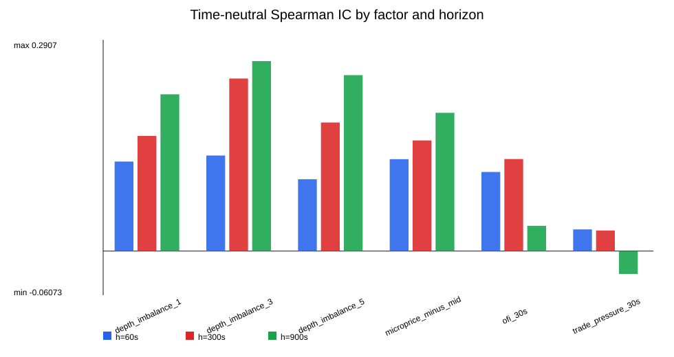
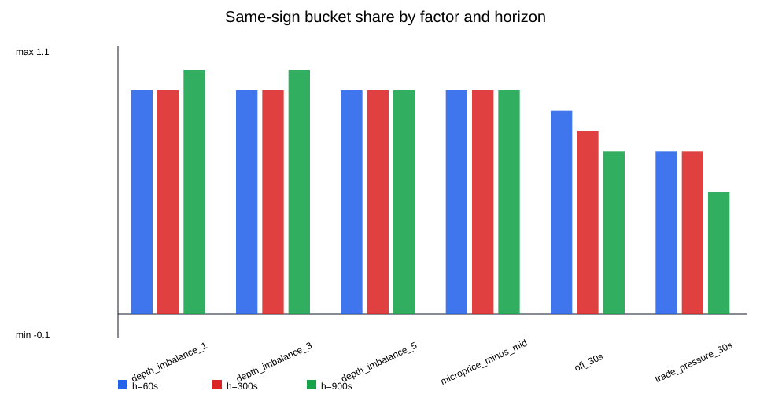
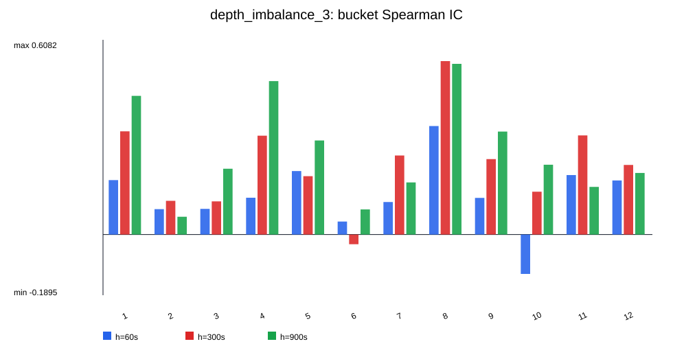
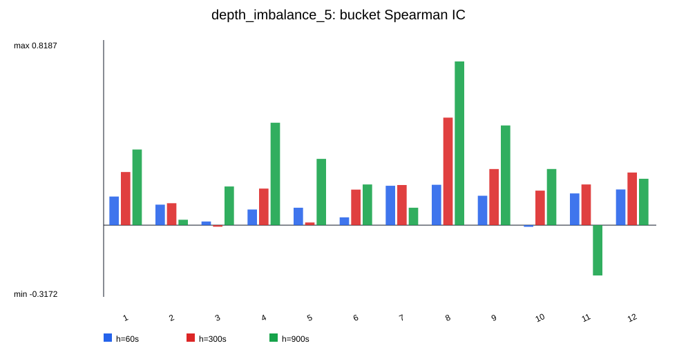
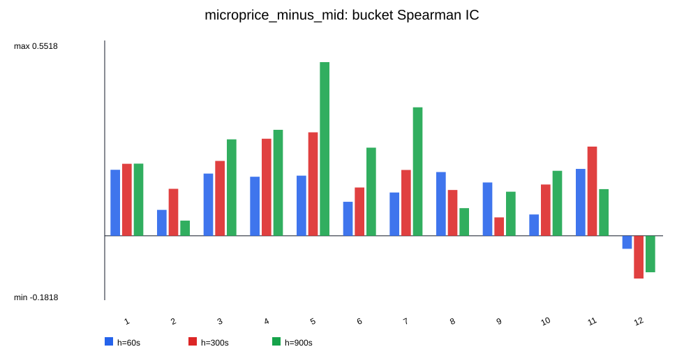
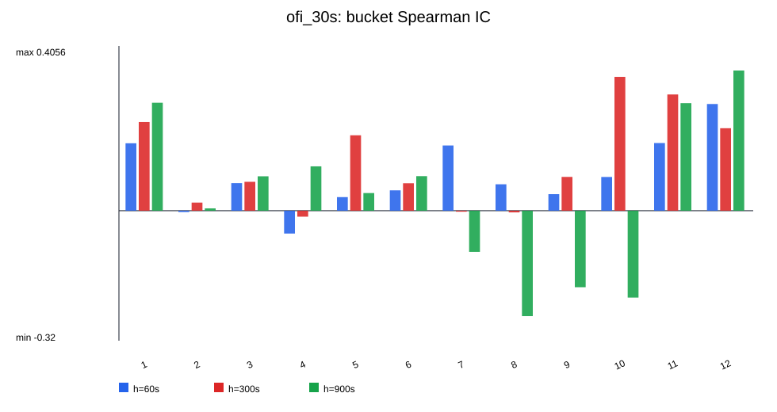

# PMXT L2 因子稳健性检查

生成时间: 2026-07-09T07:45:11.236597+00:00

## 0. 结论先行

这一步不是新增策略，而是专门检查上一份报告里偏高的 IC 是否可能只是单 event 趋势、重叠 label 或时钟结构造成。

- 可进入跨 event 复验的最强 clean book 候选: `depth_imbalance_5` @ 300s，time-neutral IC = `0.176927`，non-overlap IC = `0.137420`，非零方向命中率 = `0.576`，分层单调性 = `0.600`。
- 若只看基础统计筛选，最强组合是 `depth_imbalance_3` @ 900s，但需要结合 factor_family / horizon / spread / 时钟风险 / 分层形态降级。
- `ofi_30s` / `trade_pressure_30s` 标为 flow_clock_sensitive：在上游时钟失序修复前，只作诊断，不升级为策略候选。
- 这仍然只是单 event 研究；下一步必须跨 event 复验，且最后仍要进 Nautilus 成交回测。

## 1. 方法

- time buckets: `12`，按 `timestamp_received` 等量切片。
- null repeats: `50`，随机打散 future return 后计算 |Spearman| 的 95% 分位。
- bootstrap repeats: `1000`，在时间切片 IC 上做 block/bootstrap 风格均值置信区间。
- raw Spearman: 全样本因子 rank vs future mid-return rank。
- time-neutral Spearman: 每个时间切片内部 rank 后再算整体相关，用来削弱趋势项。
- time-demeaned Spearman: 每个时间切片内先去均值，再算 rank correlation。
- non-overlap Spearman: 每个 asset 内按 horizon 做贪心非重叠抽样，降低重叠 label 虚增样本量。
- nonzero direction hit: 只看 future return 非零样本，用时间切片内因子 rank 的方向预测涨跌。
- quantile monotonicity: 看分层均值是否单调，避免把驼峰形活跃度信号误判为方向 alpha。

## 2. 候选筛选规则

进入 `candidate_for_cross_event` 需要同时满足：

1. `factor_family == book`，即暂时排除 flow_clock_sensitive 因子；
2. horizon <= 300s，暂时不升级 900s 长窗口信号；
3. time-neutral IC 超过随机置换 null 的 95% 分位；
4. 时间切片 IC 同方向比例 >= 2/3；
5. 非重叠 IC 与 raw IC 同方向；
6. 非零 move 方向命中率 >= 52%；
7. quantile monotonicity >= 0.5，避免把驼峰形活跃度信号误判为方向 alpha。

## 3. 图

## 4. 稳健性排名

| factor | factor_family | horizon_seconds | count | raw_spearman | time_neutral_spearman | time_demeaned_spearman | non_overlap_count | non_overlap_spearman | nonzero_direction_hit | quantile_monotonicity_spearman | shape_warning | bucket_ic_mean | bucket_ic_median | bucket_ic_std | bucket_ic_min | bucket_ic_max | bucket_ic_bootstrap_mean_p05 | bucket_ic_bootstrap_mean_p95 | positive_bucket_share | same_sign_bucket_share | null_abs_spearman_p95 | raw_abs_over_null_p95 | time_neutral_abs_over_null_p95 | passes_basic_screen | candidate_for_cross_event |
| --- | --- | --- | --- | --- | --- | --- | --- | --- | --- | --- | --- | --- | --- | --- | --- | --- | --- | --- | --- | --- | --- | --- | --- | --- | --- |
| depth_imbalance_3 | book | 900 | 325288 | 0.147028 | 0.261441 | 0.264687 | 212 | 0.118913 | 0.599241 | 0.5 | True | 0.260236 | 0.211819 | 0.154781 | 0.0555591 | 0.533189 | 0.192567 | 0.33545 | 1 | 1 | 0.00287516 | 51.1373 | 90.931 | True | False |
| depth_imbalance_5 | book | 900 | 325288 | 0.162081 | 0.242116 | 0.279556 | 212 | 0.0799959 | 0.580867 | 0.6 | False | 0.244046 | 0.226754 | 0.239026 | -0.222561 | 0.724044 | 0.137054 | 0.355638 | 0.916667 | 0.916667 | 0.002911 | 55.6786 | 83.1726 | True | False |
| depth_imbalance_1 | book | 900 | 325288 | 0.112889 | 0.215712 | 0.175848 | 212 | 0.0774656 | 0.59029 | 0.7 | False | 0.219477 | 0.225126 | 0.159246 | 0.0024619 | 0.514026 | 0.147026 | 0.30047 | 1 | 1 | 0.00317427 | 35.5636 | 67.9565 | True | False |
| depth_imbalance_3 | book | 300 | 324797 | 0.174504 | 0.237447 | 0.239567 | 632 | 0.203694 | 0.618632 | 0.3 | True | 0.223111 | 0.226532 | 0.144273 | -0.030243 | 0.541757 | 0.15753 | 0.287341 | 0.916667 | 0.916667 | 0.00355787 | 49.0473 | 66.7385 | True | False |
| microprice_minus_mid | book | 900 | 325288 | 0.128605 | 0.190293 | 0.123846 | 212 | 0.0540048 | 0.564266 | 0.7 | False | 0.194751 | 0.193797 | 0.156736 | -0.102984 | 0.490679 | 0.125257 | 0.2725 | 0.916667 | 0.916667 | 0.00338762 | 37.9631 | 56.173 | True | False |
| depth_imbalance_5 | book | 300 | 324797 | 0.118725 | 0.176927 | 0.177926 | 632 | 0.13742 | 0.575557 | 0.6 | False | 0.176866 | 0.169589 | 0.124084 | -0.00685657 | 0.47553 | 0.121399 | 0.23008 | 0.916667 | 0.916667 | 0.00355996 | 33.35 | 49.6992 | True | True |
| microprice_minus_mid | book | 300 | 324797 | 0.13727 | 0.152241 | 0.116355 | 632 | 0.195695 | 0.560093 | 0.4 | True | 0.1579 | 0.165504 | 0.111649 | -0.1207 | 0.292347 | 0.107947 | 0.205309 | 0.916667 | 0.916667 | 0.00341658 | 40.1776 | 44.5595 | True | False |
| microprice_minus_mid | book | 60 | 324860 | 0.103898 | 0.126461 | 0.103943 | 2986 | 0.12314 | 0.558098 | 0.4 | True | 0.127873 | 0.158787 | 0.0685544 | -0.0367063 | 0.189051 | 0.0965884 | 0.154763 | 0.916667 | 0.916667 | 0.00292604 | 35.5081 | 43.2192 | True | False |
| depth_imbalance_1 | book | 300 | 324797 | 0.124319 | 0.15845 | 0.156692 | 632 | 0.178066 | 0.579157 | 0.4 | True | 0.160717 | 0.140732 | 0.10941 | -0.0374652 | 0.334264 | 0.114138 | 0.213187 | 0.916667 | 0.916667 | 0.00375932 | 33.0694 | 42.1484 | True | False |
| depth_imbalance_1 | book | 60 | 324860 | 0.0878002 | 0.12321 | 0.129928 | 2986 | 0.110433 | 0.568465 | 0.3 | True | 0.125131 | 0.142686 | 0.0767726 | -0.0306063 | 0.23509 | 0.0890755 | 0.159889 | 0.916667 | 0.916667 | 0.00311352 | 28.1997 | 39.5726 | True | False |
| ofi_30s | flow_clock_sensitive | 300 | 324797 | 0.144049 | 0.12667 | 0.268924 | 632 | 0.0713368 | 0.522886 | 0.3 | True | 0.120274 | 0.0771569 | 0.11964 | -0.0147105 | 0.329503 | 0.0677544 | 0.176971 | 0.75 | 0.75 | 0.00326938 | 44.0599 | 38.7443 | True | False |
| depth_imbalance_3 | book | 60 | 324860 | 0.0717517 | 0.131503 | 0.13082 | 2986 | 0.106438 | 0.574269 | 0 | True | 0.122506 | 0.114713 | 0.109638 | -0.123045 | 0.338935 | 0.0702139 | 0.16823 | 0.916667 | 0.916667 | 0.00360926 | 19.8799 | 36.4349 | True | False |
| depth_imbalance_5 | book | 60 | 324860 | 0.0433331 | 0.0988182 | 0.0901337 | 2986 | 0.0712444 | 0.549283 | 0.1 | True | 0.0989793 | 0.108626 | 0.0622637 | -0.00734543 | 0.178548 | 0.0685953 | 0.125622 | 0.916667 | 0.916667 | 0.00346639 | 12.5009 | 28.5076 | True | False |
| ofi_30s | flow_clock_sensitive | 60 | 324860 | 0.102093 | 0.108845 | 0.306525 | 2986 | 0.06057 | 0.525843 | 0.3 | True | 0.0863875 | 0.0664868 | 0.087782 | -0.0562594 | 0.262682 | 0.0468631 | 0.12459 | 0.833333 | 0.833333 | 0.0044317 | 23.037 | 24.5605 | True | False |
| trade_pressure_30s | flow_clock_sensitive | 300 | 324797 | 0.0705348 | 0.0283694 | 0.148077 | 632 | 0.0257086 | 0.49833 |  | True | 0.0601499 | 0.0487476 | 0.155357 | -0.187908 | 0.412024 | -0.00506515 | 0.130519 | 0.666667 | 0.666667 | 0.00271809 | 25.9501 | 10.4372 | False | False |
| ofi_30s | flow_clock_sensitive | 900 | 325288 | 0.102592 | 0.0347926 | 0.0894598 | 212 | 0.0772461 | 0.491737 | 0.3 | True | 0.0367218 | 0.0640949 | 0.197922 | -0.259571 | 0.345127 | -0.0569207 | 0.121548 | 0.666667 | 0.666667 | 0.00335465 | 30.5819 | 10.3714 | False | False |
| trade_pressure_30s | flow_clock_sensitive | 60 | 324860 | 0.0935628 | 0.0298218 | 0.244033 | 2986 | 0.0250495 | 0.508529 |  | True | 0.0743319 | 0.0889612 | 0.119505 | -0.110506 | 0.236012 | 0.0187262 | 0.127202 | 0.666667 | 0.666667 | 0.00358561 | 26.094 | 8.31708 | False | False |
| trade_pressure_30s | flow_clock_sensitive | 900 | 325288 | 0.0195045 | -0.0314396 | 0.0461821 | 212 | 0.0261977 | 0.448315 |  | True | -0.0183446 | -0.00381032 | 0.15241 | -0.294377 | 0.287211 | -0.0847847 | 0.0485684 | 0.5 | 0.5 | 0.00378636 | 5.15125 | 8.30339 | False | False |

## 5. Flow 因子隔离区

| factor | factor_family | horizon_seconds | count | raw_spearman | time_neutral_spearman | time_demeaned_spearman | non_overlap_count | non_overlap_spearman | nonzero_direction_hit | quantile_monotonicity_spearman | shape_warning | bucket_ic_mean | bucket_ic_median | bucket_ic_std | bucket_ic_min | bucket_ic_max | bucket_ic_bootstrap_mean_p05 | bucket_ic_bootstrap_mean_p95 | positive_bucket_share | same_sign_bucket_share | null_abs_spearman_p95 | raw_abs_over_null_p95 | time_neutral_abs_over_null_p95 | passes_basic_screen | candidate_for_cross_event |
| --- | --- | --- | --- | --- | --- | --- | --- | --- | --- | --- | --- | --- | --- | --- | --- | --- | --- | --- | --- | --- | --- | --- | --- | --- | --- |
| ofi_30s | flow_clock_sensitive | 300 | 324797 | 0.144049 | 0.12667 | 0.268924 | 632 | 0.0713368 | 0.522886 | 0.3 | True | 0.120274 | 0.0771569 | 0.11964 | -0.0147105 | 0.329503 | 0.0677544 | 0.176971 | 0.75 | 0.75 | 0.00326938 | 44.0599 | 38.7443 | True | False |
| ofi_30s | flow_clock_sensitive | 60 | 324860 | 0.102093 | 0.108845 | 0.306525 | 2986 | 0.06057 | 0.525843 | 0.3 | True | 0.0863875 | 0.0664868 | 0.087782 | -0.0562594 | 0.262682 | 0.0468631 | 0.12459 | 0.833333 | 0.833333 | 0.0044317 | 23.037 | 24.5605 | True | False |
| trade_pressure_30s | flow_clock_sensitive | 300 | 324797 | 0.0705348 | 0.0283694 | 0.148077 | 632 | 0.0257086 | 0.49833 |  | True | 0.0601499 | 0.0487476 | 0.155357 | -0.187908 | 0.412024 | -0.00506515 | 0.130519 | 0.666667 | 0.666667 | 0.00271809 | 25.9501 | 10.4372 | False | False |
| ofi_30s | flow_clock_sensitive | 900 | 325288 | 0.102592 | 0.0347926 | 0.0894598 | 212 | 0.0772461 | 0.491737 | 0.3 | True | 0.0367218 | 0.0640949 | 0.197922 | -0.259571 | 0.345127 | -0.0569207 | 0.121548 | 0.666667 | 0.666667 | 0.00335465 | 30.5819 | 10.3714 | False | False |
| trade_pressure_30s | flow_clock_sensitive | 60 | 324860 | 0.0935628 | 0.0298218 | 0.244033 | 2986 | 0.0250495 | 0.508529 |  | True | 0.0743319 | 0.0889612 | 0.119505 | -0.110506 | 0.236012 | 0.0187262 | 0.127202 | 0.666667 | 0.666667 | 0.00358561 | 26.094 | 8.31708 | False | False |
| trade_pressure_30s | flow_clock_sensitive | 900 | 325288 | 0.0195045 | -0.0314396 | 0.0461821 | 212 | 0.0261977 | 0.448315 |  | True | -0.0183446 | -0.00381032 | 0.15241 | -0.294377 | 0.287211 | -0.0847847 | 0.0485684 | 0.5 | 0.5 | 0.00378636 | 5.15125 | 8.30339 | False | False |

## 6. 时间切片 IC 预览

| factor | horizon_seconds | time_bucket | count | spearman_corr | factor_mean | future_mid_return_mean | zero_return_share |
| --- | --- | --- | --- | --- | --- | --- | --- |
| depth_imbalance_1 | 60 | 1 | 26988 | -0.0306063 | 0.492895 | 0.00124055 | 0.57948 |
| depth_imbalance_1 | 60 | 2 | 27427 | 0.0436167 | 0.438208 | 4.4664e-05 | 0.765961 |
| depth_imbalance_1 | 60 | 3 | 27427 | 0.163697 | 0.222883 | 0.000207642 | 0.813468 |
| depth_imbalance_1 | 60 | 4 | 27425 | 0.134042 | 0.196017 | 0.000969553 | 0.675041 |
| depth_imbalance_1 | 60 | 5 | 27427 | 0.23509 | 0.172983 | -0.000657381 | 0.67233 |
| depth_imbalance_1 | 60 | 6 | 27243 | 0.0884812 | 0.02969 | -3.23019e-05 | 0.954447 |
| depth_imbalance_1 | 60 | 7 | 27395 | 0.117285 | -0.013174 | -0.000887023 | 0.713196 |
| depth_imbalance_1 | 60 | 8 | 27306 | 0.190503 | -0.181991 | 0.00049696 | 0.389511 |
| depth_imbalance_1 | 60 | 9 | 26937 | 0.15133 | -0.0541568 | 0.00187159 | 0.165163 |
| depth_imbalance_1 | 60 | 10 | 24666 | 0.0425481 | 0.0417285 | 0.0326056 | 0.144774 |
| depth_imbalance_1 | 60 | 11 | 27200 | 0.197678 | -0.155976 | 0.00759368 | 0.418272 |
| depth_imbalance_1 | 60 | 12 | 27419 | 0.167915 | -0.332866 | 0.0102325 | 0.165323 |
| depth_imbalance_1 | 300 | 1 | 27414 | -0.0374652 | 0.491892 | 0.00401072 | 0.544503 |
| depth_imbalance_1 | 300 | 2 | 27427 | 0.0867009 | 0.438208 | 0.000144748 | 0.631823 |
| depth_imbalance_1 | 300 | 3 | 27427 | 0.215839 | 0.222883 | 0.000719546 | 0.60043 |
| depth_imbalance_1 | 300 | 4 | 27420 | 0.27968 | 0.196004 | 0.00398979 | 0.359737 |
| depth_imbalance_1 | 300 | 5 | 27427 | 0.334264 | 0.172983 | -0.00397218 | 0.293433 |
| depth_imbalance_1 | 300 | 6 | 27365 | 0.121402 | 0.0267378 | -0.00020391 | 0.863183 |
| depth_imbalance_1 | 300 | 7 | 27210 | 0.192103 | -0.00899393 | -0.0062183 | 0.360603 |
| depth_imbalance_1 | 300 | 8 | 27022 | 0.0904945 | -0.187421 | -0.00576826 | 0.139738 |
| depth_imbalance_1 | 300 | 9 | 26515 | 0.0587279 | -0.0750219 | 0.000742787 | 0.0267019 |
| depth_imbalance_1 | 300 | 10 | 24751 | 0.143795 | 0.039689 | 0.145763 | 0.010343 |
| depth_imbalance_1 | 300 | 11 | 27427 | 0.30539 | -0.153603 | 0.0191446 | 0.149378 |
| depth_imbalance_1 | 300 | 12 | 27392 | 0.137669 | -0.332258 | 0.0217583 | 0.0437354 |
| depth_imbalance_1 | 900 | 1 | 27411 | 0.0109198 | 0.492128 | 0.00664587 | 0.535697 |
| depth_imbalance_1 | 900 | 2 | 27427 | 0.0845294 | 0.438208 | 0.000785722 | 0.451052 |
| depth_imbalance_1 | 900 | 3 | 27427 | 0.280967 | 0.222883 | 0.00232709 | 0.479345 |
| depth_imbalance_1 | 900 | 4 | 27421 | 0.331005 | 0.19591 | 0.0143237 | 0.0986106 |
| depth_imbalance_1 | 900 | 5 | 27427 | 0.514026 | 0.172983 | -0.00944726 | 0.0824006 |
| depth_imbalance_1 | 900 | 6 | 27239 | 0.237557 | 0.0250902 | -0.000971952 | 0.763244 |
| depth_imbalance_1 | 900 | 7 | 26775 | 0.43604 | -0.010645 | -0.0162189 | 0.0981886 |
| depth_imbalance_1 | 900 | 8 | 27413 | 0.0024619 | -0.180043 | -0.023558 | 0.0171816 |
| depth_imbalance_1 | 900 | 9 | 26363 | 0.0809132 | -0.0679066 | 0.00133596 | 0.000834503 |
| depth_imbalance_1 | 900 | 10 | 25667 | 0.212694 | 0.0994371 | 0.40693 | 0.00338957 |
| depth_imbalance_1 | 900 | 11 | 27427 | 0.202724 | -0.153603 | 0.0253895 | 0.0385022 |
| depth_imbalance_1 | 900 | 12 | 27291 | 0.239891 | -0.330085 | 0.0327336 | 0.0181012 |
| depth_imbalance_3 | 60 | 1 | 26988 | 0.170023 | 0.447172 | 0.00124055 | 0.57948 |
| depth_imbalance_3 | 60 | 2 | 27427 | 0.079322 | 0.387303 | 4.4664e-05 | 0.765961 |
| depth_imbalance_3 | 60 | 3 | 27427 | 0.0802018 | -0.00903527 | 0.000207642 | 0.813468 |
| depth_imbalance_3 | 60 | 4 | 27425 | 0.114955 | 0.150174 | 0.000969553 | 0.675041 |
| depth_imbalance_3 | 60 | 5 | 27427 | 0.198291 | 0.0634929 | -0.000657381 | 0.67233 |
| depth_imbalance_3 | 60 | 6 | 27243 | 0.0405923 | 0.140214 | -3.23019e-05 | 0.954447 |
| depth_imbalance_3 | 60 | 7 | 27395 | 0.101576 | 0.073584 | -0.000887023 | 0.713196 |
| depth_imbalance_3 | 60 | 8 | 27306 | 0.338935 | -0.0012382 | 0.00049696 | 0.389511 |
| depth_imbalance_3 | 60 | 9 | 26937 | 0.11447 | 0.126649 | 0.00187159 | 0.165163 |
| depth_imbalance_3 | 60 | 10 | 24666 | -0.123045 | 0.0285136 | 0.0326056 | 0.144774 |
| depth_imbalance_3 | 60 | 11 | 27200 | 0.185788 | -0.199091 | 0.00759368 | 0.418272 |
| depth_imbalance_3 | 60 | 12 | 27419 | 0.168961 | -0.330464 | 0.0102325 | 0.165323 |
| depth_imbalance_3 | 300 | 1 | 27414 | 0.3224 | 0.452642 | 0.00401072 | 0.544503 |
| depth_imbalance_3 | 300 | 2 | 27427 | 0.105325 | 0.387303 | 0.000144748 | 0.631823 |
| depth_imbalance_3 | 300 | 3 | 27427 | 0.10361 | -0.00903527 | 0.000719546 | 0.60043 |
| depth_imbalance_3 | 300 | 4 | 27420 | 0.308787 | 0.150066 | 0.00398979 | 0.359737 |
| depth_imbalance_3 | 300 | 5 | 27427 | 0.182318 | 0.0634929 | -0.00397218 | 0.293433 |
| depth_imbalance_3 | 300 | 6 | 27365 | -0.030243 | 0.141347 | -0.00020391 | 0.863183 |
| depth_imbalance_3 | 300 | 7 | 27210 | 0.24688 | 0.0724597 | -0.0062183 | 0.360603 |
| depth_imbalance_3 | 300 | 8 | 27022 | 0.541757 | -0.00298728 | -0.00576826 | 0.139738 |
| depth_imbalance_3 | 300 | 9 | 26515 | 0.235656 | 0.119517 | 0.000742787 | 0.0267019 |
| depth_imbalance_3 | 300 | 10 | 24751 | 0.133791 | 0.0321653 | 0.145763 | 0.010343 |
| depth_imbalance_3 | 300 | 11 | 27427 | 0.309641 | -0.193991 | 0.0191446 | 0.149378 |
| depth_imbalance_3 | 300 | 12 | 27392 | 0.217408 | -0.32988 | 0.0217583 | 0.0437354 |
| depth_imbalance_3 | 900 | 1 | 27411 | 0.433194 | 0.452677 | 0.00664587 | 0.535697 |
| depth_imbalance_3 | 900 | 2 | 27427 | 0.0555591 | 0.387303 | 0.000785722 | 0.451052 |
| depth_imbalance_3 | 900 | 3 | 27427 | 0.205553 | -0.00903527 | 0.00232709 | 0.479345 |
| depth_imbalance_3 | 900 | 4 | 27421 | 0.479289 | 0.150138 | 0.0143237 | 0.0986106 |
| depth_imbalance_3 | 900 | 5 | 27427 | 0.293858 | 0.0634929 | -0.00944726 | 0.0824006 |
| depth_imbalance_3 | 900 | 6 | 27239 | 0.0784437 | 0.140594 | -0.000971952 | 0.763244 |
| depth_imbalance_3 | 900 | 7 | 26775 | 0.162788 | 0.070728 | -0.0162189 | 0.0981886 |
| depth_imbalance_3 | 900 | 8 | 27413 | 0.533189 | -0.000624587 | -0.023558 | 0.0171816 |
| depth_imbalance_3 | 900 | 9 | 26363 | 0.321665 | 0.0962246 | 0.00133596 | 0.000834503 |
| depth_imbalance_3 | 900 | 10 | 25667 | 0.218086 | 0.0651017 | 0.40693 | 0.00338957 |
| depth_imbalance_3 | 900 | 11 | 27427 | 0.148822 | -0.193991 | 0.0253895 | 0.0385022 |
| depth_imbalance_3 | 900 | 12 | 27291 | 0.192379 | -0.327759 | 0.0327336 | 0.0181012 |
| depth_imbalance_5 | 60 | 1 | 26988 | 0.126548 | 0.679807 | 0.00124055 | 0.57948 |
| depth_imbalance_5 | 60 | 2 | 27427 | 0.0907033 | 0.408651 | 4.4664e-05 | 0.765961 |
| depth_imbalance_5 | 60 | 3 | 27427 | 0.0161474 | -0.0534035 | 0.000207642 | 0.813468 |
| depth_imbalance_5 | 60 | 4 | 27425 | 0.0691664 | 0.171523 | 0.000969553 | 0.675041 |
| depth_imbalance_5 | 60 | 5 | 27427 | 0.0770377 | 0.0124123 | -0.000657381 | 0.67233 |
| depth_imbalance_5 | 60 | 6 | 27243 | 0.0345407 | 0.103916 | -3.23019e-05 | 0.954447 |
| depth_imbalance_5 | 60 | 7 | 27395 | 0.174194 | -0.0175155 | -0.000887023 | 0.713196 |
| depth_imbalance_5 | 60 | 8 | 27306 | 0.178548 | 0.168909 | 0.00049696 | 0.389511 |
