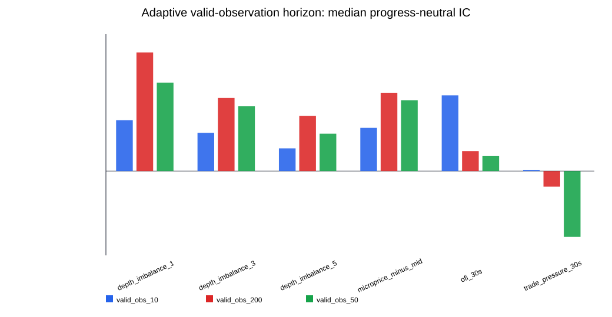
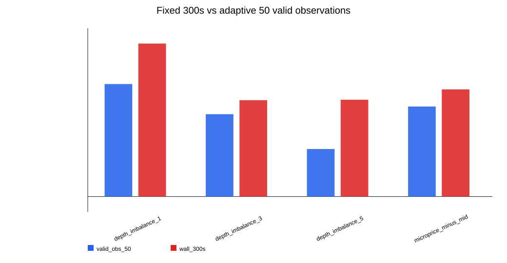
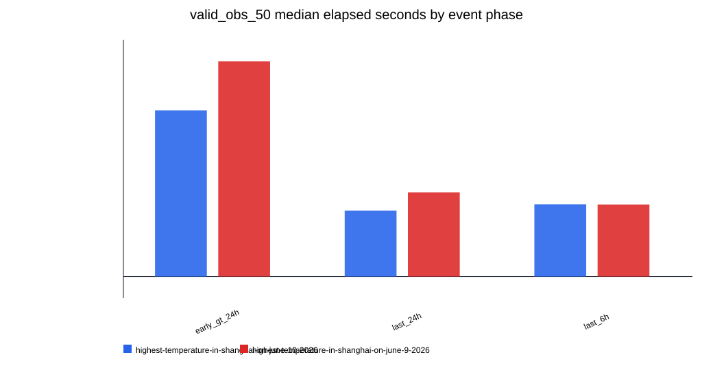

# PMXT Weather Cross-Event L2 因子研究报告

生成时间: 2026-07-09T10:32:56.355460+00:00

## 0. 结论先行

上一轮单 event 使用的是 `highest-temperature-in-shanghai-on-june-9-2026 / 25°C YES`。这轮改为两个上海最高温天气 event 的全部 YES token。

- 当前跨 event/adaptive 候选第一名: `depth_imbalance_1` + `valid_obs_200`，median progress-neutral IC = `0.129193`，positive token share = `0.955`，median nonzero hit = `0.582`。
- 固定 `300s` 对天气市场不公平：早期/末期交易频率差异很大，所以本报告只把 wall-clock horizon 当诊断。
- 真正用于候选的是 `valid_obs_N`，即向后第 N 个 valid book observation，更接近事件时间 / 活跃度归一化 horizon。
- `ofi_30s` / `trade_pressure_30s` 仍标记为 flow_clock_sensitive；PMXT source timestamp 问题解决前不升级为策略候选。
- 这仍不是 Nautilus 回测，不包含成交、fee、queue、cash、position、PnL。

## 1. 用了哪些 event/token

- event_count: 2
- processed YES tokens: 22

| event_slug | market_index | market_label | rows | trade_rows | first_timestamp_received | last_timestamp_received |
| --- | --- | --- | --- | --- | --- | --- |
| highest-temperature-in-shanghai-on-june-9-2026 | 0 | 18°C or below | 21409 | 1 | 2026-06-07T04:34:18.488000+00:00 | 2026-06-09T11:59:09.781000+00:00 |
| highest-temperature-in-shanghai-on-june-9-2026 | 1 | 19°C | 25726 | 3 | 2026-06-07T04:34:12.940000+00:00 | 2026-06-09T11:59:09.781000+00:00 |
| highest-temperature-in-shanghai-on-june-9-2026 | 2 | 20°C | 62995 | 6 | 2026-06-07T04:34:22.601000+00:00 | 2026-06-09T11:59:09.781000+00:00 |
| highest-temperature-in-shanghai-on-june-9-2026 | 3 | 21°C | 89673 | 7 | 2026-06-07T04:34:33.563000+00:00 | 2026-06-09T11:59:55.580000+00:00 |
| highest-temperature-in-shanghai-on-june-9-2026 | 4 | 22°C | 144190 | 92 | 2026-06-07T04:34:30.268000+00:00 | 2026-06-09T11:59:55.580000+00:00 |
| highest-temperature-in-shanghai-on-june-9-2026 | 5 | 23°C | 295717 | 477 | 2026-06-07T04:34:30.268000+00:00 | 2026-06-09T11:59:55.580000+00:00 |
| highest-temperature-in-shanghai-on-june-9-2026 | 6 | 24°C | 346962 | 392 | 2026-06-07T04:34:30.268000+00:00 | 2026-06-09T11:59:09.781000+00:00 |
| highest-temperature-in-shanghai-on-june-9-2026 | 7 | 25°C | 334501 | 617 | 2026-06-07T04:34:30.268000+00:00 | 2026-06-09T11:59:15.163000+00:00 |
| highest-temperature-in-shanghai-on-june-9-2026 | 8 | 26°C | 333019 | 368 | 2026-06-07T04:34:30.268000+00:00 | 2026-06-09T11:54:48.150000+00:00 |
| highest-temperature-in-shanghai-on-june-9-2026 | 9 | 27°C | 154807 | 233 | 2026-06-07T04:34:18.488000+00:00 | 2026-06-09T11:59:51.767000+00:00 |
| highest-temperature-in-shanghai-on-june-9-2026 | 10 | 28°C or higher | 153872 | 165 | 2026-06-07T04:34:05.018000+00:00 | 2026-06-09T11:59:53.871000+00:00 |
| highest-temperature-in-shanghai-on-june-10-2026 | 0 | 23°C or below | 116087 | 6 | 2026-06-08T04:27:11.576000+00:00 | 2026-06-10T11:59:57.686000+00:00 |
| highest-temperature-in-shanghai-on-june-10-2026 | 1 | 24°C | 79060 | 1 | 2026-06-08T04:26:58.749000+00:00 | 2026-06-10T11:52:35.447000+00:00 |
| highest-temperature-in-shanghai-on-june-10-2026 | 2 | 25°C | 131907 | 10 | 2026-06-08T04:26:59.159000+00:00 | 2026-06-10T11:59:57.686000+00:00 |
| highest-temperature-in-shanghai-on-june-10-2026 | 3 | 26°C | 225981 | 143 | 2026-06-08T04:26:59.159000+00:00 | 2026-06-10T11:59:57.686000+00:00 |
| highest-temperature-in-shanghai-on-june-10-2026 | 4 | 27°C | 397922 | 440 | 2026-06-08T04:26:59.159000+00:00 | 2026-06-10T11:59:59.045000+00:00 |
| highest-temperature-in-shanghai-on-june-10-2026 | 5 | 28°C | 380116 | 430 | 2026-06-08T04:26:59.159000+00:00 | 2026-06-10T11:59:59.045000+00:00 |
| highest-temperature-in-shanghai-on-june-10-2026 | 6 | 29°C | 374898 | 255 | 2026-06-08T04:26:36.213000+00:00 | 2026-06-10T11:58:03.597000+00:00 |
| highest-temperature-in-shanghai-on-june-10-2026 | 7 | 30°C | 339992 | 180 | 2026-06-08T04:26:59.159000+00:00 | 2026-06-10T11:59:57.957000+00:00 |
| highest-temperature-in-shanghai-on-june-10-2026 | 8 | 31°C | 261085 | 119 | 2026-06-08T04:26:59.159000+00:00 | 2026-06-10T11:59:57.686000+00:00 |
| highest-temperature-in-shanghai-on-june-10-2026 | 9 | 32°C | 170922 | 29 | 2026-06-08T04:26:59.159000+00:00 | 2026-06-10T11:59:57.957000+00:00 |
| highest-temperature-in-shanghai-on-june-10-2026 | 10 | 33°C or higher | 141120 | 16 | 2026-06-08T04:27:13.259000+00:00 | 2026-06-10T11:59:57.957000+00:00 |

## 2. 为什么不能只看固定 300s

天气 event 生命周期约 2-3 天，但交易活跃度集中在临近结算阶段。固定 300s 在早期可能只是没有信息流的 5 分钟，在末期却可能跨过大量盘口更新。

- `wall_60s / wall_300s / wall_900s`: 固定秒数，只做诊断；
- `valid_obs_10 / 50 / 200`: 向后第 N 个 valid book observation，更接近事件时间。

`valid_obs_50` 在不同阶段对应的真实秒数如下：

| event_slug | time_to_close_bucket | token_count | row_count | median_elapsed_p50 | median_elapsed_p90 | max_elapsed |
| --- | --- | --- | --- | --- | --- | --- |
| highest-temperature-in-shanghai-on-june-10-2026 | early_gt_24h | 11 | 969672 | 81.109 | 257.938 | 5431.26 |
| highest-temperature-in-shanghai-on-june-10-2026 | last_24h | 10 | 1245458 | 32.1655 | 86.7917 | 1689.63 |
| highest-temperature-in-shanghai-on-june-10-2026 | last_6h | 5 | 187334 | 35.235 | 52.8655 | 2809.5 |
| highest-temperature-in-shanghai-on-june-9-2026 | early_gt_24h | 11 | 823584 | 105.13 | 262.037 | 77372.6 |
| highest-temperature-in-shanghai-on-june-9-2026 | last_24h | 8 | 912835 | 41.1265 | 122.279 | 821.455 |
| highest-temperature-in-shanghai-on-june-9-2026 | last_6h | 5 | 114747 | 35.1565 | 129.027 | 1149.2 |

## 3. 图

## 4. Adaptive horizon 候选排名

| factor | factor_family | label_name | label_mode | horizon_value | event_count | token_metric_count | median_raw_spearman | median_progress_neutral_spearman | positive_token_share | median_nonzero_direction_hit | median_quantile_monotonicity_spearman | median_zero_return_share | median_label_elapsed_seconds | is_cross_event_candidate |
| --- | --- | --- | --- | --- | --- | --- | --- | --- | --- | --- | --- | --- | --- | --- |
| depth_imbalance_1 | book | valid_obs_200 | valid_observation_steps | 200 | 2 | 22 | 0.122487 | 0.129193 | 0.954545 | 0.58188 | 0.9 | 0.538091 | 314.724 | True |
| depth_imbalance_1 | book | valid_obs_50 | valid_observation_steps | 50 | 2 | 22 | 0.10795 | 0.0963617 | 0.863636 | 0.585576 | 0.9 | 0.74534 | 73.7535 | True |
| microprice_minus_mid | book | valid_obs_200 | valid_observation_steps | 200 | 2 | 22 | 0.0973974 | 0.0853257 | 0.909091 | 0.572556 | 0.6 | 0.538091 | 314.724 | True |
| depth_imbalance_3 | book | valid_obs_200 | valid_observation_steps | 200 | 2 | 22 | 0.0803086 | 0.0796645 | 0.772727 | 0.548487 | 0.75 | 0.538091 | 314.724 | True |
| microprice_minus_mid | book | valid_obs_50 | valid_observation_steps | 50 | 2 | 22 | 0.0839436 | 0.077116 | 0.909091 | 0.570799 | 0.7 | 0.74534 | 73.7535 | True |
| depth_imbalance_3 | book | valid_obs_50 | valid_observation_steps | 50 | 2 | 22 | 0.0606341 | 0.0705413 | 0.772727 | 0.55155 | 0.9 | 0.74534 | 73.7535 | True |
| depth_imbalance_5 | book | valid_obs_200 | valid_observation_steps | 200 | 2 | 22 | 0.0636524 | 0.0599914 | 0.681818 | 0.538191 | 0.7 | 0.538091 | 314.724 | True |
| depth_imbalance_1 | book | valid_obs_10 | valid_observation_steps | 10 | 2 | 22 | 0.0846443 | 0.0553348 | 0.863636 | 0.589069 | 0.9 | 0.875336 | 12.2045 | True |
| microprice_minus_mid | book | valid_obs_10 | valid_observation_steps | 10 | 2 | 22 | 0.0682969 | 0.0470922 | 0.909091 | 0.580737 | 0.6 | 0.875336 | 12.2045 | True |
| depth_imbalance_3 | book | valid_obs_10 | valid_observation_steps | 10 | 2 | 22 | 0.0453976 | 0.0415899 | 0.818182 | 0.550073 | 0.8 | 0.875336 | 12.2045 | True |
| depth_imbalance_5 | book | valid_obs_50 | valid_observation_steps | 50 | 2 | 22 | 0.0379672 | 0.0407283 | 0.818182 | 0.537788 | 0.65 | 0.74534 | 73.7535 | True |
| depth_imbalance_5 | book | valid_obs_10 | valid_observation_steps | 10 | 2 | 22 | 0.022294 | 0.0247226 | 0.727273 | 0.536196 | 0.7 | 0.875336 | 12.2045 | True |
| ofi_30s | flow_clock_sensitive | valid_obs_10 | valid_observation_steps | 10 | 2 | 22 | 0.03281 | 0.0825041 | 0.545455 | 0.528732 | 0.8 | 0.875336 | 12.2045 | False |
| ofi_30s | flow_clock_sensitive | valid_obs_200 | valid_observation_steps | 200 | 2 | 22 | 0.0368181 | 0.0217846 | 0.545455 | 0.518075 | 0.4 | 0.538091 | 314.724 | False |
| ofi_30s | flow_clock_sensitive | valid_obs_50 | valid_observation_steps | 50 | 2 | 22 | 0.0344468 | 0.0162799 | 0.545455 | 0.518465 | 0.4 | 0.74534 | 73.7535 | False |
| trade_pressure_30s | flow_clock_sensitive | valid_obs_10 | valid_observation_steps | 10 | 2 | 22 | 0.0203563 | 0.000877381 | 0.5 | 0.512524 |  | 0.875336 | 12.2045 | False |
| trade_pressure_30s | flow_clock_sensitive | valid_obs_200 | valid_observation_steps | 200 | 2 | 22 | 0.0445355 | -0.0169408 | 0.409091 | 0.515585 |  | 0.538091 | 314.724 | False |
| trade_pressure_30s | flow_clock_sensitive | valid_obs_50 | valid_observation_steps | 50 | 2 | 22 | 0.031227 | -0.0718222 | 0.409091 | 0.501023 |  | 0.74534 | 73.7535 | False |

## 5. 固定 wall-clock horizon 诊断排名

| factor | factor_family | label_name | label_mode | horizon_value | event_count | token_metric_count | median_raw_spearman | median_progress_neutral_spearman | positive_token_share | median_nonzero_direction_hit | median_quantile_monotonicity_spearman | median_zero_return_share | median_label_elapsed_seconds | is_cross_event_candidate |
| --- | --- | --- | --- | --- | --- | --- | --- | --- | --- | --- | --- | --- | --- | --- |
| depth_imbalance_1 | book | wall_300s | wall_clock_seconds | 300 | 2 | 22 | 0.122804 | 0.131047 | 0.818182 | 0.569389 | 0.6 | 0.540794 | 301.948 | False |
| depth_imbalance_1 | book | wall_60s | wall_clock_seconds | 60 | 2 | 22 | 0.120193 | 0.108661 | 0.863636 | 0.593974 | 0.9 | 0.74894 | 61.5157 | False |
| depth_imbalance_1 | book | wall_900s | wall_clock_seconds | 900 | 2 | 22 | 0.087605 | 0.0996286 | 0.909091 | 0.549367 | 0.7 | 0.365069 | 902.187 | False |
| depth_imbalance_3 | book | wall_900s | wall_clock_seconds | 900 | 2 | 22 | 0.0826098 | 0.0929376 | 0.772727 | 0.534587 | 0.5 | 0.365069 | 902.187 | False |
| microprice_minus_mid | book | wall_300s | wall_clock_seconds | 300 | 2 | 22 | 0.0921544 | 0.0918127 | 0.863636 | 0.556996 | 0.4 | 0.540794 | 301.948 | False |
| depth_imbalance_5 | book | wall_900s | wall_clock_seconds | 900 | 2 | 22 | 0.0840371 | 0.0890504 | 0.863636 | 0.544803 | 0.6 | 0.365069 | 902.187 | False |
| microprice_minus_mid | book | wall_60s | wall_clock_seconds | 60 | 2 | 22 | 0.103009 | 0.0849564 | 0.909091 | 0.583221 | 0.6 | 0.74894 | 61.5157 | False |
| depth_imbalance_5 | book | wall_300s | wall_clock_seconds | 300 | 2 | 22 | 0.065897 | 0.0829511 | 0.727273 | 0.546532 | 0.6 | 0.540794 | 301.948 | False |
| depth_imbalance_3 | book | wall_300s | wall_clock_seconds | 300 | 2 | 22 | 0.0763781 | 0.0825429 | 0.772727 | 0.543936 | 0.6 | 0.540794 | 301.948 | False |
| depth_imbalance_3 | book | wall_60s | wall_clock_seconds | 60 | 2 | 22 | 0.08323 | 0.0821571 | 0.818182 | 0.555697 | 0.7 | 0.74894 | 61.5157 | False |
| microprice_minus_mid | book | wall_900s | wall_clock_seconds | 900 | 2 | 22 | 0.0447886 | 0.0582442 | 0.727273 | 0.532256 | 0.3 | 0.365069 | 902.187 | False |
| depth_imbalance_5 | book | wall_60s | wall_clock_seconds | 60 | 2 | 22 | 0.0440796 | 0.0476375 | 0.818182 | 0.550877 | 0.65 | 0.74894 | 61.5157 | False |
| ofi_30s | flow_clock_sensitive | wall_60s | wall_clock_seconds | 60 | 2 | 22 | 0.0401846 | 0.0285684 | 0.545455 | 0.524851 | 0.4 | 0.74894 | 61.5157 | False |
| trade_pressure_30s | flow_clock_sensitive | wall_300s | wall_clock_seconds | 300 | 2 | 22 | 0.0390028 | 0.0249659 | 0.590909 | 0.497484 |  | 0.540794 | 301.948 | False |
| trade_pressure_30s | flow_clock_sensitive | wall_900s | wall_clock_seconds | 900 | 2 | 22 | 0.0112865 | 0.0239819 | 0.636364 | 0.488408 |  | 0.365069 | 902.187 | False |
| ofi_30s | flow_clock_sensitive | wall_300s | wall_clock_seconds | 300 | 2 | 22 | 0.0338407 | 0.0203002 | 0.636364 | 0.51008 | 0.15 | 0.540794 | 301.948 | False |
| trade_pressure_30s | flow_clock_sensitive | wall_60s | wall_clock_seconds | 60 | 2 | 22 | 0.0360772 | 0.0109507 | 0.545455 | 0.525895 |  | 0.74894 | 61.5157 | False |
| ofi_30s | flow_clock_sensitive | wall_900s | wall_clock_seconds | 900 | 2 | 22 | 0.0179561 | 0.0103059 | 0.545455 | 0.501408 | -0.1 | 0.365069 | 902.187 | False |

## 6. Token-level 指标预览

| event_slug | event_title | event_start | event_end | market_index | market_label | condition_id | asset_id | token_side | factor | factor_family | label_name | label_mode | horizon_value | count | raw_spearman | progress_neutral_spearman | nonzero_direction_hit | quantile_monotonicity_spearman | bottom_quantile_mean_return | top_quantile_mean_return | top_minus_bottom_mean_return | zero_return_share | positive_return_share | median_label_elapsed_seconds | p90_label_elapsed_seconds | source_time_inversion_count | source_delay_over_threshold_count |
| --- | --- | --- | --- | --- | --- | --- | --- | --- | --- | --- | --- | --- | --- | --- | --- | --- | --- | --- | --- | --- | --- | --- | --- | --- | --- | --- | --- |
| highest-temperature-in-shanghai-on-june-9-2026 | Highest temperature in Shanghai on June 9? | 2026-06-07T04:34:03Z | 2026-06-09T12:00:00Z | 0 | 18°C or below | 0xc2e74183c15adfc561bdab466ce80efb6525b907ff36a1667452f14e7e607b73 | 82108548216968010072870699597305974161044963313995774427931182710031745067538 | YES | depth_imbalance_1 | book | wall_60s | wall_clock_seconds | 60 | 7500 | -0.361083 | -0.361083 | 0.31875 |  |  |  |  | 0.978667 | 0.00133333 | 64.7815 | 95.458 | 4660 | 7169 |
| highest-temperature-in-shanghai-on-june-9-2026 | Highest temperature in Shanghai on June 9? | 2026-06-07T04:34:03Z | 2026-06-09T12:00:00Z | 0 | 18°C or below | 0xc2e74183c15adfc561bdab466ce80efb6525b907ff36a1667452f14e7e607b73 | 82108548216968010072870699597305974161044963313995774427931182710031745067538 | YES | depth_imbalance_3 | book | wall_60s | wall_clock_seconds | 60 | 7500 | -0.0333475 | -0.0333475 | 0.3375 | -0.4 | -2.34472e-05 | -0.00826542 | -0.00824197 | 0.978667 | 0.00133333 | 64.7815 | 95.458 | 4660 | 7169 |
| highest-temperature-in-shanghai-on-june-9-2026 | Highest temperature in Shanghai on June 9? | 2026-06-07T04:34:03Z | 2026-06-09T12:00:00Z | 0 | 18°C or below | 0xc2e74183c15adfc561bdab466ce80efb6525b907ff36a1667452f14e7e607b73 | 82108548216968010072870699597305974161044963313995774427931182710031745067538 | YES | depth_imbalance_5 | book | wall_60s | wall_clock_seconds | 60 | 7500 | 0.00680772 | 0.00680772 | 0.40625 | -0.2 | -3.68069e-05 | -0.00752604 | -0.00748923 | 0.978667 | 0.00133333 | 64.7815 | 95.458 | 4660 | 7169 |
| highest-temperature-in-shanghai-on-june-9-2026 | Highest temperature in Shanghai on June 9? | 2026-06-07T04:34:03Z | 2026-06-09T12:00:00Z | 0 | 18°C or below | 0xc2e74183c15adfc561bdab466ce80efb6525b907ff36a1667452f14e7e607b73 | 82108548216968010072870699597305974161044963313995774427931182710031745067538 | YES | microprice_minus_mid | book | wall_60s | wall_clock_seconds | 60 | 7500 | -0.154881 | -0.154881 | 0.375 |  | -1.11174e-05 | -0.0130178 | -0.0130066 | 0.978667 | 0.00133333 | 64.7815 | 95.458 | 4660 | 7169 |
| highest-temperature-in-shanghai-on-june-9-2026 | Highest temperature in Shanghai on June 9? | 2026-06-07T04:34:03Z | 2026-06-09T12:00:00Z | 0 | 18°C or below | 0xc2e74183c15adfc561bdab466ce80efb6525b907ff36a1667452f14e7e607b73 | 82108548216968010072870699597305974161044963313995774427931182710031745067538 | YES | ofi_30s | flow_clock_sensitive | wall_60s | wall_clock_seconds | 60 | 7500 | -0.0809163 | -0.0809163 | 0.775 |  | -0.00048364 | -0.0156827 | -0.0151991 | 0.978667 | 0.00133333 | 64.7815 | 95.458 | 4660 | 7169 |
| highest-temperature-in-shanghai-on-june-9-2026 | Highest temperature in Shanghai on June 9? | 2026-06-07T04:34:03Z | 2026-06-09T12:00:00Z | 0 | 18°C or below | 0xc2e74183c15adfc561bdab466ce80efb6525b907ff36a1667452f14e7e607b73 | 82108548216968010072870699597305974161044963313995774427931182710031745067538 | YES | trade_pressure_30s | flow_clock_sensitive | wall_60s | wall_clock_seconds | 60 | 7500 |  |  | 0.0625 |  |  |  |  | 0.978667 | 0.00133333 | 64.7815 | 95.458 | 4660 | 7169 |
| highest-temperature-in-shanghai-on-june-9-2026 | Highest temperature in Shanghai on June 9? | 2026-06-07T04:34:03Z | 2026-06-09T12:00:00Z | 0 | 18°C or below | 0xc2e74183c15adfc561bdab466ce80efb6525b907ff36a1667452f14e7e607b73 | 82108548216968010072870699597305974161044963313995774427931182710031745067538 | YES | depth_imbalance_1 | book | wall_300s | wall_clock_seconds | 300 | 7451 | -0.663576 | -0.663576 | 0.178161 |  |  |  |  | 0.953295 | 0.00295262 | 308.857 | 342.932 | 4660 | 7169 |
| highest-temperature-in-shanghai-on-june-9-2026 | Highest temperature in Shanghai on June 9? | 2026-06-07T04:34:03Z | 2026-06-09T12:00:00Z | 0 | 18°C or below | 0xc2e74183c15adfc561bdab466ce80efb6525b907ff36a1667452f14e7e607b73 | 82108548216968010072870699597305974161044963313995774427931182710031745067538 | YES | depth_imbalance_3 | book | wall_300s | wall_clock_seconds | 300 | 7451 | -0.0425852 | -0.0425852 | 0.327586 | -0.2 | -0.000289394 | -0.0288888 | -0.0285994 | 0.953295 | 0.00295262 | 308.857 | 342.932 | 4660 | 7169 |
| highest-temperature-in-shanghai-on-june-9-2026 | Highest temperature in Shanghai on June 9? | 2026-06-07T04:34:03Z | 2026-06-09T12:00:00Z | 0 | 18°C or below | 0xc2e74183c15adfc561bdab466ce80efb6525b907ff36a1667452f14e7e607b73 | 82108548216968010072870699597305974161044963313995774427931182710031745067538 | YES | depth_imbalance_5 | book | wall_300s | wall_clock_seconds | 300 | 7451 | -0.0199802 | -0.0199802 | 0.393678 | -0.2 | -0.000689058 | -0.0241421 | -0.0234531 | 0.953295 | 0.00295262 | 308.857 | 342.932 | 4660 | 7169 |
| highest-temperature-in-shanghai-on-june-9-2026 | Highest temperature in Shanghai on June 9? | 2026-06-07T04:34:03Z | 2026-06-09T12:00:00Z | 0 | 18°C or below | 0xc2e74183c15adfc561bdab466ce80efb6525b907ff36a1667452f14e7e607b73 | 82108548216968010072870699597305974161044963313995774427931182710031745067538 | YES | microprice_minus_mid | book | wall_300s | wall_clock_seconds | 300 | 7451 | -0.331404 | -0.331404 | 0.295977 |  | -2.86241e-05 | -0.0477855 | -0.0477569 | 0.953295 | 0.00295262 | 308.857 | 342.932 | 4660 | 7169 |
| highest-temperature-in-shanghai-on-june-9-2026 | Highest temperature in Shanghai on June 9? | 2026-06-07T04:34:03Z | 2026-06-09T12:00:00Z | 0 | 18°C or below | 0xc2e74183c15adfc561bdab466ce80efb6525b907ff36a1667452f14e7e607b73 | 82108548216968010072870699597305974161044963313995774427931182710031745067538 | YES | ofi_30s | flow_clock_sensitive | wall_300s | wall_clock_seconds | 300 | 7451 | -0.131639 | -0.131639 | 0.727011 |  | -0.00176957 | -0.0579663 | -0.0561968 | 0.953295 | 0.00295262 | 308.857 | 342.932 | 4660 | 7169 |
| highest-temperature-in-shanghai-on-june-9-2026 | Highest temperature in Shanghai on June 9? | 2026-06-07T04:34:03Z | 2026-06-09T12:00:00Z | 0 | 18°C or below | 0xc2e74183c15adfc561bdab466ce80efb6525b907ff36a1667452f14e7e607b73 | 82108548216968010072870699597305974161044963313995774427931182710031745067538 | YES | trade_pressure_30s | flow_clock_sensitive | wall_300s | wall_clock_seconds | 300 | 7451 |  |  | 0.0632184 |  |  |  |  | 0.953295 | 0.00295262 | 308.857 | 342.932 | 4660 | 7169 |
| highest-temperature-in-shanghai-on-june-9-2026 | Highest temperature in Shanghai on June 9? | 2026-06-07T04:34:03Z | 2026-06-09T12:00:00Z | 0 | 18°C or below | 0xc2e74183c15adfc561bdab466ce80efb6525b907ff36a1667452f14e7e607b73 | 82108548216968010072870699597305974161044963313995774427931182710031745067538 | YES | depth_imbalance_1 | book | wall_900s | wall_clock_seconds | 900 | 7350 | -0.948513 | -0.948513 | 0.0956341 |  |  |  |  | 0.934558 | 0 | 907.641 | 943.383 | 4660 | 7169 |
| highest-temperature-in-shanghai-on-june-9-2026 | Highest temperature in Shanghai on June 9? | 2026-06-07T04:34:03Z | 2026-06-09T12:00:00Z | 0 | 18°C or below | 0xc2e74183c15adfc561bdab466ce80efb6525b907ff36a1667452f14e7e607b73 | 82108548216968010072870699597305974161044963313995774427931182710031745067538 | YES | depth_imbalance_3 | book | wall_900s | wall_clock_seconds | 900 | 7350 | -0.11134 | -0.11134 | 0.203742 | -0.2 | -0.000361752 | -0.040517 | -0.0401553 | 0.934558 | 0 | 907.641 | 943.383 | 4660 | 7169 |
| highest-temperature-in-shanghai-on-june-9-2026 | Highest temperature in Shanghai on June 9? | 2026-06-07T04:34:03Z | 2026-06-09T12:00:00Z | 0 | 18°C or below | 0xc2e74183c15adfc561bdab466ce80efb6525b907ff36a1667452f14e7e607b73 | 82108548216968010072870699597305974161044963313995774427931182710031745067538 | YES | depth_imbalance_5 | book | wall_900s | wall_clock_seconds | 900 | 7350 | -0.11457 | -0.11457 | 0.251559 | -0.2 | -0.000877677 | -0.0344003 | -0.0335226 | 0.934558 | 0 | 907.641 | 943.383 | 4660 | 7169 |
| highest-temperature-in-shanghai-on-june-9-2026 | Highest temperature in Shanghai on June 9? | 2026-06-07T04:34:03Z | 2026-06-09T12:00:00Z | 0 | 18°C or below | 0xc2e74183c15adfc561bdab466ce80efb6525b907ff36a1667452f14e7e607b73 | 82108548216968010072870699597305974161044963313995774427931182710031745067538 | YES | microprice_minus_mid | book | wall_900s | wall_clock_seconds | 900 | 7350 | -0.647567 | -0.647567 | 0.180873 |  | -3.10523e-05 | -0.0672906 | -0.0672596 | 0.934558 | 0 | 907.641 | 943.383 | 4660 | 7169 |
| highest-temperature-in-shanghai-on-june-9-2026 | Highest temperature in Shanghai on June 9? | 2026-06-07T04:34:03Z | 2026-06-09T12:00:00Z | 0 | 18°C or below | 0xc2e74183c15adfc561bdab466ce80efb6525b907ff36a1667452f14e7e607b73 | 82108548216968010072870699597305974161044963313995774427931182710031745067538 | YES | ofi_30s | flow_clock_sensitive | wall_900s | wall_clock_seconds | 900 | 7350 | -0.194792 | -0.194792 | 0.800416 |  | -0.00243452 | -0.0873846 | -0.0849501 | 0.934558 | 0 | 907.641 | 943.383 | 4660 | 7169 |
| highest-temperature-in-shanghai-on-june-9-2026 | Highest temperature in Shanghai on June 9? | 2026-06-07T04:34:03Z | 2026-06-09T12:00:00Z | 0 | 18°C or below | 0xc2e74183c15adfc561bdab466ce80efb6525b907ff36a1667452f14e7e607b73 | 82108548216968010072870699597305974161044963313995774427931182710031745067538 | YES | trade_pressure_30s | flow_clock_sensitive | wall_900s | wall_clock_seconds | 900 | 7350 |  |  | 0 |  |  |  |  | 0.934558 | 0 | 907.641 | 943.383 | 4660 | 7169 |
| highest-temperature-in-shanghai-on-june-9-2026 | Highest temperature in Shanghai on June 9? | 2026-06-07T04:34:03Z | 2026-06-09T12:00:00Z | 0 | 18°C or below | 0xc2e74183c15adfc561bdab466ce80efb6525b907ff36a1667452f14e7e607b73 | 82108548216968010072870699597305974161044963313995774427931182710031745067538 | YES | depth_imbalance_1 | book | valid_obs_10 | valid_observation_steps | 10 | 7492 | -0.338794 | -0.338794 | 0.303797 |  |  |  |  | 0.978911 | 0.00266951 | 40.155 | 132.499 | 4660 | 7169 |
| highest-temperature-in-shanghai-on-june-9-2026 | Highest temperature in Shanghai on June 9? | 2026-06-07T04:34:03Z | 2026-06-09T12:00:00Z | 0 | 18°C or below | 0xc2e74183c15adfc561bdab466ce80efb6525b907ff36a1667452f14e7e607b73 | 82108548216968010072870699597305974161044963313995774427931182710031745067538 | YES | depth_imbalance_3 | book | valid_obs_10 | valid_observation_steps | 10 | 7492 | -0.0847329 | -0.0847329 | 0.310127 | -0.2 | -1.71207e-05 | -0.0194659 | -0.0194488 | 0.978911 | 0.00266951 | 40.155 | 132.499 | 4660 | 7169 |
| highest-temperature-in-shanghai-on-june-9-2026 | Highest temperature in Shanghai on June 9? | 2026-06-07T04:34:03Z | 2026-06-09T12:00:00Z | 0 | 18°C or below | 0xc2e74183c15adfc561bdab466ce80efb6525b907ff36a1667452f14e7e607b73 | 82108548216968010072870699597305974161044963313995774427931182710031745067538 | YES | depth_imbalance_5 | book | valid_obs_10 | valid_observation_steps | 10 | 7492 | -0.0357701 | -0.0357701 | 0.379747 | -0.2 | -3.37061e-05 | -0.0177366 | -0.0177029 | 0.978911 | 0.00266951 | 40.155 | 132.499 | 4660 | 7169 |
| highest-temperature-in-shanghai-on-june-9-2026 | Highest temperature in Shanghai on June 9? | 2026-06-07T04:34:03Z | 2026-06-09T12:00:00Z | 0 | 18°C or below | 0xc2e74183c15adfc561bdab466ce80efb6525b907ff36a1667452f14e7e607b73 | 82108548216968010072870699597305974161044963313995774427931182710031745067538 | YES | microprice_minus_mid | book | valid_obs_10 | valid_observation_steps | 10 | 7492 | -0.189779 | -0.189779 | 0.348101 |  | -7.53733e-06 | -0.0304937 | -0.0304861 | 0.978911 | 0.00266951 | 40.155 | 132.499 | 4660 | 7169 |
| highest-temperature-in-shanghai-on-june-9-2026 | Highest temperature in Shanghai on June 9? | 2026-06-07T04:34:03Z | 2026-06-09T12:00:00Z | 0 | 18°C or below | 0xc2e74183c15adfc561bdab466ce80efb6525b907ff36a1667452f14e7e607b73 | 82108548216968010072870699597305974161044963313995774427931182710031745067538 | YES | ofi_30s | flow_clock_sensitive | valid_obs_10 | valid_observation_steps | 10 | 7492 | -0.0946262 | -0.0946262 | 0.708861 |  | -0.00128039 | -0.0250817 | -0.0238013 | 0.978911 | 0.00266951 | 40.155 | 132.499 | 4660 | 7169 |
| highest-temperature-in-shanghai-on-june-9-2026 | Highest temperature in Shanghai on June 9? | 2026-06-07T04:34:03Z | 2026-06-09T12:00:00Z | 0 | 18°C or below | 0xc2e74183c15adfc561bdab466ce80efb6525b907ff36a1667452f14e7e607b73 | 82108548216968010072870699597305974161044963313995774427931182710031745067538 | YES | trade_pressure_30s | flow_clock_sensitive | valid_obs_10 | valid_observation_steps | 10 | 7492 |  |  | 0.126582 |  |  |  |  | 0.978911 | 0.00266951 | 40.155 | 132.499 | 4660 | 7169 |
| highest-temperature-in-shanghai-on-june-9-2026 | Highest temperature in Shanghai on June 9? | 2026-06-07T04:34:03Z | 2026-06-09T12:00:00Z | 0 | 18°C or below | 0xc2e74183c15adfc561bdab466ce80efb6525b907ff36a1667452f14e7e607b73 | 82108548216968010072870699597305974161044963313995774427931182710031745067538 | YES | depth_imbalance_1 | book | valid_obs_50 | valid_observation_steps | 50 | 7402 | -0.754403 | -0.754403 | 0.157895 |  |  |  |  | 0.948663 | 0.00121589 | 261.691 | 586.799 | 4660 | 7169 |
| highest-temperature-in-shanghai-on-june-9-2026 | Highest temperature in Shanghai on June 9? | 2026-06-07T04:34:03Z | 2026-06-09T12:00:00Z | 0 | 18°C or below | 0xc2e74183c15adfc561bdab466ce80efb6525b907ff36a1667452f14e7e607b73 | 82108548216968010072870699597305974161044963313995774427931182710031745067538 | YES | depth_imbalance_3 | book | valid_obs_50 | valid_observation_steps | 50 | 7402 | -0.0885685 | -0.0885685 | 0.294737 | -0.2 | -0.000290846 | -0.0397922 | -0.0395014 | 0.948663 | 0.00121589 | 261.691 | 586.799 | 4660 | 7169 |
| highest-temperature-in-shanghai-on-june-9-2026 | Highest temperature in Shanghai on June 9? | 2026-06-07T04:34:03Z | 2026-06-09T12:00:00Z | 0 | 18°C or below | 0xc2e74183c15adfc561bdab466ce80efb6525b907ff36a1667452f14e7e607b73 | 82108548216968010072870699597305974161044963313995774427931182710031745067538 | YES | depth_imbalance_5 | book | valid_obs_50 | valid_observation_steps | 50 | 7402 | -0.0535198 | -0.0535198 | 0.355263 | -0.2 | -0.000723684 | -0.033753 | -0.0330293 | 0.948663 | 0.00121589 | 261.691 | 586.799 | 4660 | 7169 |
| highest-temperature-in-shanghai-on-june-9-2026 | Highest temperature in Shanghai on June 9? | 2026-06-07T04:34:03Z | 2026-06-09T12:00:00Z | 0 | 18°C or below | 0xc2e74183c15adfc561bdab466ce80efb6525b907ff36a1667452f14e7e607b73 | 82108548216968010072870699597305974161044963313995774427931182710031745067538 | YES | microprice_minus_mid | book | valid_obs_50 | valid_observation_steps | 50 | 7402 | -0.432635 | -0.432635 | 0.265789 |  | -2.754e-05 | -0.0647995 | -0.064772 | 0.948663 | 0.00121589 | 261.691 | 586.799 | 4660 | 7169 |
| highest-temperature-in-shanghai-on-june-9-2026 | Highest temperature in Shanghai on June 9? | 2026-06-07T04:34:03Z | 2026-06-09T12:00:00Z | 0 | 18°C or below | 0xc2e74183c15adfc561bdab466ce80efb6525b907ff36a1667452f14e7e607b73 | 82108548216968010072870699597305974161044963313995774427931182710031745067538 | YES | ofi_30s | flow_clock_sensitive | valid_obs_50 | valid_observation_steps | 50 | 7402 | -0.205974 | -0.205974 | 0.736842 |  | -0.00233756 | -0.0833125 | -0.0809749 | 0.948663 | 0.00121589 | 261.691 | 586.799 | 4660 | 7169 |
| highest-temperature-in-shanghai-on-june-9-2026 | Highest temperature in Shanghai on June 9? | 2026-06-07T04:34:03Z | 2026-06-09T12:00:00Z | 0 | 18°C or below | 0xc2e74183c15adfc561bdab466ce80efb6525b907ff36a1667452f14e7e607b73 | 82108548216968010072870699597305974161044963313995774427931182710031745067538 | YES | trade_pressure_30s | flow_clock_sensitive | valid_obs_50 | valid_observation_steps | 50 | 7402 |  |  | 0.0236842 |  |  |  |  | 0.948663 | 0.00121589 | 261.691 | 586.799 | 4660 | 7169 |
| highest-temperature-in-shanghai-on-june-9-2026 | Highest temperature in Shanghai on June 9? | 2026-06-07T04:34:03Z | 2026-06-09T12:00:00Z | 0 | 18°C or below | 0xc2e74183c15adfc561bdab466ce80efb6525b907ff36a1667452f14e7e607b73 | 82108548216968010072870699597305974161044963313995774427931182710031745067538 | YES | depth_imbalance_1 | book | valid_obs_200 | valid_observation_steps | 200 | 7106 | -0.942815 | -0.942815 | 0.102669 |  |  |  |  | 0.931466 | 0.000281452 | 988.342 | 1734.04 | 4660 | 7169 |
| highest-temperature-in-shanghai-on-june-9-2026 | Highest temperature in Shanghai on June 9? | 2026-06-07T04:34:03Z | 2026-06-09T12:00:00Z | 0 | 18°C or below | 0xc2e74183c15adfc561bdab466ce80efb6525b907ff36a1667452f14e7e607b73 | 82108548216968010072870699597305974161044963313995774427931182710031745067538 | YES | depth_imbalance_3 | book | valid_obs_200 | valid_observation_steps | 200 | 7106 | -0.104778 | -0.104778 | 0.209446 | -0.4 | -0.00038852 | -0.0409172 | -0.0405287 | 0.931466 | 0.000281452 | 988.342 | 1734.04 | 4660 | 7169 |
| highest-temperature-in-shanghai-on-june-9-2026 | Highest temperature in Shanghai on June 9? | 2026-06-07T04:34:03Z | 2026-06-09T12:00:00Z | 0 | 18°C or below | 0xc2e74183c15adfc561bdab466ce80efb6525b907ff36a1667452f14e7e607b73 | 82108548216968010072870699597305974161044963313995774427931182710031745067538 | YES | depth_imbalance_5 | book | valid_obs_200 | valid_observation_steps | 200 | 7106 | -0.108506 | -0.108506 | 0.256674 | -0.4 | -0.000961552 | -0.0347485 | -0.033787 | 0.931466 | 0.000281452 | 988.342 | 1734.04 | 4660 | 7169 |
| highest-temperature-in-shanghai-on-june-9-2026 | Highest temperature in Shanghai on June 9? | 2026-06-07T04:34:03Z | 2026-06-09T12:00:00Z | 0 | 18°C or below | 0xc2e74183c15adfc561bdab466ce80efb6525b907ff36a1667452f14e7e607b73 | 82108548216968010072870699597305974161044963313995774427931182710031745067538 | YES | microprice_minus_mid | book | valid_obs_200 | valid_observation_steps | 200 | 7106 | -0.643743 | -0.643743 | 0.186858 |  | -3.23302e-05 | -0.0679353 | -0.0679029 | 0.931466 | 0.000281452 | 988.342 | 1734.04 | 4660 | 7169 |
| highest-temperature-in-shanghai-on-june-9-2026 | Highest temperature in Shanghai on June 9? | 2026-06-07T04:34:03Z | 2026-06-09T12:00:00Z | 0 | 18°C or below | 0xc2e74183c15adfc561bdab466ce80efb6525b907ff36a1667452f14e7e607b73 | 82108548216968010072870699597305974161044963313995774427931182710031745067538 | YES | ofi_30s | flow_clock_sensitive | valid_obs_200 | valid_observation_steps | 200 | 7106 | -0.19361 | -0.19361 | 0.798768 |  | -0.0025422 | -0.0882981 | -0.0857559 | 0.931466 | 0.000281452 | 988.342 | 1734.04 | 4660 | 7169 |
| highest-temperature-in-shanghai-on-june-9-2026 | Highest temperature in Shanghai on June 9? | 2026-06-07T04:34:03Z | 2026-06-09T12:00:00Z | 0 | 18°C or below | 0xc2e74183c15adfc561bdab466ce80efb6525b907ff36a1667452f14e7e607b73 | 82108548216968010072870699597305974161044963313995774427931182710031745067538 | YES | trade_pressure_30s | flow_clock_sensitive | valid_obs_200 | valid_observation_steps | 200 | 7106 |  |  | 0.00410678 |  |  |  |  | 0.931466 | 0.000281452 | 988.342 | 1734.04 | 4660 | 7169 |
| highest-temperature-in-shanghai-on-june-9-2026 | Highest temperature in Shanghai on June 9? | 2026-06-07T04:34:03Z | 2026-06-09T12:00:00Z | 1 | 19°C | 0xe9270a0ad0e9215e2249b5573f8e1e40b39e76d19b45ded06aa4c0faeae9b9a8 | 74502948617169463266911772205376938956442075011044734712645525624423814463171 | YES | depth_imbalance_1 | book | wall_60s | wall_clock_seconds | 60 | 10830 | -0.0411007 | -0.0411007 | 0.452 | 0 | -9.5631e-06 | 0 | 9.5631e-06 | 0.976916 | 0.0110803 | 64.956 | 97.6604 | 5720 | 8248 |
| highest-temperature-in-shanghai-on-june-9-2026 | Highest temperature in Shanghai on June 9? | 2026-06-07T04:34:03Z | 2026-06-09T12:00:00Z | 1 | 19°C | 0xe9270a0ad0e9215e2249b5573f8e1e40b39e76d19b45ded06aa4c0faeae9b9a8 | 74502948617169463266911772205376938956442075011044734712645525624423814463171 | YES | depth_imbalance_3 | book | wall_60s | wall_clock_seconds | 60 | 10830 | -0.0704932 | -0.0704932 | 0.228 | 0 | -9.42522e-06 | -1.89414e-05 | -9.51614e-06 | 0.976916 | 0.0110803 | 64.956 | 97.6604 | 5720 | 8248 |
| highest-temperature-in-shanghai-on-june-9-2026 | Highest temperature in Shanghai on June 9? | 2026-06-07T04:34:03Z | 2026-06-09T12:00:00Z | 1 | 19°C | 0xe9270a0ad0e9215e2249b5573f8e1e40b39e76d19b45ded06aa4c0faeae9b9a8 | 74502948617169463266911772205376938956442075011044734712645525624423814463171 | YES | depth_imbalance_5 | book | wall_60s | wall_clock_seconds | 60 | 10830 | 0.00193537 | 0.00193537 | 0.56 | 0.4 | -9.05045e-06 | 6.95088e-07 | 9.74553e-06 | 0.976916 | 0.0110803 | 64.956 | 97.6604 | 5720 | 8248 |
| highest-temperature-in-shanghai-on-june-9-2026 | Highest temperature in Shanghai on June 9? | 2026-06-07T04:34:03Z | 2026-06-09T12:00:00Z | 1 | 19°C | 0xe9270a0ad0e9215e2249b5573f8e1e40b39e76d19b45ded06aa4c0faeae9b9a8 | 74502948617169463266911772205376938956442075011044734712645525624423814463171 | YES | microprice_minus_mid | book | wall_60s | wall_clock_seconds | 60 | 10830 | -0.0324336 | -0.0324336 | 0.452 | -0.316228 | -9.5631e-06 | -2.28614e-05 | -1.32983e-05 | 0.976916 | 0.0110803 | 64.956 | 97.6604 | 5720 | 8248 |
| highest-temperature-in-shanghai-on-june-9-2026 | Highest temperature in Shanghai on June 9? | 2026-06-07T04:34:03Z | 2026-06-09T12:00:00Z | 1 | 19°C | 0xe9270a0ad0e9215e2249b5573f8e1e40b39e76d19b45ded06aa4c0faeae9b9a8 | 74502948617169463266911772205376938956442075011044734712645525624423814463171 | YES | ofi_30s | flow_clock_sensitive | wall_60s | wall_clock_seconds | 60 | 10830 | 0.129785 | 0.129785 | 0.608 |  | -9.08498e-06 | 0 | 9.08498e-06 | 0.976916 | 0.0110803 | 64.956 | 97.6604 | 5720 | 8248 |
| highest-temperature-in-shanghai-on-june-9-2026 | Highest temperature in Shanghai on June 9? | 2026-06-07T04:34:03Z | 2026-06-09T12:00:00Z | 1 | 19°C | 0xe9270a0ad0e9215e2249b5573f8e1e40b39e76d19b45ded06aa4c0faeae9b9a8 | 74502948617169463266911772205376938956442075011044734712645525624423814463171 | YES | trade_pressure_30s | flow_clock_sensitive | wall_60s | wall_clock_seconds | 60 | 10830 | 0.000313026 | 0.000313026 | 0.52 |  |  |  |  | 0.976916 | 0.0110803 | 64.956 | 97.6604 | 5720 | 8248 |
| highest-temperature-in-shanghai-on-june-9-2026 | Highest temperature in Shanghai on June 9? | 2026-06-07T04:34:03Z | 2026-06-09T12:00:00Z | 1 | 19°C | 0xe9270a0ad0e9215e2249b5573f8e1e40b39e76d19b45ded06aa4c0faeae9b9a8 | 74502948617169463266911772205376938956442075011044734712645525624423814463171 | YES | depth_imbalance_1 | book | wall_300s | wall_clock_seconds | 300 | 10704 | -0.0812991 | -0.0812991 | 0.384496 | -0.5 | -4.38777e-05 | -4.91447e-05 | -5.26694e-06 | 0.939742 | 0.0233558 | 308.661 | 342.932 | 5720 | 8248 |
| highest-temperature-in-shanghai-on-june-9-2026 | Highest temperature in Shanghai on June 9? | 2026-06-07T04:34:03Z | 2026-06-09T12:00:00Z | 1 | 19°C | 0xe9270a0ad0e9215e2249b5573f8e1e40b39e76d19b45ded06aa4c0faeae9b9a8 | 74502948617169463266911772205376938956442075011044734712645525624423814463171 | YES | depth_imbalance_3 | book | wall_300s | wall_clock_seconds | 300 | 10704 | -0.147692 | -0.147692 | 0.235659 | 0 | -9.61842e-06 | -6.30514e-05 | -5.3433e-05 | 0.939742 | 0.0233558 | 308.661 | 342.932 | 5720 | 8248 |
| highest-temperature-in-shanghai-on-june-9-2026 | Highest temperature in Shanghai on June 9? | 2026-06-07T04:34:03Z | 2026-06-09T12:00:00Z | 1 | 19°C | 0xe9270a0ad0e9215e2249b5573f8e1e40b39e76d19b45ded06aa4c0faeae9b9a8 | 74502948617169463266911772205376938956442075011044734712645525624423814463171 | YES | depth_imbalance_5 | book | wall_300s | wall_clock_seconds | 300 | 10704 | -0.082333 | -0.082333 | 0.418605 | -0.6 | -9.22844e-06 | -5.8724e-05 | -4.94956e-05 | 0.939742 | 0.0233558 | 308.661 | 342.932 | 5720 | 8248 |
| highest-temperature-in-shanghai-on-june-9-2026 | Highest temperature in Shanghai on June 9? | 2026-06-07T04:34:03Z | 2026-06-09T12:00:00Z | 1 | 19°C | 0xe9270a0ad0e9215e2249b5573f8e1e40b39e76d19b45ded06aa4c0faeae9b9a8 | 74502948617169463266911772205376938956442075011044734712645525624423814463171 | YES | microprice_minus_mid | book | wall_300s | wall_clock_seconds | 300 | 10704 | -0.106048 | -0.106048 | 0.384496 | -0.316228 | -4.38777e-05 | -5.48181e-05 | -1.09404e-05 | 0.939742 | 0.0233558 | 308.661 | 342.932 | 5720 | 8248 |
| highest-temperature-in-shanghai-on-june-9-2026 | Highest temperature in Shanghai on June 9? | 2026-06-07T04:34:03Z | 2026-06-09T12:00:00Z | 1 | 19°C | 0xe9270a0ad0e9215e2249b5573f8e1e40b39e76d19b45ded06aa4c0faeae9b9a8 | 74502948617169463266911772205376938956442075011044734712645525624423814463171 | YES | ofi_30s | flow_clock_sensitive | wall_300s | wall_clock_seconds | 300 | 10704 | 0.0750387 | 0.0750387 | 0.426357 |  | -3.26158e-05 | 2.30769e-05 | 5.56928e-05 | 0.939742 | 0.0233558 | 308.661 | 342.932 | 5720 | 8248 |
| highest-temperature-in-shanghai-on-june-9-2026 | Highest temperature in Shanghai on June 9? | 2026-06-07T04:34:03Z | 2026-06-09T12:00:00Z | 1 | 19°C | 0xe9270a0ad0e9215e2249b5573f8e1e40b39e76d19b45ded06aa4c0faeae9b9a8 | 74502948617169463266911772205376938956442075011044734712645525624423814463171 | YES | trade_pressure_30s | flow_clock_sensitive | wall_300s | wall_clock_seconds | 300 | 10704 |  |  | 0.387597 |  |  |  |  | 0.939742 | 0.0233558 | 308.661 | 342.932 | 5720 | 8248 |
| highest-temperature-in-shanghai-on-june-9-2026 | Highest temperature in Shanghai on June 9? | 2026-06-07T04:34:03Z | 2026-06-09T12:00:00Z | 1 | 19°C | 0xe9270a0ad0e9215e2249b5573f8e1e40b39e76d19b45ded06aa4c0faeae9b9a8 | 74502948617169463266911772205376938956442075011044734712645525624423814463171 | YES | depth_imbalance_1 | book | wall_900s | wall_clock_seconds | 900 | 10672 | -0.0563012 | -0.0563012 | 0.475624 | 0.5 | -0.000172886 | -9.87243e-05 | 7.41615e-05 | 0.842391 | 0.0527549 | 908.311 | 943.095 | 5720 | 8248 |
| highest-temperature-in-shanghai-on-june-9-2026 | Highest temperature in Shanghai on June 9? | 2026-06-07T04:34:03Z | 2026-06-09T12:00:00Z | 1 | 19°C | 0xe9270a0ad0e9215e2249b5573f8e1e40b39e76d19b45ded06aa4c0faeae9b9a8 | 74502948617169463266911772205376938956442075011044734712645525624423814463171 | YES | depth_imbalance_3 | book | wall_900s | wall_clock_seconds | 900 | 10672 | -0.226063 | -0.226063 | 0.221165 | -0.4 | -9.07932e-06 | -0.000133887 | -0.000124808 | 0.842391 | 0.0527549 | 908.311 | 943.095 | 5720 | 8248 |
| highest-temperature-in-shanghai-on-june-9-2026 | Highest temperature in Shanghai on June 9? | 2026-06-07T04:34:03Z | 2026-06-09T12:00:00Z | 1 | 19°C | 0xe9270a0ad0e9215e2249b5573f8e1e40b39e76d19b45ded06aa4c0faeae9b9a8 | 74502948617169463266911772205376938956442075011044734712645525624423814463171 | YES | depth_imbalance_5 | book | wall_900s | wall_clock_seconds | 900 | 10672 | -0.177085 | -0.177085 | 0.424495 | -0.8 | 6.1106e-06 | -0.00012204 | -0.00012815 | 0.842391 | 0.0527549 | 908.311 | 943.095 | 5720 | 8248 |
| highest-temperature-in-shanghai-on-june-9-2026 | Highest temperature in Shanghai on June 9? | 2026-06-07T04:34:03Z | 2026-06-09T12:00:00Z | 1 | 19°C | 0xe9270a0ad0e9215e2249b5573f8e1e40b39e76d19b45ded06aa4c0faeae9b9a8 | 74502948617169463266911772205376938956442075011044734712645525624423814463171 | YES | microprice_minus_mid | book | wall_900s | wall_clock_seconds | 900 | 10672 | -0.0888923 | -0.0888923 | 0.476813 | 0.4 | -0.000172886 | -0.000123648 | 4.92378e-05 | 0.842391 | 0.0527549 | 908.311 | 943.095 | 5720 | 8248 |
| highest-temperature-in-shanghai-on-june-9-2026 | Highest temperature in Shanghai on June 9? | 2026-06-07T04:34:03Z | 2026-06-09T12:00:00Z | 1 | 19°C | 0xe9270a0ad0e9215e2249b5573f8e1e40b39e76d19b45ded06aa4c0faeae9b9a8 | 74502948617169463266911772205376938956442075011044734712645525624423814463171 | YES | ofi_30s | flow_clock_sensitive | wall_900s | wall_clock_seconds | 900 | 10672 | 0.037638 | 0.037638 | 0.341855 |  | -0.000106015 | 9.23077e-05 | 0.000198323 | 0.842391 | 0.0527549 | 908.311 | 943.095 | 5720 | 8248 |
| highest-temperature-in-shanghai-on-june-9-2026 | Highest temperature in Shanghai on June 9? | 2026-06-07T04:34:03Z | 2026-06-09T12:00:00Z | 1 | 19°C | 0xe9270a0ad0e9215e2249b5573f8e1e40b39e76d19b45ded06aa4c0faeae9b9a8 | 74502948617169463266911772205376938956442075011044734712645525624423814463171 | YES | trade_pressure_30s | flow_clock_sensitive | wall_900s | wall_clock_seconds | 900 | 10672 |  |  | 0.334721 |  |  |  |  | 0.842391 | 0.0527549 | 908.311 | 943.095 | 5720 | 8248 |
| highest-temperature-in-shanghai-on-june-9-2026 | Highest temperature in Shanghai on June 9? | 2026-06-07T04:34:03Z | 2026-06-09T12:00:00Z | 1 | 19°C | 0xe9270a0ad0e9215e2249b5573f8e1e40b39e76d19b45ded06aa4c0faeae9b9a8 | 74502948617169463266911772205376938956442075011044734712645525624423814463171 | YES | depth_imbalance_1 | book | valid_obs_10 | valid_observation_steps | 10 | 10839 | -0.0183938 | -0.0183938 | 0.458101 | 0 | -1.04069e-05 | 0 | 1.04069e-05 | 0.983486 | 0.0059046 | 42.386 | 126.675 | 5720 | 8248 |
| highest-temperature-in-shanghai-on-june-9-2026 | Highest temperature in Shanghai on June 9? | 2026-06-07T04:34:03Z | 2026-06-09T12:00:00Z | 1 | 19°C | 0xe9270a0ad0e9215e2249b5573f8e1e40b39e76d19b45ded06aa4c0faeae9b9a8 | 74502948617169463266911772205376938956442075011044734712645525624423814463171 | YES | depth_imbalance_3 | book | valid_obs_10 | valid_observation_steps | 10 | 10839 | -0.0297926 | -0.0297926 | 0.407821 | 0 | -9.40197e-06 | -1.08978e-05 | -1.4958e-06 | 0.983486 | 0.0059046 | 42.386 | 126.675 | 5720 | 8248 |
| highest-temperature-in-shanghai-on-june-9-2026 | Highest temperature in Shanghai on June 9? | 2026-06-07T04:34:03Z | 2026-06-09T12:00:00Z | 1 | 19°C | 0xe9270a0ad0e9215e2249b5573f8e1e40b39e76d19b45ded06aa4c0faeae9b9a8 | 74502948617169463266911772205376938956442075011044734712645525624423814463171 | YES | depth_imbalance_5 | book | valid_obs_10 | valid_observation_steps | 10 | 10839 | -0.00871245 | -0.00871245 | 0.469274 | 0.4 | -9.02901e-06 | -3.24374e-06 | 5.78527e-06 | 0.983486 | 0.0059046 | 42.386 | 126.675 | 5720 | 8248 |
| highest-temperature-in-shanghai-on-june-9-2026 | Highest temperature in Shanghai on June 9? | 2026-06-07T04:34:03Z | 2026-06-09T12:00:00Z | 1 | 19°C | 0xe9270a0ad0e9215e2249b5573f8e1e40b39e76d19b45ded06aa4c0faeae9b9a8 | 74502948617169463266911772205376938956442075011044734712645525624423814463171 | YES | microprice_minus_mid | book | valid_obs_10 | valid_observation_steps | 10 | 10839 | -0.0289242 | -0.0289242 | 0.458101 | -0.316228 | -1.04069e-05 | -2.50737e-05 | -1.46668e-05 | 0.983486 | 0.0059046 | 42.386 | 126.675 | 5720 | 8248 |
| highest-temperature-in-shanghai-on-june-9-2026 | Highest temperature in Shanghai on June 9? | 2026-06-07T04:34:03Z | 2026-06-09T12:00:00Z | 1 | 19°C | 0xe9270a0ad0e9215e2249b5573f8e1e40b39e76d19b45ded06aa4c0faeae9b9a8 | 74502948617169463266911772205376938956442075011044734712645525624423814463171 | YES | ofi_30s | flow_clock_sensitive | valid_obs_10 | valid_observation_steps | 10 | 10839 | 0.147764 | 0.147764 | 0.530726 |  | -9.91528e-06 | 0 | 9.91528e-06 | 0.983486 | 0.0059046 | 42.386 | 126.675 | 5720 | 8248 |
| highest-temperature-in-shanghai-on-june-9-2026 | Highest temperature in Shanghai on June 9? | 2026-06-07T04:34:03Z | 2026-06-09T12:00:00Z | 1 | 19°C | 0xe9270a0ad0e9215e2249b5573f8e1e40b39e76d19b45ded06aa4c0faeae9b9a8 | 74502948617169463266911772205376938956442075011044734712645525624423814463171 | YES | trade_pressure_30s | flow_clock_sensitive | valid_obs_10 | valid_observation_steps | 10 | 10839 | 0.00187885 | 0.00187885 | 0.642458 |  |  |  |  | 0.983486 | 0.0059046 | 42.386 | 126.675 | 5720 | 8248 |

## 7. Event phase / regime 指标预览

| event_slug | event_title | event_start | event_end | market_index | market_label | condition_id | asset_id | token_side | factor | factor_family | label_name | label_mode | horizon_value | time_to_close_bucket | count | raw_spearman | nonzero_direction_hit | zero_return_share | median_label_elapsed_seconds |
| --- | --- | --- | --- | --- | --- | --- | --- | --- | --- | --- | --- | --- | --- | --- | --- | --- | --- | --- | --- |
| highest-temperature-in-shanghai-on-june-9-2026 | Highest temperature in Shanghai on June 9? | 2026-06-07T04:34:03Z | 2026-06-09T12:00:00Z | 0 | 18°C or below | 0xc2e74183c15adfc561bdab466ce80efb6525b907ff36a1667452f14e7e607b73 | 82108548216968010072870699597305974161044963313995774427931182710031745067538 | YES | depth_imbalance_1 | book | wall_60s | wall_clock_seconds | 60 | early_gt_24h | 7500 | -0.361083 | 0.31875 | 0.978667 | 64.7815 |
| highest-temperature-in-shanghai-on-june-9-2026 | Highest temperature in Shanghai on June 9? | 2026-06-07T04:34:03Z | 2026-06-09T12:00:00Z | 0 | 18°C or below | 0xc2e74183c15adfc561bdab466ce80efb6525b907ff36a1667452f14e7e607b73 | 82108548216968010072870699597305974161044963313995774427931182710031745067538 | YES | depth_imbalance_3 | book | wall_60s | wall_clock_seconds | 60 | early_gt_24h | 7500 | -0.0333475 | 0.3375 | 0.978667 | 64.7815 |
| highest-temperature-in-shanghai-on-june-9-2026 | Highest temperature in Shanghai on June 9? | 2026-06-07T04:34:03Z | 2026-06-09T12:00:00Z | 0 | 18°C or below | 0xc2e74183c15adfc561bdab466ce80efb6525b907ff36a1667452f14e7e607b73 | 82108548216968010072870699597305974161044963313995774427931182710031745067538 | YES | depth_imbalance_5 | book | wall_60s | wall_clock_seconds | 60 | early_gt_24h | 7500 | 0.00680772 | 0.40625 | 0.978667 | 64.7815 |
| highest-temperature-in-shanghai-on-june-9-2026 | Highest temperature in Shanghai on June 9? | 2026-06-07T04:34:03Z | 2026-06-09T12:00:00Z | 0 | 18°C or below | 0xc2e74183c15adfc561bdab466ce80efb6525b907ff36a1667452f14e7e607b73 | 82108548216968010072870699597305974161044963313995774427931182710031745067538 | YES | microprice_minus_mid | book | wall_60s | wall_clock_seconds | 60 | early_gt_24h | 7500 | -0.154881 | 0.375 | 0.978667 | 64.7815 |
| highest-temperature-in-shanghai-on-june-9-2026 | Highest temperature in Shanghai on June 9? | 2026-06-07T04:34:03Z | 2026-06-09T12:00:00Z | 0 | 18°C or below | 0xc2e74183c15adfc561bdab466ce80efb6525b907ff36a1667452f14e7e607b73 | 82108548216968010072870699597305974161044963313995774427931182710031745067538 | YES | ofi_30s | flow_clock_sensitive | wall_60s | wall_clock_seconds | 60 | early_gt_24h | 7500 | -0.0809163 | 0.775 | 0.978667 | 64.7815 |
| highest-temperature-in-shanghai-on-june-9-2026 | Highest temperature in Shanghai on June 9? | 2026-06-07T04:34:03Z | 2026-06-09T12:00:00Z | 0 | 18°C or below | 0xc2e74183c15adfc561bdab466ce80efb6525b907ff36a1667452f14e7e607b73 | 82108548216968010072870699597305974161044963313995774427931182710031745067538 | YES | trade_pressure_30s | flow_clock_sensitive | wall_60s | wall_clock_seconds | 60 | early_gt_24h | 7500 |  | 0.0625 | 0.978667 | 64.7815 |
| highest-temperature-in-shanghai-on-june-9-2026 | Highest temperature in Shanghai on June 9? | 2026-06-07T04:34:03Z | 2026-06-09T12:00:00Z | 0 | 18°C or below | 0xc2e74183c15adfc561bdab466ce80efb6525b907ff36a1667452f14e7e607b73 | 82108548216968010072870699597305974161044963313995774427931182710031745067538 | YES | depth_imbalance_1 | book | wall_300s | wall_clock_seconds | 300 | early_gt_24h | 7451 | -0.663576 | 0.178161 | 0.953295 | 308.857 |
| highest-temperature-in-shanghai-on-june-9-2026 | Highest temperature in Shanghai on June 9? | 2026-06-07T04:34:03Z | 2026-06-09T12:00:00Z | 0 | 18°C or below | 0xc2e74183c15adfc561bdab466ce80efb6525b907ff36a1667452f14e7e607b73 | 82108548216968010072870699597305974161044963313995774427931182710031745067538 | YES | depth_imbalance_3 | book | wall_300s | wall_clock_seconds | 300 | early_gt_24h | 7451 | -0.0425852 | 0.327586 | 0.953295 | 308.857 |
| highest-temperature-in-shanghai-on-june-9-2026 | Highest temperature in Shanghai on June 9? | 2026-06-07T04:34:03Z | 2026-06-09T12:00:00Z | 0 | 18°C or below | 0xc2e74183c15adfc561bdab466ce80efb6525b907ff36a1667452f14e7e607b73 | 82108548216968010072870699597305974161044963313995774427931182710031745067538 | YES | depth_imbalance_5 | book | wall_300s | wall_clock_seconds | 300 | early_gt_24h | 7451 | -0.0199802 | 0.393678 | 0.953295 | 308.857 |
| highest-temperature-in-shanghai-on-june-9-2026 | Highest temperature in Shanghai on June 9? | 2026-06-07T04:34:03Z | 2026-06-09T12:00:00Z | 0 | 18°C or below | 0xc2e74183c15adfc561bdab466ce80efb6525b907ff36a1667452f14e7e607b73 | 82108548216968010072870699597305974161044963313995774427931182710031745067538 | YES | microprice_minus_mid | book | wall_300s | wall_clock_seconds | 300 | early_gt_24h | 7451 | -0.331404 | 0.295977 | 0.953295 | 308.857 |
| highest-temperature-in-shanghai-on-june-9-2026 | Highest temperature in Shanghai on June 9? | 2026-06-07T04:34:03Z | 2026-06-09T12:00:00Z | 0 | 18°C or below | 0xc2e74183c15adfc561bdab466ce80efb6525b907ff36a1667452f14e7e607b73 | 82108548216968010072870699597305974161044963313995774427931182710031745067538 | YES | ofi_30s | flow_clock_sensitive | wall_300s | wall_clock_seconds | 300 | early_gt_24h | 7451 | -0.131639 | 0.727011 | 0.953295 | 308.857 |
| highest-temperature-in-shanghai-on-june-9-2026 | Highest temperature in Shanghai on June 9? | 2026-06-07T04:34:03Z | 2026-06-09T12:00:00Z | 0 | 18°C or below | 0xc2e74183c15adfc561bdab466ce80efb6525b907ff36a1667452f14e7e607b73 | 82108548216968010072870699597305974161044963313995774427931182710031745067538 | YES | trade_pressure_30s | flow_clock_sensitive | wall_300s | wall_clock_seconds | 300 | early_gt_24h | 7451 |  | 0.0632184 | 0.953295 | 308.857 |
| highest-temperature-in-shanghai-on-june-9-2026 | Highest temperature in Shanghai on June 9? | 2026-06-07T04:34:03Z | 2026-06-09T12:00:00Z | 0 | 18°C or below | 0xc2e74183c15adfc561bdab466ce80efb6525b907ff36a1667452f14e7e607b73 | 82108548216968010072870699597305974161044963313995774427931182710031745067538 | YES | depth_imbalance_1 | book | wall_900s | wall_clock_seconds | 900 | early_gt_24h | 7350 | -0.948513 | 0.0956341 | 0.934558 | 907.641 |
| highest-temperature-in-shanghai-on-june-9-2026 | Highest temperature in Shanghai on June 9? | 2026-06-07T04:34:03Z | 2026-06-09T12:00:00Z | 0 | 18°C or below | 0xc2e74183c15adfc561bdab466ce80efb6525b907ff36a1667452f14e7e607b73 | 82108548216968010072870699597305974161044963313995774427931182710031745067538 | YES | depth_imbalance_3 | book | wall_900s | wall_clock_seconds | 900 | early_gt_24h | 7350 | -0.11134 | 0.203742 | 0.934558 | 907.641 |
| highest-temperature-in-shanghai-on-june-9-2026 | Highest temperature in Shanghai on June 9? | 2026-06-07T04:34:03Z | 2026-06-09T12:00:00Z | 0 | 18°C or below | 0xc2e74183c15adfc561bdab466ce80efb6525b907ff36a1667452f14e7e607b73 | 82108548216968010072870699597305974161044963313995774427931182710031745067538 | YES | depth_imbalance_5 | book | wall_900s | wall_clock_seconds | 900 | early_gt_24h | 7350 | -0.11457 | 0.251559 | 0.934558 | 907.641 |
| highest-temperature-in-shanghai-on-june-9-2026 | Highest temperature in Shanghai on June 9? | 2026-06-07T04:34:03Z | 2026-06-09T12:00:00Z | 0 | 18°C or below | 0xc2e74183c15adfc561bdab466ce80efb6525b907ff36a1667452f14e7e607b73 | 82108548216968010072870699597305974161044963313995774427931182710031745067538 | YES | microprice_minus_mid | book | wall_900s | wall_clock_seconds | 900 | early_gt_24h | 7350 | -0.647567 | 0.180873 | 0.934558 | 907.641 |
| highest-temperature-in-shanghai-on-june-9-2026 | Highest temperature in Shanghai on June 9? | 2026-06-07T04:34:03Z | 2026-06-09T12:00:00Z | 0 | 18°C or below | 0xc2e74183c15adfc561bdab466ce80efb6525b907ff36a1667452f14e7e607b73 | 82108548216968010072870699597305974161044963313995774427931182710031745067538 | YES | ofi_30s | flow_clock_sensitive | wall_900s | wall_clock_seconds | 900 | early_gt_24h | 7350 | -0.194792 | 0.800416 | 0.934558 | 907.641 |
| highest-temperature-in-shanghai-on-june-9-2026 | Highest temperature in Shanghai on June 9? | 2026-06-07T04:34:03Z | 2026-06-09T12:00:00Z | 0 | 18°C or below | 0xc2e74183c15adfc561bdab466ce80efb6525b907ff36a1667452f14e7e607b73 | 82108548216968010072870699597305974161044963313995774427931182710031745067538 | YES | trade_pressure_30s | flow_clock_sensitive | wall_900s | wall_clock_seconds | 900 | early_gt_24h | 7350 |  | 0 | 0.934558 | 907.641 |
| highest-temperature-in-shanghai-on-june-9-2026 | Highest temperature in Shanghai on June 9? | 2026-06-07T04:34:03Z | 2026-06-09T12:00:00Z | 0 | 18°C or below | 0xc2e74183c15adfc561bdab466ce80efb6525b907ff36a1667452f14e7e607b73 | 82108548216968010072870699597305974161044963313995774427931182710031745067538 | YES | depth_imbalance_1 | book | valid_obs_10 | valid_observation_steps | 10 | early_gt_24h | 7492 | -0.338794 | 0.303797 | 0.978911 | 40.155 |
| highest-temperature-in-shanghai-on-june-9-2026 | Highest temperature in Shanghai on June 9? | 2026-06-07T04:34:03Z | 2026-06-09T12:00:00Z | 0 | 18°C or below | 0xc2e74183c15adfc561bdab466ce80efb6525b907ff36a1667452f14e7e607b73 | 82108548216968010072870699597305974161044963313995774427931182710031745067538 | YES | depth_imbalance_3 | book | valid_obs_10 | valid_observation_steps | 10 | early_gt_24h | 7492 | -0.0847329 | 0.310127 | 0.978911 | 40.155 |
| highest-temperature-in-shanghai-on-june-9-2026 | Highest temperature in Shanghai on June 9? | 2026-06-07T04:34:03Z | 2026-06-09T12:00:00Z | 0 | 18°C or below | 0xc2e74183c15adfc561bdab466ce80efb6525b907ff36a1667452f14e7e607b73 | 82108548216968010072870699597305974161044963313995774427931182710031745067538 | YES | depth_imbalance_5 | book | valid_obs_10 | valid_observation_steps | 10 | early_gt_24h | 7492 | -0.0357701 | 0.379747 | 0.978911 | 40.155 |
| highest-temperature-in-shanghai-on-june-9-2026 | Highest temperature in Shanghai on June 9? | 2026-06-07T04:34:03Z | 2026-06-09T12:00:00Z | 0 | 18°C or below | 0xc2e74183c15adfc561bdab466ce80efb6525b907ff36a1667452f14e7e607b73 | 82108548216968010072870699597305974161044963313995774427931182710031745067538 | YES | microprice_minus_mid | book | valid_obs_10 | valid_observation_steps | 10 | early_gt_24h | 7492 | -0.189779 | 0.348101 | 0.978911 | 40.155 |
| highest-temperature-in-shanghai-on-june-9-2026 | Highest temperature in Shanghai on June 9? | 2026-06-07T04:34:03Z | 2026-06-09T12:00:00Z | 0 | 18°C or below | 0xc2e74183c15adfc561bdab466ce80efb6525b907ff36a1667452f14e7e607b73 | 82108548216968010072870699597305974161044963313995774427931182710031745067538 | YES | ofi_30s | flow_clock_sensitive | valid_obs_10 | valid_observation_steps | 10 | early_gt_24h | 7492 | -0.0946262 | 0.708861 | 0.978911 | 40.155 |
| highest-temperature-in-shanghai-on-june-9-2026 | Highest temperature in Shanghai on June 9? | 2026-06-07T04:34:03Z | 2026-06-09T12:00:00Z | 0 | 18°C or below | 0xc2e74183c15adfc561bdab466ce80efb6525b907ff36a1667452f14e7e607b73 | 82108548216968010072870699597305974161044963313995774427931182710031745067538 | YES | trade_pressure_30s | flow_clock_sensitive | valid_obs_10 | valid_observation_steps | 10 | early_gt_24h | 7492 |  | 0.126582 | 0.978911 | 40.155 |
| highest-temperature-in-shanghai-on-june-9-2026 | Highest temperature in Shanghai on June 9? | 2026-06-07T04:34:03Z | 2026-06-09T12:00:00Z | 0 | 18°C or below | 0xc2e74183c15adfc561bdab466ce80efb6525b907ff36a1667452f14e7e607b73 | 82108548216968010072870699597305974161044963313995774427931182710031745067538 | YES | depth_imbalance_1 | book | valid_obs_50 | valid_observation_steps | 50 | early_gt_24h | 7402 | -0.754403 | 0.157895 | 0.948663 | 261.691 |
| highest-temperature-in-shanghai-on-june-9-2026 | Highest temperature in Shanghai on June 9? | 2026-06-07T04:34:03Z | 2026-06-09T12:00:00Z | 0 | 18°C or below | 0xc2e74183c15adfc561bdab466ce80efb6525b907ff36a1667452f14e7e607b73 | 82108548216968010072870699597305974161044963313995774427931182710031745067538 | YES | depth_imbalance_3 | book | valid_obs_50 | valid_observation_steps | 50 | early_gt_24h | 7402 | -0.0885685 | 0.294737 | 0.948663 | 261.691 |
| highest-temperature-in-shanghai-on-june-9-2026 | Highest temperature in Shanghai on June 9? | 2026-06-07T04:34:03Z | 2026-06-09T12:00:00Z | 0 | 18°C or below | 0xc2e74183c15adfc561bdab466ce80efb6525b907ff36a1667452f14e7e607b73 | 82108548216968010072870699597305974161044963313995774427931182710031745067538 | YES | depth_imbalance_5 | book | valid_obs_50 | valid_observation_steps | 50 | early_gt_24h | 7402 | -0.0535198 | 0.355263 | 0.948663 | 261.691 |
| highest-temperature-in-shanghai-on-june-9-2026 | Highest temperature in Shanghai on June 9? | 2026-06-07T04:34:03Z | 2026-06-09T12:00:00Z | 0 | 18°C or below | 0xc2e74183c15adfc561bdab466ce80efb6525b907ff36a1667452f14e7e607b73 | 82108548216968010072870699597305974161044963313995774427931182710031745067538 | YES | microprice_minus_mid | book | valid_obs_50 | valid_observation_steps | 50 | early_gt_24h | 7402 | -0.432635 | 0.265789 | 0.948663 | 261.691 |
| highest-temperature-in-shanghai-on-june-9-2026 | Highest temperature in Shanghai on June 9? | 2026-06-07T04:34:03Z | 2026-06-09T12:00:00Z | 0 | 18°C or below | 0xc2e74183c15adfc561bdab466ce80efb6525b907ff36a1667452f14e7e607b73 | 82108548216968010072870699597305974161044963313995774427931182710031745067538 | YES | ofi_30s | flow_clock_sensitive | valid_obs_50 | valid_observation_steps | 50 | early_gt_24h | 7402 | -0.205974 | 0.736842 | 0.948663 | 261.691 |
| highest-temperature-in-shanghai-on-june-9-2026 | Highest temperature in Shanghai on June 9? | 2026-06-07T04:34:03Z | 2026-06-09T12:00:00Z | 0 | 18°C or below | 0xc2e74183c15adfc561bdab466ce80efb6525b907ff36a1667452f14e7e607b73 | 82108548216968010072870699597305974161044963313995774427931182710031745067538 | YES | trade_pressure_30s | flow_clock_sensitive | valid_obs_50 | valid_observation_steps | 50 | early_gt_24h | 7402 |  | 0.0236842 | 0.948663 | 261.691 |
| highest-temperature-in-shanghai-on-june-9-2026 | Highest temperature in Shanghai on June 9? | 2026-06-07T04:34:03Z | 2026-06-09T12:00:00Z | 0 | 18°C or below | 0xc2e74183c15adfc561bdab466ce80efb6525b907ff36a1667452f14e7e607b73 | 82108548216968010072870699597305974161044963313995774427931182710031745067538 | YES | depth_imbalance_1 | book | valid_obs_200 | valid_observation_steps | 200 | early_gt_24h | 7106 | -0.942815 | 0.102669 | 0.931466 | 988.342 |
| highest-temperature-in-shanghai-on-june-9-2026 | Highest temperature in Shanghai on June 9? | 2026-06-07T04:34:03Z | 2026-06-09T12:00:00Z | 0 | 18°C or below | 0xc2e74183c15adfc561bdab466ce80efb6525b907ff36a1667452f14e7e607b73 | 82108548216968010072870699597305974161044963313995774427931182710031745067538 | YES | depth_imbalance_3 | book | valid_obs_200 | valid_observation_steps | 200 | early_gt_24h | 7106 | -0.104778 | 0.209446 | 0.931466 | 988.342 |
| highest-temperature-in-shanghai-on-june-9-2026 | Highest temperature in Shanghai on June 9? | 2026-06-07T04:34:03Z | 2026-06-09T12:00:00Z | 0 | 18°C or below | 0xc2e74183c15adfc561bdab466ce80efb6525b907ff36a1667452f14e7e607b73 | 82108548216968010072870699597305974161044963313995774427931182710031745067538 | YES | depth_imbalance_5 | book | valid_obs_200 | valid_observation_steps | 200 | early_gt_24h | 7106 | -0.108506 | 0.256674 | 0.931466 | 988.342 |
| highest-temperature-in-shanghai-on-june-9-2026 | Highest temperature in Shanghai on June 9? | 2026-06-07T04:34:03Z | 2026-06-09T12:00:00Z | 0 | 18°C or below | 0xc2e74183c15adfc561bdab466ce80efb6525b907ff36a1667452f14e7e607b73 | 82108548216968010072870699597305974161044963313995774427931182710031745067538 | YES | microprice_minus_mid | book | valid_obs_200 | valid_observation_steps | 200 | early_gt_24h | 7106 | -0.643743 | 0.186858 | 0.931466 | 988.342 |
| highest-temperature-in-shanghai-on-june-9-2026 | Highest temperature in Shanghai on June 9? | 2026-06-07T04:34:03Z | 2026-06-09T12:00:00Z | 0 | 18°C or below | 0xc2e74183c15adfc561bdab466ce80efb6525b907ff36a1667452f14e7e607b73 | 82108548216968010072870699597305974161044963313995774427931182710031745067538 | YES | ofi_30s | flow_clock_sensitive | valid_obs_200 | valid_observation_steps | 200 | early_gt_24h | 7106 | -0.19361 | 0.798768 | 0.931466 | 988.342 |
| highest-temperature-in-shanghai-on-june-9-2026 | Highest temperature in Shanghai on June 9? | 2026-06-07T04:34:03Z | 2026-06-09T12:00:00Z | 0 | 18°C or below | 0xc2e74183c15adfc561bdab466ce80efb6525b907ff36a1667452f14e7e607b73 | 82108548216968010072870699597305974161044963313995774427931182710031745067538 | YES | trade_pressure_30s | flow_clock_sensitive | valid_obs_200 | valid_observation_steps | 200 | early_gt_24h | 7106 |  | 0.00410678 | 0.931466 | 988.342 |
| highest-temperature-in-shanghai-on-june-9-2026 | Highest temperature in Shanghai on June 9? | 2026-06-07T04:34:03Z | 2026-06-09T12:00:00Z | 1 | 19°C | 0xe9270a0ad0e9215e2249b5573f8e1e40b39e76d19b45ded06aa4c0faeae9b9a8 | 74502948617169463266911772205376938956442075011044734712645525624423814463171 | YES | depth_imbalance_1 | book | wall_60s | wall_clock_seconds | 60 | early_gt_24h | 10830 | -0.0411007 | 0.452 | 0.976916 | 64.956 |
| highest-temperature-in-shanghai-on-june-9-2026 | Highest temperature in Shanghai on June 9? | 2026-06-07T04:34:03Z | 2026-06-09T12:00:00Z | 1 | 19°C | 0xe9270a0ad0e9215e2249b5573f8e1e40b39e76d19b45ded06aa4c0faeae9b9a8 | 74502948617169463266911772205376938956442075011044734712645525624423814463171 | YES | depth_imbalance_3 | book | wall_60s | wall_clock_seconds | 60 | early_gt_24h | 10830 | -0.0704932 | 0.228 | 0.976916 | 64.956 |
| highest-temperature-in-shanghai-on-june-9-2026 | Highest temperature in Shanghai on June 9? | 2026-06-07T04:34:03Z | 2026-06-09T12:00:00Z | 1 | 19°C | 0xe9270a0ad0e9215e2249b5573f8e1e40b39e76d19b45ded06aa4c0faeae9b9a8 | 74502948617169463266911772205376938956442075011044734712645525624423814463171 | YES | depth_imbalance_5 | book | wall_60s | wall_clock_seconds | 60 | early_gt_24h | 10830 | 0.00193537 | 0.56 | 0.976916 | 64.956 |
| highest-temperature-in-shanghai-on-june-9-2026 | Highest temperature in Shanghai on June 9? | 2026-06-07T04:34:03Z | 2026-06-09T12:00:00Z | 1 | 19°C | 0xe9270a0ad0e9215e2249b5573f8e1e40b39e76d19b45ded06aa4c0faeae9b9a8 | 74502948617169463266911772205376938956442075011044734712645525624423814463171 | YES | microprice_minus_mid | book | wall_60s | wall_clock_seconds | 60 | early_gt_24h | 10830 | -0.0324336 | 0.452 | 0.976916 | 64.956 |
| highest-temperature-in-shanghai-on-june-9-2026 | Highest temperature in Shanghai on June 9? | 2026-06-07T04:34:03Z | 2026-06-09T12:00:00Z | 1 | 19°C | 0xe9270a0ad0e9215e2249b5573f8e1e40b39e76d19b45ded06aa4c0faeae9b9a8 | 74502948617169463266911772205376938956442075011044734712645525624423814463171 | YES | ofi_30s | flow_clock_sensitive | wall_60s | wall_clock_seconds | 60 | early_gt_24h | 10830 | 0.129785 | 0.608 | 0.976916 | 64.956 |
| highest-temperature-in-shanghai-on-june-9-2026 | Highest temperature in Shanghai on June 9? | 2026-06-07T04:34:03Z | 2026-06-09T12:00:00Z | 1 | 19°C | 0xe9270a0ad0e9215e2249b5573f8e1e40b39e76d19b45ded06aa4c0faeae9b9a8 | 74502948617169463266911772205376938956442075011044734712645525624423814463171 | YES | trade_pressure_30s | flow_clock_sensitive | wall_60s | wall_clock_seconds | 60 | early_gt_24h | 10830 | 0.000313026 | 0.52 | 0.976916 | 64.956 |
| highest-temperature-in-shanghai-on-june-9-2026 | Highest temperature in Shanghai on June 9? | 2026-06-07T04:34:03Z | 2026-06-09T12:00:00Z | 1 | 19°C | 0xe9270a0ad0e9215e2249b5573f8e1e40b39e76d19b45ded06aa4c0faeae9b9a8 | 74502948617169463266911772205376938956442075011044734712645525624423814463171 | YES | depth_imbalance_1 | book | wall_300s | wall_clock_seconds | 300 | early_gt_24h | 10704 | -0.0812991 | 0.384496 | 0.939742 | 308.661 |
| highest-temperature-in-shanghai-on-june-9-2026 | Highest temperature in Shanghai on June 9? | 2026-06-07T04:34:03Z | 2026-06-09T12:00:00Z | 1 | 19°C | 0xe9270a0ad0e9215e2249b5573f8e1e40b39e76d19b45ded06aa4c0faeae9b9a8 | 74502948617169463266911772205376938956442075011044734712645525624423814463171 | YES | depth_imbalance_3 | book | wall_300s | wall_clock_seconds | 300 | early_gt_24h | 10704 | -0.147692 | 0.235659 | 0.939742 | 308.661 |
| highest-temperature-in-shanghai-on-june-9-2026 | Highest temperature in Shanghai on June 9? | 2026-06-07T04:34:03Z | 2026-06-09T12:00:00Z | 1 | 19°C | 0xe9270a0ad0e9215e2249b5573f8e1e40b39e76d19b45ded06aa4c0faeae9b9a8 | 74502948617169463266911772205376938956442075011044734712645525624423814463171 | YES | depth_imbalance_5 | book | wall_300s | wall_clock_seconds | 300 | early_gt_24h | 10704 | -0.082333 | 0.418605 | 0.939742 | 308.661 |
| highest-temperature-in-shanghai-on-june-9-2026 | Highest temperature in Shanghai on June 9? | 2026-06-07T04:34:03Z | 2026-06-09T12:00:00Z | 1 | 19°C | 0xe9270a0ad0e9215e2249b5573f8e1e40b39e76d19b45ded06aa4c0faeae9b9a8 | 74502948617169463266911772205376938956442075011044734712645525624423814463171 | YES | microprice_minus_mid | book | wall_300s | wall_clock_seconds | 300 | early_gt_24h | 10704 | -0.106048 | 0.384496 | 0.939742 | 308.661 |
| highest-temperature-in-shanghai-on-june-9-2026 | Highest temperature in Shanghai on June 9? | 2026-06-07T04:34:03Z | 2026-06-09T12:00:00Z | 1 | 19°C | 0xe9270a0ad0e9215e2249b5573f8e1e40b39e76d19b45ded06aa4c0faeae9b9a8 | 74502948617169463266911772205376938956442075011044734712645525624423814463171 | YES | ofi_30s | flow_clock_sensitive | wall_300s | wall_clock_seconds | 300 | early_gt_24h | 10704 | 0.0750387 | 0.426357 | 0.939742 | 308.661 |
| highest-temperature-in-shanghai-on-june-9-2026 | Highest temperature in Shanghai on June 9? | 2026-06-07T04:34:03Z | 2026-06-09T12:00:00Z | 1 | 19°C | 0xe9270a0ad0e9215e2249b5573f8e1e40b39e76d19b45ded06aa4c0faeae9b9a8 | 74502948617169463266911772205376938956442075011044734712645525624423814463171 | YES | trade_pressure_30s | flow_clock_sensitive | wall_300s | wall_clock_seconds | 300 | early_gt_24h | 10704 |  | 0.387597 | 0.939742 | 308.661 |
| highest-temperature-in-shanghai-on-june-9-2026 | Highest temperature in Shanghai on June 9? | 2026-06-07T04:34:03Z | 2026-06-09T12:00:00Z | 1 | 19°C | 0xe9270a0ad0e9215e2249b5573f8e1e40b39e76d19b45ded06aa4c0faeae9b9a8 | 74502948617169463266911772205376938956442075011044734712645525624423814463171 | YES | depth_imbalance_1 | book | wall_900s | wall_clock_seconds | 900 | early_gt_24h | 10672 | -0.0563012 | 0.475624 | 0.842391 | 908.311 |
| highest-temperature-in-shanghai-on-june-9-2026 | Highest temperature in Shanghai on June 9? | 2026-06-07T04:34:03Z | 2026-06-09T12:00:00Z | 1 | 19°C | 0xe9270a0ad0e9215e2249b5573f8e1e40b39e76d19b45ded06aa4c0faeae9b9a8 | 74502948617169463266911772205376938956442075011044734712645525624423814463171 | YES | depth_imbalance_3 | book | wall_900s | wall_clock_seconds | 900 | early_gt_24h | 10672 | -0.226063 | 0.221165 | 0.842391 | 908.311 |
| highest-temperature-in-shanghai-on-june-9-2026 | Highest temperature in Shanghai on June 9? | 2026-06-07T04:34:03Z | 2026-06-09T12:00:00Z | 1 | 19°C | 0xe9270a0ad0e9215e2249b5573f8e1e40b39e76d19b45ded06aa4c0faeae9b9a8 | 74502948617169463266911772205376938956442075011044734712645525624423814463171 | YES | depth_imbalance_5 | book | wall_900s | wall_clock_seconds | 900 | early_gt_24h | 10672 | -0.177085 | 0.424495 | 0.842391 | 908.311 |
| highest-temperature-in-shanghai-on-june-9-2026 | Highest temperature in Shanghai on June 9? | 2026-06-07T04:34:03Z | 2026-06-09T12:00:00Z | 1 | 19°C | 0xe9270a0ad0e9215e2249b5573f8e1e40b39e76d19b45ded06aa4c0faeae9b9a8 | 74502948617169463266911772205376938956442075011044734712645525624423814463171 | YES | microprice_minus_mid | book | wall_900s | wall_clock_seconds | 900 | early_gt_24h | 10672 | -0.0888923 | 0.476813 | 0.842391 | 908.311 |
| highest-temperature-in-shanghai-on-june-9-2026 | Highest temperature in Shanghai on June 9? | 2026-06-07T04:34:03Z | 2026-06-09T12:00:00Z | 1 | 19°C | 0xe9270a0ad0e9215e2249b5573f8e1e40b39e76d19b45ded06aa4c0faeae9b9a8 | 74502948617169463266911772205376938956442075011044734712645525624423814463171 | YES | ofi_30s | flow_clock_sensitive | wall_900s | wall_clock_seconds | 900 | early_gt_24h | 10672 | 0.037638 | 0.341855 | 0.842391 | 908.311 |
| highest-temperature-in-shanghai-on-june-9-2026 | Highest temperature in Shanghai on June 9? | 2026-06-07T04:34:03Z | 2026-06-09T12:00:00Z | 1 | 19°C | 0xe9270a0ad0e9215e2249b5573f8e1e40b39e76d19b45ded06aa4c0faeae9b9a8 | 74502948617169463266911772205376938956442075011044734712645525624423814463171 | YES | trade_pressure_30s | flow_clock_sensitive | wall_900s | wall_clock_seconds | 900 | early_gt_24h | 10672 |  | 0.334721 | 0.842391 | 908.311 |
| highest-temperature-in-shanghai-on-june-9-2026 | Highest temperature in Shanghai on June 9? | 2026-06-07T04:34:03Z | 2026-06-09T12:00:00Z | 1 | 19°C | 0xe9270a0ad0e9215e2249b5573f8e1e40b39e76d19b45ded06aa4c0faeae9b9a8 | 74502948617169463266911772205376938956442075011044734712645525624423814463171 | YES | depth_imbalance_1 | book | valid_obs_10 | valid_observation_steps | 10 | early_gt_24h | 10839 | -0.0183938 | 0.458101 | 0.983486 | 42.386 |
| highest-temperature-in-shanghai-on-june-9-2026 | Highest temperature in Shanghai on June 9? | 2026-06-07T04:34:03Z | 2026-06-09T12:00:00Z | 1 | 19°C | 0xe9270a0ad0e9215e2249b5573f8e1e40b39e76d19b45ded06aa4c0faeae9b9a8 | 74502948617169463266911772205376938956442075011044734712645525624423814463171 | YES | depth_imbalance_3 | book | valid_obs_10 | valid_observation_steps | 10 | early_gt_24h | 10839 | -0.0297926 | 0.407821 | 0.983486 | 42.386 |
| highest-temperature-in-shanghai-on-june-9-2026 | Highest temperature in Shanghai on June 9? | 2026-06-07T04:34:03Z | 2026-06-09T12:00:00Z | 1 | 19°C | 0xe9270a0ad0e9215e2249b5573f8e1e40b39e76d19b45ded06aa4c0faeae9b9a8 | 74502948617169463266911772205376938956442075011044734712645525624423814463171 | YES | depth_imbalance_5 | book | valid_obs_10 | valid_observation_steps | 10 | early_gt_24h | 10839 | -0.00871245 | 0.469274 | 0.983486 | 42.386 |
| highest-temperature-in-shanghai-on-june-9-2026 | Highest temperature in Shanghai on June 9? | 2026-06-07T04:34:03Z | 2026-06-09T12:00:00Z | 1 | 19°C | 0xe9270a0ad0e9215e2249b5573f8e1e40b39e76d19b45ded06aa4c0faeae9b9a8 | 74502948617169463266911772205376938956442075011044734712645525624423814463171 | YES | microprice_minus_mid | book | valid_obs_10 | valid_observation_steps | 10 | early_gt_24h | 10839 | -0.0289242 | 0.458101 | 0.983486 | 42.386 |
| highest-temperature-in-shanghai-on-june-9-2026 | Highest temperature in Shanghai on June 9? | 2026-06-07T04:34:03Z | 2026-06-09T12:00:00Z | 1 | 19°C | 0xe9270a0ad0e9215e2249b5573f8e1e40b39e76d19b45ded06aa4c0faeae9b9a8 | 74502948617169463266911772205376938956442075011044734712645525624423814463171 | YES | ofi_30s | flow_clock_sensitive | valid_obs_10 | valid_observation_steps | 10 | early_gt_24h | 10839 | 0.147764 | 0.530726 | 0.983486 | 42.386 |
| highest-temperature-in-shanghai-on-june-9-2026 | Highest temperature in Shanghai on June 9? | 2026-06-07T04:34:03Z | 2026-06-09T12:00:00Z | 1 | 19°C | 0xe9270a0ad0e9215e2249b5573f8e1e40b39e76d19b45ded06aa4c0faeae9b9a8 | 74502948617169463266911772205376938956442075011044734712645525624423814463171 | YES | trade_pressure_30s | flow_clock_sensitive | valid_obs_10 | valid_observation_steps | 10 | early_gt_24h | 10839 | 0.00187885 | 0.642458 | 0.983486 | 42.386 |

## 8. 产物

- `event_token_inventory.csv`
- `token_factor_metrics.csv`
- `regime_factor_metrics.csv`
- `valid_observation_elapsed_summary.csv`
- `candidate_summary.csv`
- `run_summary.json`
