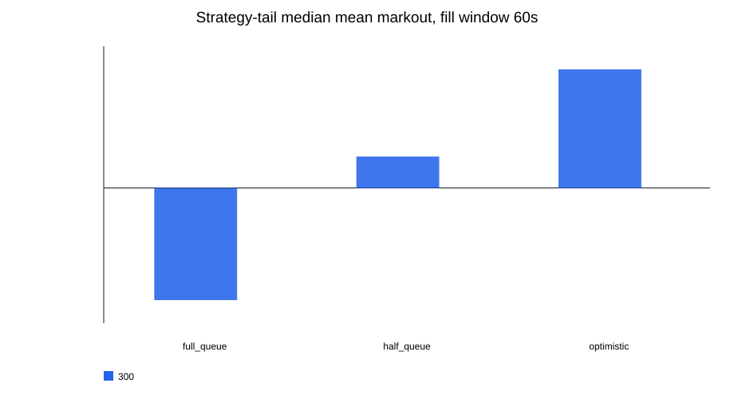
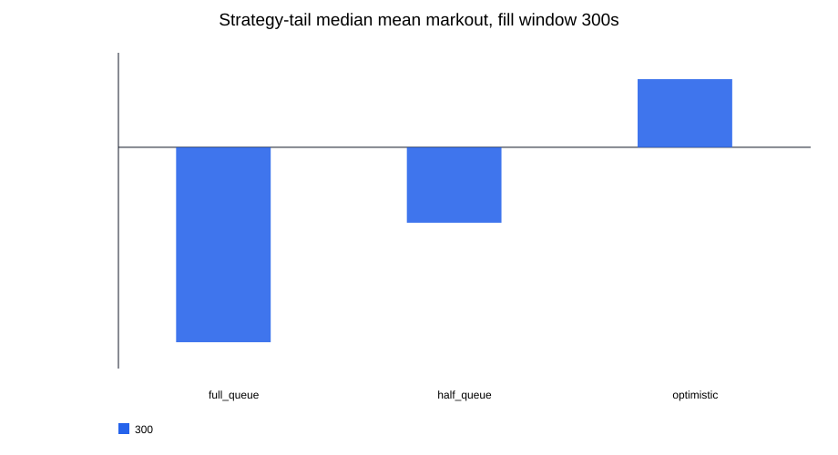
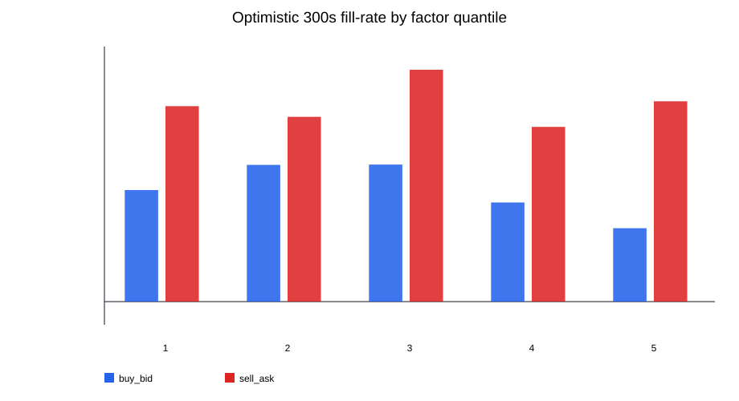

# PMXT 天气 maker markout / fill 诊断报告

生成时间: 2026-07-10T05:26:51.338527+00:00

## 0. 结论先行

这份报告不是 Nautilus 回测，也不是 PnL。它只回答一个更窄的问题：

> `depth_imbalance_1` 如果被当作 maker / quote-skew 信号，在粗糙 fill proxy 下，成交后的 markout 是否还能为正？

乐观 300s fill / 300s markout：median_mean_markout=`0.000944444`，median_fill_rate=`0.0228`，positive_token_share=`0.477`。 半队列假设：median_mean_markout=`-0.00104545`，median_fill_rate=`0.0101`，positive_token_share=`0.159`。 全队列假设：median_mean_markout=`-0.0027`，median_fill_rate=`0.00449`，positive_token_share=`0.0682`。

核心读法：如果假设自己几乎排在队首，信号还有一点弱正 markout；但只要引入半队列/全队列假设，strategy-tail 的 median markout 很快转负或接近 0。这说明上一轮 IC 里的盘口预测性，至少在这两个 PMXT 天气 event 上，并不能直接升级成 maker 可捕获收益。

本报告比上一轮 IC 分析更保守：上一轮证明的是“盘口状态后 mid-price 倾向怎么走”；这一轮检查的是“如果我被动挂单并被成交，成交后的 mid-price markout 怎么样”。

## 1. 信任边界

- 数据源：curated PMXT event parquet。
- 回放时钟：`replay_timestamp`，PMXT 中优先使用 source `timestamp`，缺失时才退回 `timestamp_received`。
- probe 抽样：每 `60` 秒取最后一个 valid book state，避免每行都提交一个虚拟订单导致严重重复计数。
- fill proxy：未来 trade touch/cross 当前 best bid/ask。
- queue proxy：需要成交量 >= displayed top size × queue fraction + order size。
- markout：成交后未来 mid-price 相对 fill price 的变化。
- 不包含 fee、rebate、真实 queue priority、撤单、库存、现金、仓位、Nautilus order state 或可执行 PnL。

## 2. Fill 模型

| queue_model | 含义 |
| --- | --- |
| optimistic | 队列前面没有别人，只要求成交量覆盖自己的 order_size。 |
| half_queue | 假设自己排在当前 displayed top size 的一半之后。 |
| full_queue | 假设自己排在当前 displayed top size 全部之后。 |

买单 fill 条件：未来 `SELL` trade price <= 当前 bid。卖单 fill 条件：未来 `BUY` trade price >= 当前 ask。

## 3. 使用的 event/token

- event_count: 2
- token_count: 22
- probe_count: 54359

| event_slug | market_index | market_label | panel_rows | probe_rows | trade_rows | first_replay_timestamp | last_replay_timestamp | source_quality_ordering_status | source_quality_ordering_ambiguous_rows |
| --- | --- | --- | --- | --- | --- | --- | --- | --- | --- |
| highest-temperature-in-shanghai-on-june-9-2026 | 0 | 18°C or below | 21409 | 282 | 1 | 2026-06-07T04:34:18.347000+00:00 | 2026-06-09T11:59:09.735000+00:00 | ambiguous | 143 |
| highest-temperature-in-shanghai-on-june-9-2026 | 1 | 19°C | 25726 | 420 | 3 | 2026-06-07T04:34:12.866000+00:00 | 2026-06-09T11:59:09.738000+00:00 | ambiguous | 185 |
| highest-temperature-in-shanghai-on-june-9-2026 | 2 | 20°C | 62995 | 1615 | 6 | 2026-06-07T04:34:21.827000+00:00 | 2026-06-09T11:59:09.736000+00:00 | ambiguous | 483 |
| highest-temperature-in-shanghai-on-june-9-2026 | 3 | 21°C | 89673 | 2385 | 7 | 2026-06-07T04:34:33.489000+00:00 | 2026-06-09T11:59:55.400000+00:00 | ambiguous | 699 |
| highest-temperature-in-shanghai-on-june-9-2026 | 4 | 22°C | 144190 | 2538 | 92 | 2026-06-07T04:34:30.063000+00:00 | 2026-06-09T11:59:55.417000+00:00 | ambiguous | 1737 |
| highest-temperature-in-shanghai-on-june-9-2026 | 5 | 23°C | 295717 | 2731 | 477 | 2026-06-07T04:34:30.056000+00:00 | 2026-06-09T11:59:55.408000+00:00 | ambiguous | 6079 |
| highest-temperature-in-shanghai-on-june-9-2026 | 6 | 24°C | 346962 | 2807 | 392 | 2026-06-07T04:34:30.081000+00:00 | 2026-06-09T11:59:09.736000+00:00 | ambiguous | 10545 |
| highest-temperature-in-shanghai-on-june-9-2026 | 7 | 25°C | 334501 | 3032 | 617 | 2026-06-07T04:34:30.072000+00:00 | 2026-06-09T11:59:14.959000+00:00 | ambiguous | 9433 |
| highest-temperature-in-shanghai-on-june-9-2026 | 8 | 26°C | 333019 | 2972 | 368 | 2026-06-07T04:34:30.048000+00:00 | 2026-06-09T11:54:48.014000+00:00 | ambiguous | 7285 |
| highest-temperature-in-shanghai-on-june-9-2026 | 9 | 27°C | 154807 | 2902 | 233 | 2026-06-07T04:34:18.381000+00:00 | 2026-06-09T11:59:51.651000+00:00 | ambiguous | 1996 |
| highest-temperature-in-shanghai-on-june-9-2026 | 10 | 28°C or higher | 153872 | 2832 | 165 | 2026-06-07T04:34:04.763000+00:00 | 2026-06-09T11:59:53.748000+00:00 | ambiguous | 1615 |
| highest-temperature-in-shanghai-on-june-10-2026 | 0 | 23°C or below | 116087 | 2336 | 6 | 2026-06-08T04:27:10.144000+00:00 | 2026-06-10T11:59:57.497000+00:00 | ambiguous | 497 |
| highest-temperature-in-shanghai-on-june-10-2026 | 1 | 24°C | 79060 | 1779 | 1 | 2026-06-08T04:26:57.551000+00:00 | 2026-06-10T11:50:29.327000+00:00 | ambiguous | 412 |
| highest-temperature-in-shanghai-on-june-10-2026 | 2 | 25°C | 131907 | 2595 | 10 | 2026-06-08T04:26:57.773000+00:00 | 2026-06-10T11:59:57.487000+00:00 | ambiguous | 754 |
| highest-temperature-in-shanghai-on-june-10-2026 | 3 | 26°C | 225981 | 2701 | 143 | 2026-06-08T04:26:57.779000+00:00 | 2026-06-10T11:59:57.500000+00:00 | ambiguous | 3102 |
| highest-temperature-in-shanghai-on-june-10-2026 | 4 | 27°C | 397922 | 2835 | 440 | 2026-06-08T04:26:57.782000+00:00 | 2026-06-10T11:59:58.336000+00:00 | ambiguous | 9986 |
| highest-temperature-in-shanghai-on-june-10-2026 | 5 | 28°C | 380116 | 3030 | 430 | 2026-06-08T04:26:57.776000+00:00 | 2026-06-10T11:59:58.334000+00:00 | ambiguous | 8483 |
| highest-temperature-in-shanghai-on-june-10-2026 | 6 | 29°C | 374898 | 3044 | 255 | 2026-06-08T04:26:35.266000+00:00 | 2026-06-10T11:58:03.509000+00:00 | ambiguous | 9050 |
| highest-temperature-in-shanghai-on-june-10-2026 | 7 | 30°C | 339992 | 2947 | 180 | 2026-06-08T04:26:57.796000+00:00 | 2026-06-10T11:59:57.521000+00:00 | ambiguous | 7789 |
| highest-temperature-in-shanghai-on-june-10-2026 | 8 | 31°C | 261085 | 2926 | 119 | 2026-06-08T04:26:57.790000+00:00 | 2026-06-10T11:59:57.496000+00:00 | ambiguous | 3343 |
| highest-temperature-in-shanghai-on-june-10-2026 | 9 | 32°C | 170922 | 2908 | 29 | 2026-06-08T04:26:57.799000+00:00 | 2026-06-10T11:59:57.520000+00:00 | ambiguous | 1147 |
| highest-temperature-in-shanghai-on-june-10-2026 | 10 | 33°C or higher | 141120 | 2742 | 16 | 2026-06-08T04:27:12.754000+00:00 | 2026-06-10T11:59:57.520000+00:00 | ambiguous | 881 |

## 4. Strategy-tail 汇总

strategy-tail 的定义：

- Q5 + buy_bid：因子最高分位时挂买一档；
- Q1 + sell_ask：因子最低分位时挂卖一档；
- combined：把上面两个方向合并看。

| queue_model | queue_ahead_fraction | fill_window_seconds | markout_seconds | quote_side | token_metric_count | total_probes | total_fills | median_fill_rate | median_mean_markout | positive_markout_token_share | median_hit_rate | median_avg_win | median_avg_loss_abs | median_win_loss_ratio | adverse_selection_token_share |
| --- | --- | --- | --- | --- | --- | --- | --- | --- | --- | --- | --- | --- | --- | --- | --- |
| optimistic | 0 | 60 | 60 | buy_bid | 22 | 10877 | 138 | 0.0056218 | 0.0034 | 0.363636 | 0.833333 | 0.0065 | 0.00995833 | 0.971911 | 0.136364 |
| optimistic | 0 | 60 | 60 | sell_ask | 22 | 10881 | 285 | 0.0150208 | 0.0034317 | 0.454545 | 0.773333 | 0.00881327 | 0.0149196 | 0.608751 | 0.5 |
| optimistic | 0 | 60 | 60 | strategy_tail_combined | 44 | 21758 | 423 | 0.0078951 | 0.0034 | 0.409091 | 0.78 | 0.00783333 | 0.0131905 | 0.693636 | 0.318182 |
| optimistic | 0 | 60 | 300 | buy_bid | 22 | 10877 | 138 | 0.0056218 | 0.00391667 | 0.363636 | 0.818182 | 0.0116667 | 0.0145 | 0.796748 | 0.181818 |
| optimistic | 0 | 60 | 300 | sell_ask | 22 | 10881 | 285 | 0.0150208 | 0.00234066 | 0.5 | 0.675 | 0.0123908 | 0.016775 | 0.696121 | 0.363636 |
| optimistic | 0 | 60 | 300 | strategy_tail_combined | 44 | 21758 | 423 | 0.0078951 | 0.00264286 | 0.431818 | 0.683333 | 0.0123529 | 0.0146429 | 0.726316 | 0.272727 |
| optimistic | 0 | 60 | 900 | buy_bid | 22 | 10877 | 138 | 0.0056218 | 0.00464286 | 0.318182 | 0.8 | 0.0142667 | 0.00765 | 1.51215 | 0.181818 |
| optimistic | 0 | 60 | 900 | sell_ask | 22 | 10881 | 285 | 0.0150208 | 0.0037 | 0.5 | 0.666667 | 0.014431 | 0.0247917 | 1.1432 | 0.227273 |
| optimistic | 0 | 60 | 900 | strategy_tail_combined | 44 | 21758 | 423 | 0.0078951 | 0.0039 | 0.409091 | 0.666667 | 0.0142667 | 0.0135588 | 1.1432 | 0.204545 |
| optimistic | 0 | 300 | 60 | buy_bid | 22 | 10877 | 473 | 0.0184757 | 0.003625 | 0.636364 | 0.722222 | 0.005 | 0.01 | 1.13943 | 0.181818 |
| optimistic | 0 | 300 | 60 | sell_ask | 22 | 10881 | 940 | 0.0492003 | 0.00146204 | 0.545455 | 0.708333 | 0.00673684 | 0.0085 | 0.56859 | 0.454545 |
| optimistic | 0 | 300 | 60 | strategy_tail_combined | 44 | 21758 | 1413 | 0.0228337 | 0.00225714 | 0.590909 | 0.722222 | 0.00639827 | 0.00925 | 0.643519 | 0.318182 |
| optimistic | 0 | 300 | 300 | buy_bid | 22 | 10877 | 473 | 0.0184757 | 0.0014 | 0.5 | 0.666667 | 0.0075 | 0.0115 | 0.91634 | 0.318182 |
| optimistic | 0 | 300 | 300 | sell_ask | 22 | 10881 | 940 | 0.0492003 | 0.000722222 | 0.454545 | 0.661905 | 0.00921239 | 0.0106842 | 0.643771 | 0.590909 |
| optimistic | 0 | 300 | 300 | strategy_tail_combined | 44 | 21758 | 1413 | 0.0228337 | 0.000944444 | 0.477273 | 0.666667 | 0.00840307 | 0.0106842 | 0.769615 | 0.454545 |
| optimistic | 0 | 300 | 900 | buy_bid | 22 | 10877 | 473 | 0.0184757 | 0.000794118 | 0.454545 | 0.7 | 0.00887255 | 0.00902941 | 1.21892 | 0.272727 |
| optimistic | 0 | 300 | 900 | sell_ask | 22 | 10881 | 940 | 0.0492003 | 0.000641228 | 0.5 | 0.591724 | 0.0123333 | 0.0148723 | 0.813942 | 0.454545 |
| optimistic | 0 | 300 | 900 | strategy_tail_combined | 44 | 21758 | 1413 | 0.0228337 | 0.000649123 | 0.477273 | 0.635417 | 0.0107836 | 0.0113529 | 0.886905 | 0.363636 |
| half_queue | 0.5 | 60 | 60 | buy_bid | 22 | 10877 | 32 | 0.00171381 | 0.002375 | 0.0909091 | 0.5625 | 0.00925 | 0.00829167 | 1.11455 | 0.0454545 |
| half_queue | 0.5 | 60 | 60 | sell_ask | 22 | 10881 | 117 | 0.00620579 | -0.00183333 | 0.181818 | 0.454545 | 0.008 | 0.0179 | 0.555556 | 0.363636 |
| half_queue | 0.5 | 60 | 60 | strategy_tail_combined | 44 | 21758 | 149 | 0.00187914 | -0.0006 | 0.136364 | 0.5 | 0.008 | 0.015625 | 0.64135 | 0.204545 |
| half_queue | 0.5 | 60 | 300 | buy_bid | 22 | 10877 | 32 | 0.00171381 | 0.0125833 | 0.0454545 | 0.666667 | 0.022925 | 0.014125 | 1.60219 | 0.0454545 |
| half_queue | 0.5 | 60 | 300 | sell_ask | 22 | 10881 | 117 | 0.00620579 | 0.0007 | 0.318182 | 0.5 | 0.0101429 | 0.0166667 | 1 | 0.272727 |
| half_queue | 0.5 | 60 | 300 | strategy_tail_combined | 44 | 21758 | 149 | 0.00187914 | 0.0007 | 0.181818 | 0.5 | 0.01125 | 0.0166111 | 1 | 0.159091 |
| half_queue | 0.5 | 60 | 900 | buy_bid | 22 | 10877 | 32 | 0.00171381 | 0.0268958 | 0.0454545 | 0.666667 | 0.04115 | 0.010625 | 6.28703e+14 | 0.0454545 |
| half_queue | 0.5 | 60 | 900 | sell_ask | 22 | 10881 | 117 | 0.00620579 | 0.0026 | 0.318182 | 0.583333 | 0.015 | 0.0265833 | 1.23077 | 0.227273 |
| half_queue | 0.5 | 60 | 900 | strategy_tail_combined | 44 | 21758 | 149 | 0.00187914 | 0.0026 | 0.181818 | 0.583333 | 0.015 | 0.02125 | 1.23077 | 0.136364 |
| half_queue | 0.5 | 300 | 60 | buy_bid | 22 | 10877 | 124 | 0.00702435 | -0.00266667 | 0.136364 | 0.494949 | 0.005 | 0.0149318 | 0.592593 | 0.227273 |
| half_queue | 0.5 | 300 | 60 | sell_ask | 22 | 10881 | 465 | 0.025683 | -0.000368817 | 0.227273 | 0.568067 | 0.00723077 | 0.0085 | 0.499388 | 0.454545 |
| half_queue | 0.5 | 300 | 60 | strategy_tail_combined | 44 | 21758 | 589 | 0.010058 | -0.000477151 | 0.181818 | 0.559028 | 0.005625 | 0.0146429 | 0.558672 | 0.340909 |
| half_queue | 0.5 | 300 | 300 | buy_bid | 22 | 10877 | 124 | 0.00702435 | -0.000920455 | 0.136364 | 0.568182 | 0.0045 | 0.0120625 | 0.7 | 0.136364 |
| half_queue | 0.5 | 300 | 300 | sell_ask | 22 | 10881 | 465 | 0.025683 | -0.0015 | 0.181818 | 0.458188 | 0.00839286 | 0.0112895 | 0.59229 | 0.5 |
| half_queue | 0.5 | 300 | 300 | strategy_tail_combined | 44 | 21758 | 589 | 0.010058 | -0.00104545 | 0.159091 | 0.493902 | 0.00806181 | 0.0112895 | 0.636161 | 0.318182 |
| half_queue | 0.5 | 300 | 900 | buy_bid | 22 | 10877 | 124 | 0.00702435 | -0.001 | 0.181818 | 0.40404 | 0.014375 | 0.0179412 | 1.09091 | 0.0909091 |
| half_queue | 0.5 | 300 | 900 | sell_ask | 22 | 10881 | 465 | 0.025683 | 2.08333e-05 | 0.363636 | 0.4875 | 0.00905263 | 0.013511 | 0.754167 | 0.409091 |
| half_queue | 0.5 | 300 | 900 | strategy_tail_combined | 44 | 21758 | 589 | 0.010058 | 2.08333e-05 | 0.272727 | 0.46723 | 0.0117138 | 0.0148304 | 0.791667 | 0.25 |
| full_queue | 1 | 60 | 60 | buy_bid | 22 | 10877 | 16 | 0.000823723 |  | 0 |  |  |  |  | 0 |
| full_queue | 1 | 60 | 60 | sell_ask | 22 | 10881 | 62 | 0.00186609 | -0.0022 | 0.0909091 | 0.533333 | 0.008125 | 0.015 | 0.538462 | 0.136364 |
| full_queue | 1 | 60 | 60 | strategy_tail_combined | 44 | 21758 | 78 | 0.00166406 | -0.0022 | 0.0454545 | 0.533333 | 0.008125 | 0.015 | 0.538462 | 0.0681818 |
| full_queue | 1 | 60 | 300 | buy_bid | 22 | 10877 | 16 | 0.000823723 |  | 0 |  |  |  |  | 0 |
| full_queue | 1 | 60 | 300 | sell_ask | 22 | 10881 | 62 | 0.00186609 | -0.0025 | 0.0454545 | 0.5 | 0.0075 | 0.0177857 | 0.571429 | 0.181818 |
| full_queue | 1 | 60 | 300 | strategy_tail_combined | 44 | 21758 | 78 | 0.00166406 | -0.0025 | 0.0227273 | 0.5 | 0.0075 | 0.0177857 | 0.571429 | 0.0909091 |
| full_queue | 1 | 60 | 900 | buy_bid | 22 | 10877 | 16 | 0.000823723 |  | 0 |  |  |  |  | 0 |
| full_queue | 1 | 60 | 900 | sell_ask | 22 | 10881 | 62 | 0.00186609 | 0.000166667 | 0.136364 | 0.466667 | 0.015 | 0.0355714 | 1.31429 | 0.0909091 |
| full_queue | 1 | 60 | 900 | strategy_tail_combined | 44 | 21758 | 78 | 0.00166406 | 0.000166667 | 0.0681818 | 0.466667 | 0.015 | 0.0355714 | 1.31429 | 0.0454545 |
| full_queue | 1 | 300 | 60 | buy_bid | 22 | 10877 | 73 | 0.00183667 | -0.00452381 | 0 | 0.267857 | 0.005625 | 0.015625 | 0.321429 | 0.181818 |
| full_queue | 1 | 300 | 60 | sell_ask | 22 | 10881 | 279 | 0.0123585 | -0.0021 | 0.227273 | 0.478261 | 0.0075 | 0.0185 | 0.46332 | 0.409091 |
| full_queue | 1 | 300 | 60 | strategy_tail_combined | 44 | 21758 | 352 | 0.00448951 | -0.00238462 | 0.113636 | 0.384615 | 0.00747727 | 0.0175 | 0.41177 | 0.295455 |
| full_queue | 1 | 300 | 300 | buy_bid | 22 | 10877 | 73 | 0.00183667 | -0.00328125 | 0.0454545 | 0.266667 | 0.0075 | 0.0107467 | 0.773034 | 0.181818 |
| full_queue | 1 | 300 | 300 | sell_ask | 22 | 10881 | 279 | 0.0123585 | -0.0027 | 0.0909091 | 0.384615 | 0.00966667 | 0.0186333 | 0.563506 | 0.409091 |
| full_queue | 1 | 300 | 300 | strategy_tail_combined | 44 | 21758 | 352 | 0.00448951 | -0.0027 | 0.0681818 | 0.375 | 0.00940476 | 0.014375 | 0.689708 | 0.295455 |
| full_queue | 1 | 300 | 900 | buy_bid | 22 | 10877 | 73 | 0.00183667 | -0.0025 | 0.0909091 | 0.25 | 0.0302 | 0.013625 | 0.699013 | 0.0909091 |
| full_queue | 1 | 300 | 900 | sell_ask | 22 | 10881 | 279 | 0.0123585 | -0.00257547 | 0.227273 | 0.409091 | 0.015 | 0.0194093 | 1.00734 | 0.227273 |
| full_queue | 1 | 300 | 900 | strategy_tail_combined | 44 | 21758 | 352 | 0.00448951 | -0.00253774 | 0.159091 | 0.381016 | 0.015 | 0.0169286 | 0.893093 | 0.159091 |

## 5. Event-level 预览

| event_slug | queue_model | fill_window_seconds | markout_seconds | quote_side | factor_quantile | token_metric_count | total_probes | total_fills | median_fill_rate | median_mean_markout | positive_markout_token_share |
| --- | --- | --- | --- | --- | --- | --- | --- | --- | --- | --- | --- |
| highest-temperature-in-shanghai-on-june-10-2026 | full_queue | 60 | 60 | buy_bid | 1 | 11 | 5973 | 30 | 0.00184843 | -0.0059 | 0.0909091 |
| highest-temperature-in-shanghai-on-june-10-2026 | full_queue | 60 | 60 | buy_bid | 2 | 11 | 5967 | 35 | 0.00182482 | 0.0005625 | 0.272727 |
| highest-temperature-in-shanghai-on-june-10-2026 | full_queue | 60 | 60 | buy_bid | 3 | 11 | 5966 | 28 | 0.00185185 | -0.006625 | 0.0909091 |
| highest-temperature-in-shanghai-on-june-10-2026 | full_queue | 60 | 60 | buy_bid | 4 | 11 | 5967 | 8 | 0 |  | 0 |
| highest-temperature-in-shanghai-on-june-10-2026 | full_queue | 60 | 60 | buy_bid | 5 | 11 | 5970 | 12 | 0.0017094 |  | 0 |
| highest-temperature-in-shanghai-on-june-10-2026 | full_queue | 60 | 60 | sell_ask | 1 | 11 | 5973 | 29 | 0.00164204 | -0.0022 | 0.0909091 |
| highest-temperature-in-shanghai-on-june-10-2026 | full_queue | 60 | 60 | sell_ask | 2 | 11 | 5967 | 47 | 0.00656814 | -8.33333e-05 | 0.181818 |
| highest-temperature-in-shanghai-on-june-10-2026 | full_queue | 60 | 60 | sell_ask | 3 | 11 | 5966 | 57 | 0.00822368 | -0.00302778 | 0.272727 |
| highest-temperature-in-shanghai-on-june-10-2026 | full_queue | 60 | 60 | sell_ask | 4 | 11 | 5967 | 46 | 0.0034188 | -0.00922727 | 0 |
| highest-temperature-in-shanghai-on-june-10-2026 | full_queue | 60 | 60 | sell_ask | 5 | 11 | 5970 | 58 | 0.0034188 | -0.00102941 | 0.181818 |
| highest-temperature-in-shanghai-on-june-10-2026 | full_queue | 60 | 300 | buy_bid | 1 | 11 | 5973 | 30 | 0.00184843 | -0.00270833 | 0.0909091 |
| highest-temperature-in-shanghai-on-june-10-2026 | full_queue | 60 | 300 | buy_bid | 2 | 11 | 5967 | 35 | 0.00182482 | -0.00851042 | 0.181818 |
| highest-temperature-in-shanghai-on-june-10-2026 | full_queue | 60 | 300 | buy_bid | 3 | 11 | 5966 | 28 | 0.00185185 | -0.0146643 | 0 |
| highest-temperature-in-shanghai-on-june-10-2026 | full_queue | 60 | 300 | buy_bid | 4 | 11 | 5967 | 8 | 0 |  | 0 |
| highest-temperature-in-shanghai-on-june-10-2026 | full_queue | 60 | 300 | buy_bid | 5 | 11 | 5970 | 12 | 0.0017094 |  | 0 |
| highest-temperature-in-shanghai-on-june-10-2026 | full_queue | 60 | 300 | sell_ask | 1 | 11 | 5973 | 29 | 0.00164204 | -0.0025 | 0 |
| highest-temperature-in-shanghai-on-june-10-2026 | full_queue | 60 | 300 | sell_ask | 2 | 11 | 5967 | 47 | 0.00656814 | -0.000719697 | 0.181818 |
| highest-temperature-in-shanghai-on-june-10-2026 | full_queue | 60 | 300 | sell_ask | 3 | 11 | 5966 | 57 | 0.00822368 | -0.00319444 | 0.181818 |
| highest-temperature-in-shanghai-on-june-10-2026 | full_queue | 60 | 300 | sell_ask | 4 | 11 | 5967 | 46 | 0.0034188 | -0.00865909 | 0.0909091 |
| highest-temperature-in-shanghai-on-june-10-2026 | full_queue | 60 | 300 | sell_ask | 5 | 11 | 5970 | 58 | 0.0034188 | -0.0111944 | 0 |
| highest-temperature-in-shanghai-on-june-10-2026 | full_queue | 60 | 900 | buy_bid | 1 | 11 | 5973 | 30 | 0.00184843 | -0.011 | 0 |
| highest-temperature-in-shanghai-on-june-10-2026 | full_queue | 60 | 900 | buy_bid | 2 | 11 | 5967 | 35 | 0.00182482 | 0.00366875 | 0.181818 |
| highest-temperature-in-shanghai-on-june-10-2026 | full_queue | 60 | 900 | buy_bid | 3 | 11 | 5966 | 28 | 0.00185185 | -0.01405 | 0.0909091 |
| highest-temperature-in-shanghai-on-june-10-2026 | full_queue | 60 | 900 | buy_bid | 4 | 11 | 5967 | 8 | 0 |  | 0 |
| highest-temperature-in-shanghai-on-june-10-2026 | full_queue | 60 | 900 | buy_bid | 5 | 11 | 5970 | 12 | 0.0017094 |  | 0 |
| highest-temperature-in-shanghai-on-june-10-2026 | full_queue | 60 | 900 | sell_ask | 1 | 11 | 5973 | 29 | 0.00164204 | 0.000166667 | 0.181818 |
| highest-temperature-in-shanghai-on-june-10-2026 | full_queue | 60 | 900 | sell_ask | 2 | 11 | 5967 | 47 | 0.00656814 | 0.00429167 | 0.272727 |
| highest-temperature-in-shanghai-on-june-10-2026 | full_queue | 60 | 900 | sell_ask | 3 | 11 | 5966 | 57 | 0.00822368 | 0.00425 | 0.363636 |
| highest-temperature-in-shanghai-on-june-10-2026 | full_queue | 60 | 900 | sell_ask | 4 | 11 | 5967 | 46 | 0.0034188 | -0.00678788 | 0.0909091 |
| highest-temperature-in-shanghai-on-june-10-2026 | full_queue | 60 | 900 | sell_ask | 5 | 11 | 5970 | 58 | 0.0034188 | -0.0128028 | 0.0909091 |
| highest-temperature-in-shanghai-on-june-10-2026 | full_queue | 300 | 60 | buy_bid | 1 | 11 | 5973 | 146 | 0.012939 | -5.51948e-05 | 0.272727 |
| highest-temperature-in-shanghai-on-june-10-2026 | full_queue | 300 | 60 | buy_bid | 2 | 11 | 5967 | 159 | 0.0115512 | -1.58603e-17 | 0.272727 |
| highest-temperature-in-shanghai-on-june-10-2026 | full_queue | 300 | 60 | buy_bid | 3 | 11 | 5966 | 88 | 0.00859107 | -0.00531399 | 0.181818 |
| highest-temperature-in-shanghai-on-june-10-2026 | full_queue | 300 | 60 | buy_bid | 4 | 11 | 5967 | 34 | 0 | -0.00289286 | 0.0909091 |
| highest-temperature-in-shanghai-on-june-10-2026 | full_queue | 300 | 60 | buy_bid | 5 | 11 | 5970 | 58 | 0.00512821 | -0.00428571 | 0 |
| highest-temperature-in-shanghai-on-june-10-2026 | full_queue | 300 | 60 | sell_ask | 1 | 11 | 5973 | 147 | 0.0147874 | -0.000605351 | 0.272727 |
| highest-temperature-in-shanghai-on-june-10-2026 | full_queue | 300 | 60 | sell_ask | 2 | 11 | 5967 | 204 | 0.0213465 | -0.00179549 | 0.181818 |
| highest-temperature-in-shanghai-on-june-10-2026 | full_queue | 300 | 60 | sell_ask | 3 | 11 | 5966 | 220 | 0.0307692 | -0.00395 | 0.272727 |
| highest-temperature-in-shanghai-on-june-10-2026 | full_queue | 300 | 60 | sell_ask | 4 | 11 | 5967 | 199 | 0.0239316 | -0.00404762 | 0.0909091 |
| highest-temperature-in-shanghai-on-june-10-2026 | full_queue | 300 | 60 | sell_ask | 5 | 11 | 5970 | 275 | 0.0136752 | -0.00224537 | 0.0909091 |
| highest-temperature-in-shanghai-on-june-10-2026 | full_queue | 300 | 300 | buy_bid | 1 | 11 | 5973 | 146 | 0.012939 | -0.00241558 | 0.272727 |
| highest-temperature-in-shanghai-on-june-10-2026 | full_queue | 300 | 300 | buy_bid | 2 | 11 | 5967 | 159 | 0.0115512 | -0.00714286 | 0.272727 |
| highest-temperature-in-shanghai-on-june-10-2026 | full_queue | 300 | 300 | buy_bid | 3 | 11 | 5966 | 88 | 0.00859107 | -0.0058244 | 0.181818 |
| highest-temperature-in-shanghai-on-june-10-2026 | full_queue | 300 | 300 | buy_bid | 4 | 11 | 5967 | 34 | 0 | -0.00110714 | 0.0909091 |
| highest-temperature-in-shanghai-on-june-10-2026 | full_queue | 300 | 300 | buy_bid | 5 | 11 | 5970 | 58 | 0.00512821 | -0.0025 | 0.0909091 |
| highest-temperature-in-shanghai-on-june-10-2026 | full_queue | 300 | 300 | sell_ask | 1 | 11 | 5973 | 147 | 0.0147874 | -0.00286058 | 0 |
| highest-temperature-in-shanghai-on-june-10-2026 | full_queue | 300 | 300 | sell_ask | 2 | 11 | 5967 | 204 | 0.0213465 | 0.000175231 | 0.363636 |
| highest-temperature-in-shanghai-on-june-10-2026 | full_queue | 300 | 300 | sell_ask | 3 | 11 | 5966 | 220 | 0.0307692 | -0.00492969 | 0.181818 |
| highest-temperature-in-shanghai-on-june-10-2026 | full_queue | 300 | 300 | sell_ask | 4 | 11 | 5967 | 199 | 0.0239316 | -0.00799109 | 0.0909091 |
| highest-temperature-in-shanghai-on-june-10-2026 | full_queue | 300 | 300 | sell_ask | 5 | 11 | 5970 | 275 | 0.0136752 | -0.0055664 | 0.0909091 |
| highest-temperature-in-shanghai-on-june-10-2026 | full_queue | 300 | 900 | buy_bid | 1 | 11 | 5973 | 146 | 0.012939 | -0.0034458 | 0.272727 |
| highest-temperature-in-shanghai-on-june-10-2026 | full_queue | 300 | 900 | buy_bid | 2 | 11 | 5967 | 159 | 0.0115512 | -0.0008625 | 0.272727 |
| highest-temperature-in-shanghai-on-june-10-2026 | full_queue | 300 | 900 | buy_bid | 3 | 11 | 5966 | 88 | 0.00859107 | -0.00539062 | 0.181818 |
| highest-temperature-in-shanghai-on-june-10-2026 | full_queue | 300 | 900 | buy_bid | 4 | 11 | 5967 | 34 | 0 | -0.00496429 | 0.0909091 |
| highest-temperature-in-shanghai-on-june-10-2026 | full_queue | 300 | 900 | buy_bid | 5 | 11 | 5970 | 58 | 0.00512821 | -0.00484375 | 0.0909091 |
| highest-temperature-in-shanghai-on-june-10-2026 | full_queue | 300 | 900 | sell_ask | 1 | 11 | 5973 | 147 | 0.0147874 | -0.00120433 | 0.272727 |
| highest-temperature-in-shanghai-on-june-10-2026 | full_queue | 300 | 900 | sell_ask | 2 | 11 | 5967 | 204 | 0.0213465 | -0.000631629 | 0.363636 |
| highest-temperature-in-shanghai-on-june-10-2026 | full_queue | 300 | 900 | sell_ask | 3 | 11 | 5966 | 220 | 0.0307692 | 0.00156548 | 0.454545 |
| highest-temperature-in-shanghai-on-june-10-2026 | full_queue | 300 | 900 | sell_ask | 4 | 11 | 5967 | 199 | 0.0239316 | -0.00241699 | 0.181818 |
| highest-temperature-in-shanghai-on-june-10-2026 | full_queue | 300 | 900 | sell_ask | 5 | 11 | 5970 | 275 | 0.0136752 | -0.00194035 | 0.272727 |
| highest-temperature-in-shanghai-on-june-10-2026 | half_queue | 60 | 60 | buy_bid | 1 | 11 | 5973 | 50 | 0.00192678 | -0.00388889 | 0.181818 |
| highest-temperature-in-shanghai-on-june-10-2026 | half_queue | 60 | 60 | buy_bid | 2 | 11 | 5967 | 54 | 0.00660066 | 0.00104583 | 0.363636 |
| highest-temperature-in-shanghai-on-june-10-2026 | half_queue | 60 | 60 | buy_bid | 3 | 11 | 5966 | 40 | 0.0037037 | -0.006475 | 0.0909091 |
| highest-temperature-in-shanghai-on-june-10-2026 | half_queue | 60 | 60 | buy_bid | 4 | 11 | 5967 | 19 | 0 | 0.0039 | 0.0909091 |
| highest-temperature-in-shanghai-on-june-10-2026 | half_queue | 60 | 60 | buy_bid | 5 | 11 | 5970 | 25 | 0.00182149 | 0.002375 | 0.181818 |
| highest-temperature-in-shanghai-on-june-10-2026 | half_queue | 60 | 60 | sell_ask | 1 | 11 | 5973 | 56 | 0.00847458 | 0.0005 | 0.272727 |
| highest-temperature-in-shanghai-on-june-10-2026 | half_queue | 60 | 60 | sell_ask | 2 | 11 | 5967 | 78 | 0.00985222 | 0.00167216 | 0.363636 |
| highest-temperature-in-shanghai-on-june-10-2026 | half_queue | 60 | 60 | sell_ask | 3 | 11 | 5966 | 97 | 0.0119658 | 0.000392857 | 0.272727 |
| highest-temperature-in-shanghai-on-june-10-2026 | half_queue | 60 | 60 | sell_ask | 4 | 11 | 5967 | 77 | 0.00512821 | -0.00496875 | 0.181818 |
| highest-temperature-in-shanghai-on-june-10-2026 | half_queue | 60 | 60 | sell_ask | 5 | 11 | 5970 | 109 | 0.0034188 | -0.0038 | 0 |
| highest-temperature-in-shanghai-on-june-10-2026 | half_queue | 60 | 300 | buy_bid | 1 | 11 | 5973 | 50 | 0.00192678 | -0.008 | 0.181818 |
| highest-temperature-in-shanghai-on-june-10-2026 | half_queue | 60 | 300 | buy_bid | 2 | 11 | 5967 | 54 | 0.00660066 | -0.00688333 | 0.181818 |
| highest-temperature-in-shanghai-on-june-10-2026 | half_queue | 60 | 300 | buy_bid | 3 | 11 | 5966 | 40 | 0.0037037 | -0.0120714 | 0 |
| highest-temperature-in-shanghai-on-june-10-2026 | half_queue | 60 | 300 | buy_bid | 4 | 11 | 5967 | 19 | 0 | 0.0041 | 0.0909091 |
| highest-temperature-in-shanghai-on-june-10-2026 | half_queue | 60 | 300 | buy_bid | 5 | 11 | 5970 | 25 | 0.00182149 | 0.0125833 | 0.0909091 |
| highest-temperature-in-shanghai-on-june-10-2026 | half_queue | 60 | 300 | sell_ask | 1 | 11 | 5973 | 56 | 0.00847458 | 0.00031875 | 0.272727 |
| highest-temperature-in-shanghai-on-june-10-2026 | half_queue | 60 | 300 | sell_ask | 2 | 11 | 5967 | 78 | 0.00985222 | -0.0016131 | 0.181818 |
| highest-temperature-in-shanghai-on-june-10-2026 | half_queue | 60 | 300 | sell_ask | 3 | 11 | 5966 | 97 | 0.0119658 | -0.00170055 | 0.181818 |
| highest-temperature-in-shanghai-on-june-10-2026 | half_queue | 60 | 300 | sell_ask | 4 | 11 | 5967 | 77 | 0.00512821 | -0.00625 | 0.0909091 |
| highest-temperature-in-shanghai-on-june-10-2026 | half_queue | 60 | 300 | sell_ask | 5 | 11 | 5970 | 109 | 0.0034188 | -0.00423333 | 0 |

## 6. Token probe 概览

| event_slug | event_title | event_start | event_end | market_index | market_label | condition_id | asset_id | token_side | source_quality_coverage_status | source_quality_ordering_status | source_quality_snapshot_replay_status | source_quality_metadata_join_status | source_quality_ordering_ambiguous_groups | source_quality_ordering_ambiguous_rows | source_quality_missing_source_timestamp_rows | source_quality_stable_sort_key | ordering_ambiguous | probe_rows | trade_rows | first_timestamp_received | last_timestamp_received | first_replay_timestamp | last_replay_timestamp | median_spread | median_depth_imbalance_1 | source_time_inversion_count | source_delay_over_threshold_count |
| --- | --- | --- | --- | --- | --- | --- | --- | --- | --- | --- | --- | --- | --- | --- | --- | --- | --- | --- | --- | --- | --- | --- | --- | --- | --- | --- | --- |
| highest-temperature-in-shanghai-on-june-9-2026 | Highest temperature in Shanghai on June 9? | 2026-06-07T04:34:03Z | 2026-06-09T12:00:00Z | 0 | 18°C or below | 0xc2e74183c15adfc561bdab466ce80efb6525b907ff36a1667452f14e7e607b73 | 82108548216968010072870699597305974161044963313995774427931182710031745067538 | YES | not_run | ambiguous | not_run | pass | 71 | 143 | 0 | timestamp,timestamp_received,_original_row_index | True | 282 | 1 | 2026-06-07T04:34:18.488000+00:00 | 2026-06-09T11:59:09.781000+00:00 | 2026-06-07T04:34:18.347000+00:00 | 2026-06-09T11:59:09.735000+00:00 | 0.002 | -0.96019 | 0 | 7169 |
| highest-temperature-in-shanghai-on-june-9-2026 | Highest temperature in Shanghai on June 9? | 2026-06-07T04:34:03Z | 2026-06-09T12:00:00Z | 1 | 19°C | 0xe9270a0ad0e9215e2249b5573f8e1e40b39e76d19b45ded06aa4c0faeae9b9a8 | 74502948617169463266911772205376938956442075011044734712645525624423814463171 | YES | not_run | ambiguous | not_run | pass | 92 | 185 | 0 | timestamp,timestamp_received,_original_row_index | True | 420 | 3 | 2026-06-07T04:34:12.940000+00:00 | 2026-06-09T11:59:09.781000+00:00 | 2026-06-07T04:34:12.866000+00:00 | 2026-06-09T11:59:09.738000+00:00 | 0.007 | 0.254658 | 0 | 8248 |
| highest-temperature-in-shanghai-on-june-9-2026 | Highest temperature in Shanghai on June 9? | 2026-06-07T04:34:03Z | 2026-06-09T12:00:00Z | 2 | 20°C | 0xe692a6f51125cf6914c090f8e01ecf1491030ed0ad775156b7dea9ed74099392 | 29363478216105628907851761749240280974313606434750483239415068662725185057677 | YES | not_run | ambiguous | not_run | pass | 241 | 483 | 0 | timestamp,timestamp_received,_original_row_index | True | 1615 | 6 | 2026-06-07T04:34:22.601000+00:00 | 2026-06-09T11:59:09.781000+00:00 | 2026-06-07T04:34:21.827000+00:00 | 2026-06-09T11:59:09.736000+00:00 | 0.003 | 0.285714 | 0 | 31089 |
| highest-temperature-in-shanghai-on-june-9-2026 | Highest temperature in Shanghai on June 9? | 2026-06-07T04:34:03Z | 2026-06-09T12:00:00Z | 3 | 21°C | 0x4b71fc3b2d6d0a5a6d4a3c57a66f3b7c0a70049d1bd8fb47fdb985ca5e42a0e7 | 32958582433402594997678224016035388842620018324746531711463337433683768535571 | YES | not_run | ambiguous | not_run | pass | 349 | 699 | 0 | timestamp,timestamp_received,_original_row_index | True | 2385 | 7 | 2026-06-07T04:34:33.563000+00:00 | 2026-06-09T11:59:55.580000+00:00 | 2026-06-07T04:34:33.489000+00:00 | 2026-06-09T11:59:55.400000+00:00 | 0.004 | 0.551891 | 0 | 47884 |
| highest-temperature-in-shanghai-on-june-9-2026 | Highest temperature in Shanghai on June 9? | 2026-06-07T04:34:03Z | 2026-06-09T12:00:00Z | 4 | 22°C | 0x5e9cdf0acfadf1d761629c3e824f608b4c8abda66747f716816cd21a6ef44b02 | 21885399021320574560651114684216824442350810668622956886293663194490254187234 | YES | not_run | ambiguous | not_run | pass | 866 | 1737 | 0 | timestamp,timestamp_received,_original_row_index | True | 2538 | 92 | 2026-06-07T04:34:30.268000+00:00 | 2026-06-09T11:59:55.580000+00:00 | 2026-06-07T04:34:30.063000+00:00 | 2026-06-09T11:59:55.417000+00:00 | 0.016 | 0.0575916 | 0 | 90049 |
| highest-temperature-in-shanghai-on-june-9-2026 | Highest temperature in Shanghai on June 9? | 2026-06-07T04:34:03Z | 2026-06-09T12:00:00Z | 5 | 23°C | 0xc6e48d3b9fb338a583851f46245eeb5d016d1c7db5325bc711b47592d44dea31 | 88280062208897936928474997251824304255619443393959943341817445415105690345219 | YES | not_run | ambiguous | not_run | pass | 3031 | 6079 | 0 | timestamp,timestamp_received,_original_row_index | True | 2731 | 477 | 2026-06-07T04:34:30.268000+00:00 | 2026-06-09T11:59:55.580000+00:00 | 2026-06-07T04:34:30.056000+00:00 | 2026-06-09T11:59:55.408000+00:00 | 0.02 | 0.143722 | 0 | 172368 |
| highest-temperature-in-shanghai-on-june-9-2026 | Highest temperature in Shanghai on June 9? | 2026-06-07T04:34:03Z | 2026-06-09T12:00:00Z | 6 | 24°C | 0x09e1e10495f1dbb1948b63ad02a4af9f59a0401dde53ec713e5105d75eefe748 | 24582299336321328719263949980519370081553878495528020204195731783368989713817 | YES | not_run | ambiguous | not_run | pass | 5248 | 10545 | 0 | timestamp,timestamp_received,_original_row_index | True | 2807 | 392 | 2026-06-07T04:34:30.268000+00:00 | 2026-06-09T11:59:09.781000+00:00 | 2026-06-07T04:34:30.081000+00:00 | 2026-06-09T11:59:09.736000+00:00 | 0.01 | 0.0218296 | 0 | 218452 |
| highest-temperature-in-shanghai-on-june-9-2026 | Highest temperature in Shanghai on June 9? | 2026-06-07T04:34:03Z | 2026-06-09T12:00:00Z | 7 | 25°C | 0x715ee73ffee65801adb9f51098cf61a14fb4262ae2b20eeb1d68528bdde59c41 | 93683348120137447419301462197228170067558545967622008841151707439369216600718 | YES | not_run | ambiguous | not_run | pass | 4694 | 9433 | 0 | timestamp,timestamp_received,_original_row_index | True | 3032 | 617 | 2026-06-07T04:34:30.268000+00:00 | 2026-06-09T11:59:15.163000+00:00 | 2026-06-07T04:34:30.072000+00:00 | 2026-06-09T11:59:14.959000+00:00 | 0.02 | 0.310741 | 0 | 177530 |
| highest-temperature-in-shanghai-on-june-9-2026 | Highest temperature in Shanghai on June 9? | 2026-06-07T04:34:03Z | 2026-06-09T12:00:00Z | 8 | 26°C | 0x2488923e3cccb1742f4a230dfe8d79f6add52e0807b81809f1cd1e33028d03c1 | 84036100857155819931728194506958678774155362425129625655151905448772883585970 | YES | not_run | ambiguous | not_run | pass | 3628 | 7285 | 0 | timestamp,timestamp_received,_original_row_index | True | 2972 | 368 | 2026-06-07T04:34:30.268000+00:00 | 2026-06-09T11:54:48.150000+00:00 | 2026-06-07T04:34:30.048000+00:00 | 2026-06-09T11:54:48.014000+00:00 | 0.02 | 0.311089 | 0 | 172674 |
| highest-temperature-in-shanghai-on-june-9-2026 | Highest temperature in Shanghai on June 9? | 2026-06-07T04:34:03Z | 2026-06-09T12:00:00Z | 9 | 27°C | 0x15a54d2d69dbe4ba0be84b4be5d634bcd81fb2659e4c211167ce7345c0f29ef7 | 8027430777184882285423173626503131257499585722975011528474150083679962657468 | YES | not_run | ambiguous | not_run | pass | 995 | 1996 | 0 | timestamp,timestamp_received,_original_row_index | True | 2902 | 233 | 2026-06-07T04:34:18.488000+00:00 | 2026-06-09T11:59:51.767000+00:00 | 2026-06-07T04:34:18.381000+00:00 | 2026-06-09T11:59:51.651000+00:00 | 0.007 | 0.442308 | 0 | 80865 |
| highest-temperature-in-shanghai-on-june-9-2026 | Highest temperature in Shanghai on June 9? | 2026-06-07T04:34:03Z | 2026-06-09T12:00:00Z | 10 | 28°C or higher | 0xbb205043a60774a3a047d9b19a1ff1b89f476d221df716552ffbce4dc9d47524 | 74894507304943217982308150117351772383465743335849048351488006458495739714670 | YES | not_run | ambiguous | not_run | pass | 807 | 1615 | 0 | timestamp,timestamp_received,_original_row_index | True | 2832 | 165 | 2026-06-07T04:34:05.018000+00:00 | 2026-06-09T11:59:53.871000+00:00 | 2026-06-07T04:34:04.763000+00:00 | 2026-06-09T11:59:53.748000+00:00 | 0.003 | 0.322733 | 0 | 81943 |
| highest-temperature-in-shanghai-on-june-10-2026 | Highest temperature in Shanghai on June 10? | 2026-06-08T04:26:36Z | 2026-06-10T12:00:00Z | 0 | 23°C or below | 0x209ea702bffd8aa70d4fca6c1287885fdb91716c30e0e8bd81567963400b0e50 | 12036673829484768976214971983373134806036380987353183612468179472146562556837 | YES | not_run | ambiguous | not_run | pass | 248 | 497 | 0 | timestamp,timestamp_received,_original_row_index | True | 2336 | 6 | 2026-06-08T04:27:11.576000+00:00 | 2026-06-10T11:59:57.686000+00:00 | 2026-06-08T04:27:10.144000+00:00 | 2026-06-10T11:59:57.497000+00:00 | 0.002 | 0.182878 | 0 | 48035 |
| highest-temperature-in-shanghai-on-june-10-2026 | Highest temperature in Shanghai on June 10? | 2026-06-08T04:26:36Z | 2026-06-10T12:00:00Z | 1 | 24°C | 0xb3b7b4ad958cbe3e28c7d6ba4ebe7a7a879dac0223b694775f12050c38a6f384 | 68012748651234380826998744095104282306642841521116724279855731758194825122632 | YES | not_run | ambiguous | not_run | pass | 206 | 412 | 0 | timestamp,timestamp_received,_original_row_index | True | 1779 | 1 | 2026-06-08T04:26:58.749000+00:00 | 2026-06-10T11:52:35.447000+00:00 | 2026-06-08T04:26:57.551000+00:00 | 2026-06-10T11:50:29.327000+00:00 | 0.003 | 0.657381 | 0 | 35069 |
| highest-temperature-in-shanghai-on-june-10-2026 | Highest temperature in Shanghai on June 10? | 2026-06-08T04:26:36Z | 2026-06-10T12:00:00Z | 2 | 25°C | 0x1637fef417faa8e8123e6932708157b1347d8325263f33ca81ba04629ba4ecb3 | 56788830322716258264964226087573396454736855011978630420131480404812475321234 | YES | not_run | ambiguous | not_run | pass | 376 | 754 | 0 | timestamp,timestamp_received,_original_row_index | True | 2595 | 10 | 2026-06-08T04:26:59.159000+00:00 | 2026-06-10T11:59:57.686000+00:00 | 2026-06-08T04:26:57.773000+00:00 | 2026-06-10T11:59:57.487000+00:00 | 0.003 | 0.552031 | 0 | 56270 |
| highest-temperature-in-shanghai-on-june-10-2026 | Highest temperature in Shanghai on June 10? | 2026-06-08T04:26:36Z | 2026-06-10T12:00:00Z | 3 | 26°C | 0x23b087336e0307221d1d284112a21c185292a3ec68d31fa5676401b39c5e4e92 | 104200728392517260769227840787358244233838628411342747825408718627319711152999 | YES | not_run | ambiguous | not_run | pass | 1548 | 3102 | 0 | timestamp,timestamp_received,_original_row_index | True | 2701 | 143 | 2026-06-08T04:26:59.159000+00:00 | 2026-06-10T11:59:57.686000+00:00 | 2026-06-08T04:26:57.779000+00:00 | 2026-06-10T11:59:57.500000+00:00 | 0.02 | 0.122288 | 0 | 100074 |
| highest-temperature-in-shanghai-on-june-10-2026 | Highest temperature in Shanghai on June 10? | 2026-06-08T04:26:36Z | 2026-06-10T12:00:00Z | 4 | 27°C | 0xdf893641b3da75d542e9816e3e50650ff9a57395826fd717e855bd5eec447ed5 | 70515615079914594072283762648675090779952114797105930464607795042963547323371 | YES | not_run | ambiguous | not_run | pass | 4971 | 9986 | 0 | timestamp,timestamp_received,_original_row_index | True | 2835 | 440 | 2026-06-08T04:26:59.159000+00:00 | 2026-06-10T11:59:59.045000+00:00 | 2026-06-08T04:26:57.782000+00:00 | 2026-06-10T11:59:58.336000+00:00 | 0.02 | 0.276304 | 0 | 136266 |
| highest-temperature-in-shanghai-on-june-10-2026 | Highest temperature in Shanghai on June 10? | 2026-06-08T04:26:36Z | 2026-06-10T12:00:00Z | 5 | 28°C | 0x9fe8b4b759767560042e24c382fb7fc9be3da3235298edd0065ece2888659184 | 79468022192238370215968228824413698994937653291968216025900787429247470618594 | YES | not_run | ambiguous | not_run | pass | 4229 | 8483 | 0 | timestamp,timestamp_received,_original_row_index | True | 3030 | 430 | 2026-06-08T04:26:59.159000+00:00 | 2026-06-10T11:59:59.045000+00:00 | 2026-06-08T04:26:57.776000+00:00 | 2026-06-10T11:59:58.334000+00:00 | 0.02 | -0.071705 | 0 | 117045 |
| highest-temperature-in-shanghai-on-june-10-2026 | Highest temperature in Shanghai on June 10? | 2026-06-08T04:26:36Z | 2026-06-10T12:00:00Z | 6 | 29°C | 0xfd87fa8472dfb154071783a0aebe68d0b8277ce700a4265c707ec9639114d952 | 27278603221623619784217526778931912161201014588668933433614811866718916250456 | YES | not_run | ambiguous | not_run | pass | 4508 | 9050 | 0 | timestamp,timestamp_received,_original_row_index | True | 3044 | 255 | 2026-06-08T04:26:36.213000+00:00 | 2026-06-10T11:58:03.597000+00:00 | 2026-06-08T04:26:35.266000+00:00 | 2026-06-10T11:58:03.509000+00:00 | 0.02 | -0.0629685 | 0 | 127024 |
| highest-temperature-in-shanghai-on-june-10-2026 | Highest temperature in Shanghai on June 10? | 2026-06-08T04:26:36Z | 2026-06-10T12:00:00Z | 7 | 30°C | 0x159328aa49ce5325050c0737bf19698a5a9b5c417d8a7d404e6da19d8ae9d5c2 | 42762311995392589756762413746744603645968981252144913788678454874717778235915 | YES | not_run | ambiguous | not_run | pass | 3878 | 7789 | 0 | timestamp,timestamp_received,_original_row_index | True | 2947 | 180 | 2026-06-08T04:26:59.159000+00:00 | 2026-06-10T11:59:57.957000+00:00 | 2026-06-08T04:26:57.796000+00:00 | 2026-06-10T11:59:57.521000+00:00 | 0.02 | 0.144298 | 0 | 151495 |
| highest-temperature-in-shanghai-on-june-10-2026 | Highest temperature in Shanghai on June 10? | 2026-06-08T04:26:36Z | 2026-06-10T12:00:00Z | 8 | 31°C | 0xdb6d5221bcee90c9b194e42681793e2caff0509197eb53c0031fc9802f50474f | 83824793511464858660778918412947343764676476743062614862944889637630496459149 | YES | not_run | ambiguous | not_run | pass | 1661 | 3343 | 0 | timestamp,timestamp_received,_original_row_index | True | 2926 | 119 | 2026-06-08T04:26:59.159000+00:00 | 2026-06-10T11:59:57.686000+00:00 | 2026-06-08T04:26:57.790000+00:00 | 2026-06-10T11:59:57.496000+00:00 | 0.004 | 0.583215 | 0 | 115444 |
| highest-temperature-in-shanghai-on-june-10-2026 | Highest temperature in Shanghai on June 10? | 2026-06-08T04:26:36Z | 2026-06-10T12:00:00Z | 9 | 32°C | 0x172043a1fcf0edff9fc73bd6ed63a50b2874be1f4323f7070b7c235d7fd2b636 | 107394249729422528580295423197418949033681781170606210461168594071997949686079 | YES | not_run | ambiguous | not_run | pass | 573 | 1147 | 0 | timestamp,timestamp_received,_original_row_index | True | 2908 | 29 | 2026-06-08T04:26:59.159000+00:00 | 2026-06-10T11:59:57.957000+00:00 | 2026-06-08T04:26:57.799000+00:00 | 2026-06-10T11:59:57.520000+00:00 | 0.003 | 0.624966 | 0 | 64649 |
| highest-temperature-in-shanghai-on-june-10-2026 | Highest temperature in Shanghai on June 10? | 2026-06-08T04:26:36Z | 2026-06-10T12:00:00Z | 10 | 33°C or higher | 0xf7c320623ae04b343a84ef1d29e41f1a0a9273cb5ede41198542839b04663b42 | 77126216875827511182932083508968979397438543022663466379727138106562657476235 | YES | not_run | ambiguous | not_run | pass | 440 | 881 | 0 | timestamp,timestamp_received,_original_row_index | True | 2742 | 16 | 2026-06-08T04:27:13.259000+00:00 | 2026-06-10T11:59:57.957000+00:00 | 2026-06-08T04:27:12.754000+00:00 | 2026-06-10T11:59:57.520000+00:00 | 0.002 | 0.432624 | 0 | 58680 |

## 7. 图

## 8. 输出文件

- `event_token_inventory.csv`
- `token_probe_summary.csv`
- `maker_diagnostics.csv`
- `strategy_tail_summary.csv`
- `event_summary.csv`
- `fill_event_sample.csv`
- `run_summary.json`
